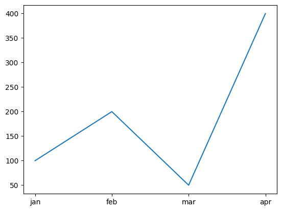

# 16. Matplotlib For Data Visualization

Matplotib is a library that we use for data visualization. We are going to cover following visualization in Matplotlib :

1. Scatter Plot
2. line chart - plot
3. bar chart
4. pie chart
5. histogram
6. stackplot
7. boxplot

**Install Matplotlib**

`pip install matplotlib`

**Let's Understand Matplotlib first , with an example :**

```python
import pandas as pd
import matplotlib.pyplot as plt
month = ['jan','feb','mar','apr']
sale = [100,200,50,400]

plt.plot(month,sale)  # a line chart
plt.show()
```


<figure><figcaption></figcaption></figure>

Note : From this graph we can see the lowest dip in sales was in march and the highest was in apr

**1. Scatter Plot**

A scatter plot is a type of graph that shows the relationship between two numerical variables.

```python
import matplotlib.pyplot as plt
month = ['jan','feb','mar','apr']
sale = [100,200,50,400]

plt.scatter(month,sale,color='red')
plt.title('Monthly Sales') # title of the graph
plt.xlabel('Month')  # x axis name
plt.ylabel('Sales')  # y axis name
plt.grid()   # for grid
plt.show()
```

<figure><figcaption></figcaption></figure>

**Multiple Values in Scatter Plot**

```python
month = ['jan','feb','mar','apr']
isale = [100,200,50,400]
ssale = [200,400,100,700]

plt.scatter(month,isale,label='Iphone')
plt.scatter(month,ssale,label='Samsung')
plt.title('Monthly Sales')
plt.xlabel('Month')
plt.ylabel('Sales')
plt.grid()
plt.legend()   # legend of the graph
plt.show()
```

<figure><figcaption></figcaption></figure>

**Scatter Plot is also used to find relationship between two variables / data**

```python
temp = [10,20,30,40,50,60]
tea = [100,80,70,40,20,10]
plt.scatter(temp,tea)
plt.title('Tea Sales')
plt.xlabel('Temperature')
plt.ylabel('Sales')
plt.grid()
plt.show()
```

<figure><figcaption></figcaption></figure>

Note : Here we can see , If temperature increase , Tea Sales decreases. It means they have negative relationship.

```python
temp = [10,20,30,40,50,60]
tea = [100,80,70,40,20,10]
ice = [20,50,80,90,100,300]
plt.scatter(temp,tea,label='Tea')
plt.scatter(temp,ice,label='Ice')
plt.title('Tea Sales')
plt.xlabel('Temperature')
plt.ylabel('Sales')
plt.grid()
plt.legend()
plt.show()
```

<figure><figcaption></figcaption></figure>

Note : Here we can see , If temperature increase , Tea Sales decreases. It means they have negative relationship. But In case of Ice cream , Ice cream and Temp have positive relationship.

**Let's See an example of Scatter in Data:**

```python
df = pd.read_excel('Adidas US Sales Datasets.xlsx')
df['total'] = df['Price per Unit'] * df['Units Sold']
df
```

|      | Retailer    | Invoice Date | Region    | State         | City       | Product                   | Price per Unit | Units Sold | Sales Method | total   |
| ---- | ----------- | ------------ | --------- | ------------- | ---------- | ------------------------- | -------------- | ---------- | ------------ | ------- |
| 0    | Foot Locker | 2020-01-01   | Northeast | New York      | New York   | Men's Street Footwear     | 50.0           | 1200       | In-store     | 60000.0 |
| 1    | Foot Locker | 2020-01-02   | Northeast | New York      | New York   | Men's Athletic Footwear   | 50.0           | 1000       | In-store     | 50000.0 |
| 2    | Foot Locker | 2020-01-03   | Northeast | New York      | New York   | Women's Street Footwear   | 40.0           | 1000       | In-store     | 40000.0 |
| 3    | Foot Locker | 2020-01-04   | Northeast | New York      | New York   | Women's Athletic Footwear | 45.0           | 850        | In-store     | 38250.0 |
| 4    | Foot Locker | 2020-01-05   | Northeast | New York      | New York   | Men's Apparel             | 60.0           | 900        | In-store     | 54000.0 |
| ...  | ...         | ...          | ...       | ...           | ...        | ...                       | ...            | ...        | ...          | ...     |
| 9643 | Foot Locker | 2021-01-24   | Northeast | New Hampshire | Manchester | Men's Apparel             | 50.0           | 64         | Outlet       | 3200.0  |
| 9644 | Foot Locker | 2021-01-24   | Northeast | New Hampshire | Manchester | Women's Apparel           | 41.0           | 105        | Outlet       | 4305.0  |
| 9645 | Foot Locker | 2021-02-22   | Northeast | New Hampshire | Manchester | Men's Street Footwear     | 41.0           | 184        | Outlet       | 7544.0  |
| 9646 | Foot Locker | 2021-02-22   | Northeast | New Hampshire | Manchester | Men's Athletic Footwear   | 42.0           | 70         | Outlet       | 2940.0  |
| 9647 | Foot Locker | 2021-02-22   | Northeast | New Hampshire | Manchester | Women's Street Footwear   | 29.0           | 83         | Outlet       | 2407.0  |

9648 rows × 10 columns

_**Finding Relationship between Units Sold and total**_

Obviously the more units you sell, the more sale will happen. So Units Sold and total must have positive relationship. Let's check it through scatter plot

```python
plt.scatter(df['Units Sold'],df['total'])
plt.title('Units vs Sales')
plt.xlabel('Units Sold')
plt.ylabel('Sales')
plt.grid()
plt.show()
```

<figure><figcaption></figcaption></figure>

**Conclusion**

The scatter plot shows a strong positive relationship between Units Sold and Sales.

This means:

1. As units sold increase, sales also increase.
2. No major outliers are visible that would break the pattern.

In your scatter plot, you can see that many points are clustered (crowded) together, especially between:

1. Units Sold: 100 to 600
2. Sales: 5,000 to 40,000

What this crowd tells us:

Most of your data falls in this range. This means the majority of your products or days have sales in this normal band.

**Another Example**

```python
df = pd.read_csv('Sleep_health_and_lifestyle_dataset.csv')
df
```

|     | Person ID | Gender | Age | Occupation           | Sleep Duration | Quality of Sleep | Physical Activity Level | Stress Level | BMI Category | Blood Pressure | Heart Rate | Daily Steps | Sleep Disorder |
| --- | --------- | ------ | --- | -------------------- | -------------- | ---------------- | ----------------------- | ------------ | ------------ | -------------- | ---------- | ----------- | -------------- |
| 0   | 1         | Male   | 27  | Software Engineer    | 6.1            | 6                | 42                      | 6            | Overweight   | 126/83         | 77         | 4200        | NaN            |
| 1   | 2         | Male   | 28  | Doctor               | 6.2            | 6                | 60                      | 8            | Normal       | 125/80         | 75         | 10000       | NaN            |
| 2   | 3         | Male   | 28  | Doctor               | 6.2            | 6                | 60                      | 8            | Normal       | 125/80         | 75         | 10000       | NaN            |
| 3   | 4         | Male   | 28  | Sales Representative | 5.9            | 4                | 30                      | 8            | Obese        | 140/90         | 85         | 3000        | Sleep Apnea    |
| 4   | 5         | Male   | 28  | Sales Representative | 5.9            | 4                | 30                      | 8            | Obese        | 140/90         | 85         | 3000        | Sleep Apnea    |
| ... | ...       | ...    | ... | ...                  | ...            | ...              | ...                     | ...          | ...          | ...            | ...        | ...         | ...            |
| 369 | 370       | Female | 59  | Nurse                | 8.1            | 9                | 75                      | 3            | Overweight   | 140/95         | 68         | 7000        | Sleep Apnea    |
| 370 | 371       | Female | 59  | Nurse                | 8.0            | 9                | 75                      | 3            | Overweight   | 140/95         | 68         | 7000        | Sleep Apnea    |
| 371 | 372       | Female | 59  | Nurse                | 8.1            | 9                | 75                      | 3            | Overweight   | 140/95         | 68         | 7000        | Sleep Apnea    |
| 372 | 373       | Female | 59  | Nurse                | 8.1            | 9                | 75                      | 3            | Overweight   | 140/95         | 68         | 7000        | Sleep Apnea    |
| 373 | 374       | Female | 59  | Nurse                | 8.1            | 9                | 75                      | 3            | Overweight   | 140/95         | 68         | 7000        | Sleep Apnea    |

374 rows × 13 columns

```python
plt.scatter(df['Sleep Duration'],df['Quality of Sleep'])
plt.title('Sleep Duration vs Quality of Sleep')
plt.xlabel('Sleep Duration')
plt.ylabel('Quality of Sleep')
plt.grid()
plt.show()
```

<figure><figcaption></figcaption></figure>

**Conclusion**

When sleep duration is low (around 6 hours), the sleep quality is also lower (around 4–6).

As sleep duration increases to 7–8 hours, the sleep quality becomes better (7–8).

People who sleep 8+ hours generally show the highest sleep quality (8–9).

👉 In simple words:

The more you sleep (up to about 8 hours), the better your sleep quality becomes. There is a clear positive relationship between sleep duration and sleep quality.

```python
plt.scatter(df['Sleep Duration'],df['Quality of Sleep'],label='Sleep Duration')
plt.scatter(df['Sleep Duration'],df['Stress Level'],label='Stress Level')
plt.title('Sleep Duration vs Quality of Sleep')
plt.xlabel('Sleep Duration')
plt.ylabel('Quality of Sleep')
plt.grid()
plt.legend()
plt.show()
```

<figure><figcaption></figcaption></figure>

**Conclusion**

Sleep Duration vs Quality of Sleep (Blue Dots):

1. When people sleep more (7–8+ hours) → their sleep quality is higher (7–9).
2. When sleep duration is less (5.8–6.5 hours) → sleep quality is lower (4–6).
3. More sleep = better sleep quality.

Sleep Duration vs Stress Level (Orange Dots)

1. When people sleep less (around 6 hours) → their stress level is higher (7–8).
2. As sleep increases to 7–8 hours, stress level drops to 4–5.
3. With 8+ hours of sleep, stress becomes lowest (3–4).
4. More sleep = lower stress.

Overall Meaning

1. Sleep quality increases as sleep duration increases.
2. Stress decreases as sleep duration increases.

In simple words:

Sleeping more makes your sleep better and your stress lower.

### 2. Line chart <a href="#id-2-line-chart" id="id-2-line-chart"></a>

A line chart connects data points with straight lines to show how something changes over time. In simple words , we use line charts to show how something changes over time, so we can understand patterns, trends, and comparisons easily.

```python
month = ['jan','feb','mar','apr']
isale = [100,200,50,400]

plt.plot(month,isale,marker='o')  # a line chart
plt.title('Monthly Sales')
plt.xlabel('Month')
plt.ylabel('Sales')
plt.grid()
plt.show()
```

<figure><figcaption></figcaption></figure>

```python
month = ['jan','feb','mar','apr']
isale = [100,200,50,400]
ssale = [200,400,100,700]

plt.plot(month,isale,marker='o',label='Iphone')  # a line chart
plt.plot(month,ssale,marker='o',label='Samsung')
plt.title('Monthly Sales')
plt.xlabel('Month')
plt.ylabel('Sales')
plt.grid()
plt.legend()
plt.show()
```

<figure><figcaption></figcaption></figure>

**Conclusion**

1. Both brands rise in February, fall in March, and grow strongly in April.
2. Samsung consistently sells more than iPhone in all four months.

### Let's Use Line Chart on Data <a href="#lets-use-line-chart-on-data" id="lets-use-line-chart-on-data"></a>

**Find Monthly Sales in Adidas Sales**

Your manager has asked you to find Monthly Sales trend for adidas sales. Here is how you will do it.

```python
df = pd.read_excel('Adidas US Sales Datasets.xlsx')
df['total'] = df['Price per Unit'] * df['Units Sold']
df['Invoice Date'] = pd.to_datetime(df['Invoice Date'],format='%Y-%m-%d')
df['Month'] = df['Invoice Date'].dt.month
df
```

|      | Retailer    | Invoice Date | Region    | State         | City       | Product                   | Price per Unit | Units Sold | Sales Method | total   | Month |
| ---- | ----------- | ------------ | --------- | ------------- | ---------- | ------------------------- | -------------- | ---------- | ------------ | ------- | ----- |
| 0    | Foot Locker | 2020-01-01   | Northeast | New York      | New York   | Men's Street Footwear     | 50.0           | 1200       | In-store     | 60000.0 | 1     |
| 1    | Foot Locker | 2020-01-02   | Northeast | New York      | New York   | Men's Athletic Footwear   | 50.0           | 1000       | In-store     | 50000.0 | 1     |
| 2    | Foot Locker | 2020-01-03   | Northeast | New York      | New York   | Women's Street Footwear   | 40.0           | 1000       | In-store     | 40000.0 | 1     |
| 3    | Foot Locker | 2020-01-04   | Northeast | New York      | New York   | Women's Athletic Footwear | 45.0           | 850        | In-store     | 38250.0 | 1     |
| 4    | Foot Locker | 2020-01-05   | Northeast | New York      | New York   | Men's Apparel             | 60.0           | 900        | In-store     | 54000.0 | 1     |
| ...  | ...         | ...          | ...       | ...           | ...        | ...                       | ...            | ...        | ...          | ...     | ...   |
| 9643 | Foot Locker | 2021-01-24   | Northeast | New Hampshire | Manchester | Men's Apparel             | 50.0           | 64         | Outlet       | 3200.0  | 1     |
| 9644 | Foot Locker | 2021-01-24   | Northeast | New Hampshire | Manchester | Women's Apparel           | 41.0           | 105        | Outlet       | 4305.0  | 1     |
| 9645 | Foot Locker | 2021-02-22   | Northeast | New Hampshire | Manchester | Men's Street Footwear     | 41.0           | 184        | Outlet       | 7544.0  | 2     |
| 9646 | Foot Locker | 2021-02-22   | Northeast | New Hampshire | Manchester | Men's Athletic Footwear   | 42.0           | 70         | Outlet       | 2940.0  | 2     |
| 9647 | Foot Locker | 2021-02-22   | Northeast | New Hampshire | Manchester | Women's Street Footwear   | 29.0           | 83         | Outlet       | 2407.0  | 2     |

9648 rows × 11 columns

```python
sdf = df.groupby('Month').agg(
    revenue = ('total','sum')
)
sdf = sdf.reset_index()
sdf
```

|    | Month | revenue    |
| -- | ----- | ---------- |
| 0  | 1     | 9744767.0  |
| 1  | 2     | 8263853.0  |
| 2  | 3     | 7694984.0  |
| 3  | 4     | 9691420.0  |
| 4  | 5     | 10741720.0 |
| 5  | 6     | 9803147.0  |
| 6  | 7     | 12550419.0 |
| 7  | 8     | 12293226.0 |
| 8  | 9     | 10405584.0 |
| 9  | 10    | 8538758.0  |
| 10 | 11    | 9023440.0  |
| 11 | 12    | 11415332.0 |

```python
import numpy as np

plt.figure(figsize=(10,4))
plt.plot(sdf['Month'],sdf['revenue'],marker='o')
plt.title('Monthly Sales')
plt.xlabel('Month')
plt.ylabel('Revenue In Crores')
plt.grid()
plt.xticks(np.arange(1,13),['jan','feb','mar','apr','may','jun','jul','aug','sep','oct','nov','dec'])
plt.show()
```


<figure><figcaption></figcaption></figure>

**Conclusion**

The monthly revenue trend shows clear seasonal fluctuations throughout the year. Revenue declines during the first quarter, reaching its lowest point in March. This is followed by a strong upward trajectory from April to July, with July recording the highest revenue of the year. Although revenues remain relatively high in August, a noticeable decline occurs from September to October. The final quarter shows recovery, with December ending the year on a strong note.

Overall, the data indicates two major growth periods—April to July and November to December—suggesting potential seasonal demand cycles or successful mid-year and year-end business strategies.

### 3. Bar Chart <a href="#id-3-bar-chart" id="id-3-bar-chart"></a>

A bar chart is used when you want to compare categories.

```python
city = ['delhi','pune','agra','bangalore']
isale = [100,200,50,400]

plt.bar(city,isale,color='red')
plt.show()
```


<figure><figcaption></figcaption></figure>

#### Let's Use this on Data <a href="#lets-use-this-on-data" id="lets-use-this-on-data"></a>

**Give me State wise sales on Adidas**

```python
df= pd.read_excel('Adidas US Sales Datasets.xlsx')
df['total'] = df['Price per Unit'] * df['Units Sold']
df
```

|      | Retailer    | Invoice Date | Region    | State         | City       | Product                   | Price per Unit | Units Sold | Sales Method | total   |
| ---- | ----------- | ------------ | --------- | ------------- | ---------- | ------------------------- | -------------- | ---------- | ------------ | ------- |
| 0    | Foot Locker | 2020-01-01   | Northeast | New York      | New York   | Men's Street Footwear     | 50.0           | 1200       | In-store     | 60000.0 |
| 1    | Foot Locker | 2020-01-02   | Northeast | New York      | New York   | Men's Athletic Footwear   | 50.0           | 1000       | In-store     | 50000.0 |
| 2    | Foot Locker | 2020-01-03   | Northeast | New York      | New York   | Women's Street Footwear   | 40.0           | 1000       | In-store     | 40000.0 |
| 3    | Foot Locker | 2020-01-04   | Northeast | New York      | New York   | Women's Athletic Footwear | 45.0           | 850        | In-store     | 38250.0 |
| 4    | Foot Locker | 2020-01-05   | Northeast | New York      | New York   | Men's Apparel             | 60.0           | 900        | In-store     | 54000.0 |
| ...  | ...         | ...          | ...       | ...           | ...        | ...                       | ...            | ...        | ...          | ...     |
| 9643 | Foot Locker | 2021-01-24   | Northeast | New Hampshire | Manchester | Men's Apparel             | 50.0           | 64         | Outlet       | 3200.0  |
| 9644 | Foot Locker | 2021-01-24   | Northeast | New Hampshire | Manchester | Women's Apparel           | 41.0           | 105        | Outlet       | 4305.0  |
| 9645 | Foot Locker | 2021-02-22   | Northeast | New Hampshire | Manchester | Men's Street Footwear     | 41.0           | 184        | Outlet       | 7544.0  |
| 9646 | Foot Locker | 2021-02-22   | Northeast | New Hampshire | Manchester | Men's Athletic Footwear   | 42.0           | 70         | Outlet       | 2940.0  |
| 9647 | Foot Locker | 2021-02-22   | Northeast | New Hampshire | Manchester | Women's Street Footwear   | 29.0           | 83         | Outlet       | 2407.0  |

9648 rows × 10 columns

```python
sdf = df.groupby('State').agg(
    revenue = ('total','sum')
)
sdf = sdf.reset_index()
sdf =sdf.sort_values('revenue',ascending=False)
sdf
```

|    | State          | revenue   |
| -- | -------------- | --------- |
| 31 | New York       | 8670464.0 |
| 4  | California     | 8580508.0 |
| 8  | Florida        | 7820589.0 |
| 42 | Texas          | 6612371.0 |
| 39 | South Carolina | 3593112.0 |
| 17 | Louisiana      | 3377031.0 |
| 46 | Washington     | 3222093.0 |
| 45 | Virginia       | 3074415.0 |
| 36 | Oregon         | 3047049.0 |
| 27 | Nevada         | 2981134.0 |
| 32 | North Carolina | 2936581.0 |
| 30 | New Mexico     | 2824641.0 |
| 11 | Idaho          | 2742753.0 |
| 10 | Hawaii         | 2734457.0 |
| 9  | Georgia        | 2708591.0 |
| 5  | Colorado       | 2569036.0 |
| 41 | Tennessee      | 2567190.0 |
| 0  | Alabama        | 2513424.0 |
| 28 | New Hampshire  | 2339267.0 |
| 21 | Michigan       | 2287283.0 |
| 49 | Wyoming        | 2282342.0 |
| 34 | Ohio           | 2269283.0 |
| 2  | Arizona        | 2254096.0 |
| 23 | Mississippi    | 2218609.0 |
| 44 | Vermont        | 2041598.0 |
| 25 | Montana        | 1930761.0 |
| 1  | Alaska         | 1810428.0 |
| 3  | Arkansas       | 1802672.0 |
| 6  | Connecticut    | 1646448.0 |
| 20 | Massachusetts  | 1578435.0 |
| 35 | Oklahoma       | 1512059.0 |
| 7  | Delaware       | 1508537.0 |
| 37 | Pennsylvania   | 1478794.0 |
| 43 | Utah           | 1387620.0 |
| 47 | West Virginia  | 1311160.0 |
| 16 | Kentucky       | 1241148.0 |
| 15 | Kansas         | 1225314.0 |
| 29 | New Jersey     | 1220446.0 |
| 12 | Illinois       | 1204063.0 |
| 38 | Rhode Island   | 1202256.0 |
| 24 | Missouri       | 1189515.0 |
| 18 | Maine          | 1129728.0 |
| 13 | Indiana        | 1084723.0 |
| 40 | South Dakota   | 1041101.0 |
| 19 | Maryland       | 951134.0  |
| 33 | North Dakota   | 950930.0  |
| 48 | Wisconsin      | 948894.0  |
| 14 | Iowa           | 909811.0  |
| 22 | Minnesota      | 903918.0  |
| 26 | Nebraska       | 728838.0  |

```python

plt.figure(figsize=(20,4))
plt.bar(sdf['State'],sdf['revenue'],width=0.4)
plt.xticks(rotation=90)
plt.grid()
plt.show()
```


<figure><figcaption></figcaption></figure>

```python
plt.figure(figsize=(10,10))
plt.barh(sdf['State'],sdf['revenue'],color='green',height=0.5)
plt.show()
```


<figure><figcaption></figcaption></figure>


**Conclusion**

States like Nebraska and Minnesota show the lowest sales, while California, Florida, and New York generate the highest revenue. This clearly highlights which states are underperforming and which are the strongest markets.

### 4. Pie Chart <a href="#id-4-pie-chart" id="id-4-pie-chart"></a>

Pie chart is used to show percentage or proportion of the whole part. Pie charts are best when you want to display:

1. Market share
2. Budget distribution
3. Population split
4. Sales contribution of each product

It shows what portion each category contributes to the total.

```python
quantity = [13.3,2.2,8.7,5.6]
ing = ['sugar','protein','total fat','saturated fat']

plt.pie(quantity,labels=ing,autopct='%1.1f%%',colors=['red','blue','green','yellow'])
plt.show()
plt.show()
```


<figure><figcaption></figcaption></figure>

```python
quantity = [13.3,2.2,8.7,5.6]
ing = ['sugar','protein','total fat','saturated fat']

plt.pie(quantity,
        labels=ing,
        autopct='%1.1f%%',
        colors=['red','blue','green','yellow'],
        explode=[0.1,0,0,0],
        shadow=True)
plt.show()
plt.show()
```


<div align="left"><figure><figcaption></figcaption></figure></div>

### Let's understand this on data <a href="#lets-understand-this-on-data" id="lets-understand-this-on-data"></a>

**percentage contribution of Sales Method in Adidas**

```python
df.head()
```

|   | Retailer    | Invoice Date | Region    | State    | City     | Product                   | Price per Unit | Units Sold | Sales Method | total   |
| - | ----------- | ------------ | --------- | -------- | -------- | ------------------------- | -------------- | ---------- | ------------ | ------- |
| 0 | Foot Locker | 2020-01-01   | Northeast | New York | New York | Men's Street Footwear     | 50.0           | 1200       | In-store     | 60000.0 |
| 1 | Foot Locker | 2020-01-02   | Northeast | New York | New York | Men's Athletic Footwear   | 50.0           | 1000       | In-store     | 50000.0 |
| 2 | Foot Locker | 2020-01-03   | Northeast | New York | New York | Women's Street Footwear   | 40.0           | 1000       | In-store     | 40000.0 |
| 3 | Foot Locker | 2020-01-04   | Northeast | New York | New York | Women's Athletic Footwear | 45.0           | 850        | In-store     | 38250.0 |
| 4 | Foot Locker | 2020-01-05   | Northeast | New York | New York | Men's Apparel             | 60.0           | 900        | In-store     | 54000.0 |

```python
rdf = df['Sales Method'].value_counts().reset_index()
rdf
```

|   | Sales Method | count |
| - | ------------ | ----- |
| 0 | Online       | 4889  |
| 1 | Outlet       | 3019  |
| 2 | In-store     | 1740  |

```python
plt.pie(rdf['count'],
        labels=rdf['Sales Method'],
        autopct='%1.1f%%',
        explode=[0.1,0,0],
        shadow=True)
plt.show()
```


<figure><figcaption></figcaption></figure>

### 5. Histogram <a href="#id-5-histogram" id="id-5-histogram"></a>

A histogram is a graph that shows the distribution of numerical data. It splits the data into ranges (called bins) and tells how many values fall into each bin.

1. Normal Distribution: mean = median = mode
2. Right-Skewed Distribution: mean > median > mode
3. Left-Skewed Distribution: mean < median < mode

```python
office_employee_ages = [
# very low frequency (tails)
30,30,70,70,

31,31,69,69,
32,32,68,68,
33,33,67,67,

# low frequency
34,34,34,66,66,66,
35,35,35,65,65,65,

# medium frequency
36,36,36,36,64,64,64,64,
37,37,37,37,63,63,63,63,

38,38,38,38,38,62,62,62,62,62,
39,39,39,39,39,61,61,61,61,61,

# high frequency (center region)
40,40,40,40,40,40,60,60,60,60,60,60,
41,41,41,41,41,41,59,59,59,59,59,59,

42,42,42,42,42,42,42,58,58,58,58,58,58,58,
43,43,43,43,43,43,43,57,57,57,57,57,57,57,

44,44,44,44,44,44,44,44,56,56,56,56,56,56,56,56,

# peak (very high frequency)
45,45,45,45,45,45,45,45,45,
55,55,55,55,55,55,55,55,55,

46,46,46,46,46,46,46,46,46,46,
54,54,54,54,54,54,54,54,54,54,

47,47,47,47,47,47,47,47,47,47,47,
53,53,53,53,53,53,53,53,53,53,53,

48,48,48,48,48,48,48,48,48,48,48,48,
52,52,52,52,52,52,52,52,52,52,52,52,

# absolute peak //
49,49,49,49,49,49,49,49,49,49,49,49,49,
51,51,51,51,51,51,51,51,51,51,51,51,51,

# center value
50,50,50,50,50,50,50,50,50,50,50,50,50,50,50
]

plt.figure(figsize=(10,6))
plt.hist(office_employee_ages,
         color='skyblue',
         bins=20,   # bin can be caclulated by square root of number of values
         edgecolor='black',
         )
plt.xticks(np.arange(30,72,2))
plt.grid()
```


<figure><figcaption></figcaption></figure>

```python
np.mean(office_employee_ages) , np.median(office_employee_ages)
```

```
(np.float64(50.0), np.float64(50.0))
```

### Conclusion <a href="#conclusion" id="conclusion"></a>

1. The histogram of office\_employee\_ages is symmetrical and bell-shaped, indicating a normal distribution.
2. Most employees are middle-aged (around 45–50 years).
3. The mean and median are very close, which confirms the symmetry of the data.
4. The few employees at the extremes (30–35 and 65–70) represent the tails of the distribution.

```python
instagram_user_ages = [
# high frequency (left side)
30,30,30,30,30,30,30,30,30,30,
31,31,31,31,31,31,31,31,31,
32,32,32,32,32,32,32,32,
33,33,33,33,33,33,33,

# medium-high frequency
34,34,34,34,34,34,34,
35,35,35,35,35,35,
36,36,36,36,36,36,
37,37,37,37,37,37,

# medium frequency
38,38,38,38,38,
39,39,39,39,39,
40,40,40,40,40,
41,41,41,41,41,

# low-medium
42,42,42,42,
43,43,43,43,
44,44,44,44,
45,45,45,45,

# low frequency
46,46,46,
47,47,47,
48,48,48,
49,49,49,

# very low (tail starts)
50,50,
51,51,
52,52,
53,53,

# extremely low = long right tail
54,
55,
56,
57,
58,
59,
60,
61,
62,
63,
64,
65,
66,
67,
68,
69,
70
]

plt.figure(figsize=(10,6))
plt.hist(instagram_user_ages,
         color='orange',
         bins=20,
         edgecolor='black')
plt.xticks(np.arange(30,72,2))
plt.grid()
plt.title("Right Skewed Distribution")
plt.show()

```


<figure><figcaption></figcaption></figure>

```python
np.mean(instagram_user_ages) , np.median(instagram_user_ages)
```

```
(np.float64(41.46969696969697), np.float64(39.0))
```

### Conclusion <a href="#conclusion-1" id="conclusion-1"></a>

1. The age distribution of Instagram users is right-skewed (positively skewed).
2. Most users are young (30–35 years).
3. The long tail on the right shows a few older users.
4. The mean is higher than the median, which is typical for right-skewed data.
5. For skewed distributions like this, the median better represents the “typical” user age than the mean.

```python
facebook_user_ages = [
# very low (left tail)
30,
31,
32,
33,
34,
35,
36,
37,
38,
39,
40,
41,
42,
43,
44,

# low frequency
45,45,
46,46,
47,47,
48,48,

# medium frequency
49,49,49,
50,50,50,
51,51,51,
52,52,52,

# medium-high frequency
53,53,53,53,
54,54,54,54,
55,55,55,55,
56,56,56,56,

# high frequency
57,57,57,57,57,
58,58,58,58,58,
59,59,59,59,59,
60,60,60,60,60,

# very high frequency (peak areas)
61,61,61,61,61,61,
62,62,62,62,62,62,
63,63,63,63,63,63,

64,64,64,64,64,64,64,
65,65,65,65,65,65,65,

66,66,66,66,66,66,66,66,
67,67,67,67,67,67,67,67,

# absolute peak region (end)
68,68,68,68,68,68,68,68,68,
69,69,69,69,69,69,69,69,69,
70,70,70,70,70,70,70,70,70
]


plt.figure(figsize=(10,6))
plt.hist(facebook_user_ages,
         color='green',
         bins=20,
         edgecolor='black')
plt.xticks(np.arange(30,72,2))
plt.grid()
plt.title("Left Skewed Distribution")
plt.show()

```


<figure><figcaption></figcaption></figure>

```python
np.mean(facebook_user_ages) , np.median(facebook_user_ages)
```

```
(np.float64(58.363013698630134), np.float64(61.0))
```

### Conclusion <a href="#conclusion-2" id="conclusion-2"></a>

1. The age distribution of Facebook users is left-skewed (negatively skewed).
2. Most users are older (60–70 years).
3. The long tail on the left indicates a smaller number of younger users.
4. The mean is lower than the median, which is typical for left-skewed data.
5. For skewed distributions like this, the median better represents the “typical” user age than the mean.

### Let's use this on Data <a href="#lets-use-this-on-data-1" id="lets-use-this-on-data-1"></a>

```python
import math
import numpy as np
df = pd.read_csv('Sleep_health_and_lifestyle_dataset.csv')
df
```

|     | Person ID | Gender | Age | Occupation           | Sleep Duration | Quality of Sleep | Physical Activity Level | Stress Level | BMI Category | Blood Pressure | Heart Rate | Daily Steps | Sleep Disorder |
| --- | --------- | ------ | --- | -------------------- | -------------- | ---------------- | ----------------------- | ------------ | ------------ | -------------- | ---------- | ----------- | -------------- |
| 0   | 1         | Male   | 27  | Software Engineer    | 6.1            | 6                | 42                      | 6            | Overweight   | 126/83         | 77         | 4200        | NaN            |
| 1   | 2         | Male   | 28  | Doctor               | 6.2            | 6                | 60                      | 8            | Normal       | 125/80         | 75         | 10000       | NaN            |
| 2   | 3         | Male   | 28  | Doctor               | 6.2            | 6                | 60                      | 8            | Normal       | 125/80         | 75         | 10000       | NaN            |
| 3   | 4         | Male   | 28  | Sales Representative | 5.9            | 4                | 30                      | 8            | Obese        | 140/90         | 85         | 3000        | Sleep Apnea    |
| 4   | 5         | Male   | 28  | Sales Representative | 5.9            | 4                | 30                      | 8            | Obese        | 140/90         | 85         | 3000        | Sleep Apnea    |
| ... | ...       | ...    | ... | ...                  | ...            | ...              | ...                     | ...          | ...          | ...            | ...        | ...         | ...            |
| 369 | 370       | Female | 59  | Nurse                | 8.1            | 9                | 75                      | 3            | Overweight   | 140/95         | 68         | 7000        | Sleep Apnea    |
| 370 | 371       | Female | 59  | Nurse                | 8.0            | 9                | 75                      | 3            | Overweight   | 140/95         | 68         | 7000        | Sleep Apnea    |
| 371 | 372       | Female | 59  | Nurse                | 8.1            | 9                | 75                      | 3            | Overweight   | 140/95         | 68         | 7000        | Sleep Apnea    |
| 372 | 373       | Female | 59  | Nurse                | 8.1            | 9                | 75                      | 3            | Overweight   | 140/95         | 68         | 7000        | Sleep Apnea    |
| 373 | 374       | Female | 59  | Nurse                | 8.1            | 9                | 75                      | 3            | Overweight   | 140/95         | 68         | 7000        | Sleep Apnea    |

374 rows × 13 columns

```python
plt.hist(df['Age'],
         color='orange',
         bins=30,
         edgecolor='black')

plt.show()
```


<figure><figcaption></figcaption></figure>

```python
df['Age'].mean()  , df['Age'].median() , df['Age'].mode()
```

```
(np.float64(42.18449197860963),
 np.float64(43.0),
 0    43
 Name: Age, dtype: int64)
```

There is not much difference between mean , median and mode , so we can use mean here if asked about average age also.

### 6. Stackplot <a href="#id-6-stackplot" id="id-6-stackplot"></a>

A stack plot is a type of plot in Python (using Matplotlib) that shows how multiple datasets contribute to a total over a period or sequence.

1. Each dataset is stacked on top of the previous one.
2. Useful for showing cumulative contributions.
3. X-axis usually represents time or categories, Y-axis is the value.

```python
# X-axis (Months)
months = ['Jan', 'Feb', 'Mar', 'Apr', 'May']

# Sales of three products
product_a = [100, 120, 150, 170, 200]
product_b = [80, 90, 100, 120, 130]
product_c = [50, 60, 70, 80, 90]

```

```python
import matplotlib.pyplot as plt

plt.figure(figsize=(10,6))
plt.stackplot(months, product_a, product_b, product_c,
              labels=['Product A','Product B','Product C'],
              colors=['skyblue','orange','green'])
plt.title("Monthly Sales Stack Plot")
plt.xlabel("Months")
plt.ylabel("Sales")
plt.legend(loc='upper left')
plt.show()

```


<figure><figcaption></figcaption></figure>

```python
df  = pd.read_excel('Adidas US Sales Datasets.xlsx')
df['Month'] = df['Invoice Date'].dt.month
mdf = df.pivot_table(index='Month',columns='Product',values='Units Sold').reset_index()
mdf
```

| Product | Month | Men's Apparel | Men's Athletic Footwear | Men's Street Footwear | Women's Apparel | Women's Athletic Footwear | Women's Street Footwear |
| ------- | ----- | ------------- | ----------------------- | --------------------- | --------------- | ------------------------- | ----------------------- |
| 0       | 1     | 195.753521    | 280.944828              | 365.337931            | 271.117241      | 196.929577                | 273.577465              |
| 1       | 2     | 193.833333    | 249.443609              | 372.523077            | 251.832000      | 184.348837                | 245.654135              |
| 2       | 3     | 157.179104    | 247.606061              | 366.469697            | 239.742424      | 179.598540                | 241.400000              |
| 3       | 4     | 184.957447    | 253.514286              | 379.085714            | 280.305556      | 194.521739                | 250.543478              |
| 4       | 5     | 204.264286    | 264.740741              | 370.797101            | 283.751825      | 203.459259                | 242.644444              |
| 5       | 6     | 173.214876    | 244.524590              | 375.826446            | 282.462810      | 188.770492                | 225.737705              |
| 6       | 7     | 222.629921    | 293.589147              | 409.037879            | 300.060606      | 213.527559                | 250.661417              |
| 7       | 8     | 216.288732    | 348.652778              | 419.619718            | 296.514085      | 238.707143                | 291.552448              |
| 8       | 9     | 210.920290    | 306.503704              | 374.059259            | 286.521429      | 216.057971                | 272.739130              |
| 9       | 10    | 172.544776    | 247.956204              | 314.925373            | 245.179104      | 170.101449                | 199.868613              |
| 10      | 11    | 167.053030    | 230.879699              | 308.458647            | 235.369231      | 177.772727                | 197.444444              |
| 11      | 12    | 189.922481    | 269.848000              | 363.476562            | 259.492063      | 205.093750                | 228.349593              |

```python
plt.stackplot(mdf['Month'],
              mdf["Men's Apparel"],
              mdf["Women's Apparel"],
              mdf["Men's Athletic Footwear"],
              labels=['MA','WA','MF'])
plt.legend()
plt.show()
```


<figure><figcaption></figcaption></figure>

### 7. Box Plot <a href="#id-7-box-plot" id="id-7-box-plot"></a>

```python
plt.boxplot(df['Units Sold'],vert=False,showmeans=True,meanline=True)
plt.show()
```


<figure><figcaption></figcaption></figure>

```python


```
