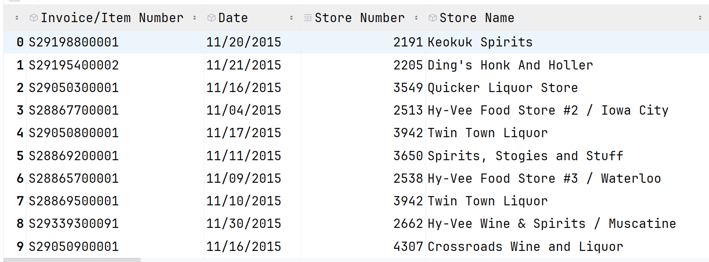

# 17. Seaborn









## Seaborn <a href="#seaborn" id="seaborn"></a>

Seaborn is an advanced data visualization tool and it is used for advanced visualization. We are going to Cover these Plots :

1. relplot(relational plot) - `scatter line`
2. heatmap
3. regression - lmplot
4. displot - `histplot kdeplot`
5. catplot(categorical plot) - `strip swarm box violin boxen point count bar`

### Install Seaborn - <a href="#install-seaborn" id="install-seaborn"></a>

`pip install seaborn`

### Import Libraries <a href="#import-libraries" id="import-libraries"></a>

```python
import numpy as np
import pandas as pd
import matplotlib.pyplot as plt
import seaborn as sns
```

### 1. relplot <a href="#id-1-relplot" id="id-1-relplot"></a>

relplot is a high-level plotting function in Seaborn used to visualize relationships between numerical variables.

It shows how one numeric variable changes with another numeric variable.

relplot offers two plots.

1. scatter plot (default)
2. line plot

```python
df = pd.read_csv('relplot data.csv')
df.head()
```

|   | Order\_ID | Year | Month | City  | Customer\_Type | Order\_Value\_K | Delivery\_Time\_Min | Customer\_Rating | Distance\_KM | Day\_Type | Weather | Festival\_Period | Time\_Slot |
| - | --------- | ---- | ----- | ----- | -------------- | --------------- | ------------------- | ---------------- | ------------ | --------- | ------- | ---------------- | ---------- |
| 0 | 1001      | 2023 | Jan   | Delhi | Premium        | 1.2             | 18                  | 4.8              | 3            | Weekday   | Clear   | No               | Lunch      |
| 1 | 1002      | 2023 | Jan   | Delhi | Regular        | 0.5             | 25                  | 4.0              | 5            | Weekday   | Clear   | No               | Dinner     |
| 2 | 1003      | 2023 | Jan   | Delhi | Premium        | 1.5             | 22                  | 4.5              | 4            | Weekend   | Rainy   | Yes              | Dinner     |
| 3 | 1004      | 2023 | Jan   | Pune  | Regular        | 0.4             | 28                  | 3.8              | 6            | Weekday   | Rainy   | No               | Lunch      |
| 4 | 1005      | 2023 | Jan   | Pune  | Premium        | 1.0             | 20                  | 4.6              | 4            | Weekend   | Clear   | Yes              | Dinner     |

**Finding Relationship Between Delivery Time and Customer Rating**

```python
sns.relplot(data=df,
            x='Delivery_Time_Min',
            y='Customer_Rating')

plt.show()
```

<figure><figcaption></figcaption></figure>

Delivery time and Customer rating has negative relationship

**Segmentation - hue**

It uses different colors to separate categories in the data.

```python
sns.relplot(data=df,
            x='Delivery_Time_Min',
            y='Customer_Rating',
            hue='Customer_Type')

plt.show()
```

<figure><figcaption></figcaption></figure>

Regular Customers often get late deliveries rather than premium customer , which is the reason , regular customers give very less rating rather than premium customers.

**hue - palette**

```python
sns.relplot(data=df,
            x='Delivery_Time_Min',
            y='Customer_Rating',
            hue='Customer_Type',
            palette =  { 'Premium':'Green' , 'Regular':'red' })

plt.show()
```


<figure><figcaption></figcaption></figure>

```python
sns.relplot(data=df,
            x='Delivery_Time_Min',
            y='Customer_Rating',
            hue='Customer_Type',
            palette =  'Reds')

plt.show()
```

<figure><figcaption></figcaption></figure>

### size <a href="#size" id="size"></a>

It uses different sizes to separate categories in the data.

```python
sns.relplot(data=df,
            x='Delivery_Time_Min',
            y='Customer_Rating',
            hue='Customer_Type',
            palette =  { 'Premium':'Green' , 'Regular':'red' },
            size='Customer_Rating')

plt.show()
```

<figure><figcaption></figcaption></figure>

**size - sizes**

```python
sns.relplot(data=df,
            x='Delivery_Time_Min',
            y='Customer_Rating',
            hue='Customer_Type',
            palette =  { 'Premium':'Green' , 'Regular':'red' },
            size='Customer_Rating',
            sizes=(50,100))

plt.show()
```

<figure><figcaption></figcaption></figure>

### Segmentation - style <a href="#segmentation---style" id="segmentation---style"></a>

It uses different sizes to separate categories in the data.

```python
sns.relplot(data=df,
            x='Delivery_Time_Min',
            y='Customer_Rating',
            hue='Customer_Type',
            palette =  { 'Premium':'Green' , 'Regular':'red' },
            size='Customer_Rating',
            sizes=(50,100),
            style='Customer_Type')

# plt.legend(
#     bbox_to_anchor=(1, 1),  # move legend outside
#     loc='upper left'
# )

plt.show()
```

<figure><figcaption></figcaption></figure>

### Segmentation - row <a href="#segmentation---row" id="segmentation---row"></a>

It uses different rows to separate categories in the data.

```python
sns.relplot(data=df,
            x='Delivery_Time_Min',
            y='Customer_Rating',
            hue='Customer_Type',
            palette =  { 'Premium':'Green' , 'Regular':'red' },
            size='Customer_Rating',
            sizes=(50,100),
            style='Customer_Type',
            row='Time_Slot')

plt.show()
```

<figure><figcaption></figcaption></figure>

### Segmentation - col <a href="#segmentation---col" id="segmentation---col"></a>

It uses different cols to separate categories in the data.

```python
sns.relplot(data=df,
            x='Delivery_Time_Min',
            y='Customer_Rating',
            hue='Customer_Type',
            palette =  { 'Premium':'Green' , 'Regular':'red' },
            size='Customer_Rating',
            sizes=(50,100),
            style='Customer_Type',
            col='Day_Type')

plt.show()
```

<figure><figcaption></figcaption></figure>

```python
sns.relplot(data=df,
            x='Delivery_Time_Min',
            y='Customer_Rating',
            hue='Customer_Type',
            palette =  { 'Premium':'Green' , 'Regular':'red' },
            size='Customer_Rating',
            sizes=(50,100),
            style='Customer_Type',
            col='Day_Type',
            row='Time_Slot')

plt.show()
```

<figure><figcaption></figcaption></figure>


### 2. relplot - line <a href="#id-2-relplot---line" id="id-2-relplot---line"></a>

line plot is used to find pattern over time.

by default line plot uses average to show the line.

```python
sns.relplot(data=df,
            x='Delivery_Time_Min',
            y='Customer_Rating',
            kind='line')

plt.show()
```

<figure><figcaption></figcaption></figure>


```python
sns.relplot(data=df,
            x='Delivery_Time_Min',
            y='Customer_Rating',
            kind='line',
            estimator='sum')

plt.show()
```

<figure><figcaption></figcaption></figure>


#### An Example : <a href="#an-example" id="an-example"></a>

```python
df = pd.read_excel('Adidas US Sales Datasets.xlsx')
df['total'] = df['Price per Unit'] * df['Units Sold']
df
```

|      | Retailer    | Invoice Date | Region    | State         | City       | Product                   | Price per Unit | Units Sold | Sales Method | total   |
| ---- | ----------- | ------------ | --------- | ------------- | ---------- | ------------------------- | -------------- | ---------- | ------------ | ------- |
| 0    | Foot Locker | 2020-01-01   | Northeast | New York      | New York   | Men's Street Footwear     | 50.0           | 1200       | In-store     | 60000.0 |
| 1    | Foot Locker | 2020-01-02   | Northeast | New York      | New York   | Men's Athletic Footwear   | 50.0           | 1000       | In-store     | 50000.0 |
| 2    | Foot Locker | 2020-01-03   | Northeast | New York      | New York   | Women's Street Footwear   | 40.0           | 1000       | In-store     | 40000.0 |
| 3    | Foot Locker | 2020-01-04   | Northeast | New York      | New York   | Women's Athletic Footwear | 45.0           | 850        | In-store     | 38250.0 |
| 4    | Foot Locker | 2020-01-05   | Northeast | New York      | New York   | Men's Apparel             | 60.0           | 900        | In-store     | 54000.0 |
| ...  | ...         | ...          | ...       | ...           | ...        | ...                       | ...            | ...        | ...          | ...     |
| 9643 | Foot Locker | 2021-01-24   | Northeast | New Hampshire | Manchester | Men's Apparel             | 50.0           | 64         | Outlet       | 3200.0  |
| 9644 | Foot Locker | 2021-01-24   | Northeast | New Hampshire | Manchester | Women's Apparel           | 41.0           | 105        | Outlet       | 4305.0  |
| 9645 | Foot Locker | 2021-02-22   | Northeast | New Hampshire | Manchester | Men's Street Footwear     | 41.0           | 184        | Outlet       | 7544.0  |
| 9646 | Foot Locker | 2021-02-22   | Northeast | New Hampshire | Manchester | Men's Athletic Footwear   | 42.0           | 70         | Outlet       | 2940.0  |
| 9647 | Foot Locker | 2021-02-22   | Northeast | New Hampshire | Manchester | Women's Street Footwear   | 29.0           | 83         | Outlet       | 2407.0  |

9648 rows × 10 columns

```python
sns.relplot(data=df,
            x='Units Sold',
            y='total')

plt.show()
```

<figure><figcaption></figcaption></figure>


```python
sns.relplot(data=df,
            x='Units Sold',
            y='total',
            kind='line',
            marker='o')

plt.show()
```

<figure><figcaption></figcaption></figure>


```python
sns.relplot(data=df,
            x='Units Sold',
            y='total',
            kind='line',
            marker='o',
            estimator='sum')

plt.show()
```

<figure><figcaption></figcaption></figure>


```python
df = pd.read_csv('relplot data.csv')
df.head()
```

|   | Order\_ID | Year | Month | City  | Customer\_Type | Order\_Value\_K | Delivery\_Time\_Min | Customer\_Rating | Distance\_KM | Day\_Type | Weather | Festival\_Period | Time\_Slot |
| - | --------- | ---- | ----- | ----- | -------------- | --------------- | ------------------- | ---------------- | ------------ | --------- | ------- | ---------------- | ---------- |
| 0 | 1001      | 2023 | Jan   | Delhi | Premium        | 1.2             | 18                  | 4.8              | 3            | Weekday   | Clear   | No               | Lunch      |
| 1 | 1002      | 2023 | Jan   | Delhi | Regular        | 0.5             | 25                  | 4.0              | 5            | Weekday   | Clear   | No               | Dinner     |
| 2 | 1003      | 2023 | Jan   | Delhi | Premium        | 1.5             | 22                  | 4.5              | 4            | Weekend   | Rainy   | Yes              | Dinner     |
| 3 | 1004      | 2023 | Jan   | Pune  | Regular        | 0.4             | 28                  | 3.8              | 6            | Weekday   | Rainy   | No               | Lunch      |
| 4 | 1005      | 2023 | Jan   | Pune  | Premium        | 1.0             | 20                  | 4.6              | 4            | Weekend   | Clear   | Yes              | Dinner     |

```python
sns.relplot(data=df,
            x='Delivery_Time_Min',
            y='Customer_Rating',
            kind='line',
            hue='Customer_Type')

plt.show()
```

<figure><figcaption></figcaption></figure>


#### Let's Explore With Examples <a href="#lets-explore-with-examples" id="lets-explore-with-examples"></a>

```python
df = pd.read_excel('Adidas US Sales Datasets.xlsx')
df['total'] = df['Price per Unit'] * df['Units Sold']
df['Invoice Date'] = pd.to_datetime(df['Invoice Date'],format='%Y-%m-%d')
df['Year'] = df['Invoice Date'].dt.year
df.head()
```

|   | Retailer    | Invoice Date | Region    | State    | City     | Product                   | Price per Unit | Units Sold | Sales Method | total   | Year |
| - | ----------- | ------------ | --------- | -------- | -------- | ------------------------- | -------------- | ---------- | ------------ | ------- | ---- |
| 0 | Foot Locker | 2020-01-01   | Northeast | New York | New York | Men's Street Footwear     | 50.0           | 1200       | In-store     | 60000.0 | 2020 |
| 1 | Foot Locker | 2020-01-02   | Northeast | New York | New York | Men's Athletic Footwear   | 50.0           | 1000       | In-store     | 50000.0 | 2020 |
| 2 | Foot Locker | 2020-01-03   | Northeast | New York | New York | Women's Street Footwear   | 40.0           | 1000       | In-store     | 40000.0 | 2020 |
| 3 | Foot Locker | 2020-01-04   | Northeast | New York | New York | Women's Athletic Footwear | 45.0           | 850        | In-store     | 38250.0 | 2020 |
| 4 | Foot Locker | 2020-01-05   | Northeast | New York | New York | Men's Apparel             | 60.0           | 900        | In-store     | 54000.0 | 2020 |

```python
sns.relplot(data=df,
            x='Units Sold',
            y='total',
            )

plt.show()
```

<figure><figcaption></figcaption></figure>

**Region Wise**

```python
sns.relplot(data=df,
            x='Units Sold',
            y='total',
            hue='Region')

plt.show()
```

<figure><figcaption></figcaption></figure>

```python
sns.relplot(data=df,
            x='Units Sold',
            y='total',
            col='Region',
            col_wrap=2,
            hue='Region')

plt.show()
```

<figure><figcaption></figcaption></figure>

#### Yearly Average Sales <a href="#yearly-average-sales" id="yearly-average-sales"></a>

```python
sns.relplot(data=df,
            x='Year',
            y='total',
            kind='line')
plt.show()
```

<figure><figcaption></figcaption></figure>

```python
sns.relplot(data=df,
            x='Year',
            y='total',
            kind='line',
            hue='Region')
plt.show()
```

<figure><figcaption></figcaption></figure>

#### Total Sales <a href="#total-sales" id="total-sales"></a>

```python
sns.relplot(data=df,
            x='Year',
            y='total',
            kind='line',
            hue='Region',
            estimator='sum')
plt.show()
```

<figure><figcaption></figcaption></figure>

## 📊 Correlation Heatmap — Notebook Explanation <a href="#correlation-heatmap-notebook-explanation" id="correlation-heatmap-notebook-explanation"></a>

### 📌 What is Correlation? <a href="#what-is-correlation" id="what-is-correlation"></a>

Correlation measures **how strongly two numerical variables are related**.

* Value range: **-1 to +1**
* `+1` → strong positive relationship
* `-1` → strong negative relationship
* `0` → no relationship

***

### 📌 What is a Correlation Heatmap? <a href="#what-is-a-correlation-heatmap" id="what-is-a-correlation-heatmap"></a>

A **correlation heatmap** is a visual way to represent correlation values using **colors**.

Instead of reading numbers, we **interpret color intensity**.

***

### 🎨 How to Read Colors in a Correlation Heatmap <a href="#how-to-read-colors-in-a-correlation-heatmap" id="how-to-read-colors-in-a-correlation-heatmap"></a>

| Color Meaning         | Interpretation              |
| --------------------- | --------------------------- |
| Dark positive color   | Strong positive correlation |
| Dark negative color   | Strong negative correlation |
| Light / neutral color | Weak or no correlation      |

👉 **Darker the color = stronger the relationship**

***

### 📌 Why Use a Correlation Heatmap? <a href="#why-use-a-correlation-heatmap" id="why-use-a-correlation-heatmap"></a>

* To quickly **identify relationships**
* To detect **multicollinearity**
* To find **important features** in data analysis

***

### 📌 Example Interpretation <a href="#example-interpretation" id="example-interpretation"></a>

If a heatmap shows:

* `Hours_Studied` vs `Marks` → dark positive color → More study hours leads to higher marks
* `Speed` vs `Travel_Time` → dark negative color → Higher speed reduces travel time

***

### 🧠 Key Takeaway <a href="#key-takeaway" id="key-takeaway"></a>

> A correlation heatmap visually shows how strongly and in which direction numerical variables are related using color intensity.

***

```python
df = pd.read_csv('Sleep_health_and_lifestyle_dataset.csv')
df
```

|     | Person ID | Gender | Age | Occupation           | Sleep Duration | Quality of Sleep | Physical Activity Level | Stress Level | BMI Category | Blood Pressure | Heart Rate | Daily Steps | Sleep Disorder |
| --- | --------- | ------ | --- | -------------------- | -------------- | ---------------- | ----------------------- | ------------ | ------------ | -------------- | ---------- | ----------- | -------------- |
| 0   | 1         | Male   | 27  | Software Engineer    | 6.1            | 6                | 42                      | 6            | Overweight   | 126/83         | 77         | 4200        | NaN            |
| 1   | 2         | Male   | 28  | Doctor               | 6.2            | 6                | 60                      | 8            | Normal       | 125/80         | 75         | 10000       | NaN            |
| 2   | 3         | Male   | 28  | Doctor               | 6.2            | 6                | 60                      | 8            | Normal       | 125/80         | 75         | 10000       | NaN            |
| 3   | 4         | Male   | 28  | Sales Representative | 5.9            | 4                | 30                      | 8            | Obese        | 140/90         | 85         | 3000        | Sleep Apnea    |
| 4   | 5         | Male   | 28  | Sales Representative | 5.9            | 4                | 30                      | 8            | Obese        | 140/90         | 85         | 3000        | Sleep Apnea    |
| ... | ...       | ...    | ... | ...                  | ...            | ...              | ...                     | ...          | ...          | ...            | ...        | ...         | ...            |
| 369 | 370       | Female | 59  | Nurse                | 8.1            | 9                | 75                      | 3            | Overweight   | 140/95         | 68         | 7000        | Sleep Apnea    |
| 370 | 371       | Female | 59  | Nurse                | 8.0            | 9                | 75                      | 3            | Overweight   | 140/95         | 68         | 7000        | Sleep Apnea    |
| 371 | 372       | Female | 59  | Nurse                | 8.1            | 9                | 75                      | 3            | Overweight   | 140/95         | 68         | 7000        | Sleep Apnea    |
| 372 | 373       | Female | 59  | Nurse                | 8.1            | 9                | 75                      | 3            | Overweight   | 140/95         | 68         | 7000        | Sleep Apnea    |
| 373 | 374       | Female | 59  | Nurse                | 8.1            | 9                | 75                      | 3            | Overweight   | 140/95         | 68         | 7000        | Sleep Apnea    |

374 rows × 13 columns

```python
cdf = df[ ['Sleep Duration','Quality of Sleep','Stress Level','Age'] ].corr()
cdf
```

|                  | Sleep Duration | Quality of Sleep | Stress Level | Age       |
| ---------------- | -------------- | ---------------- | ------------ | --------- |
| Sleep Duration   | 1.000000       | 0.883213         | -0.811023    | 0.344709  |
| Quality of Sleep | 0.883213       | 1.000000         | -0.898752    | 0.473734  |
| Stress Level     | -0.811023      | -0.898752        | 1.000000     | -0.422344 |
| Age              | 0.344709       | 0.473734         | -0.422344    | 1.000000  |

```python
sns.heatmap(data=cdf,annot=True)
plt.show()
```

<figure><figcaption></figcaption></figure>

### regression - lmplot <a href="#regression---lmplot" id="regression---lmplot"></a>

```python
df = pd.read_excel('Adidas US Sales Datasets.xlsx')
df['total'] = df['Price per Unit'] * df['Units Sold']
df.head()
```

|   | Retailer    | Invoice Date | Region    | State    | City     | Product                   | Price per Unit | Units Sold | Sales Method | total   |
| - | ----------- | ------------ | --------- | -------- | -------- | ------------------------- | -------------- | ---------- | ------------ | ------- |
| 0 | Foot Locker | 2020-01-01   | Northeast | New York | New York | Men's Street Footwear     | 50.0           | 1200       | In-store     | 60000.0 |
| 1 | Foot Locker | 2020-01-02   | Northeast | New York | New York | Men's Athletic Footwear   | 50.0           | 1000       | In-store     | 50000.0 |
| 2 | Foot Locker | 2020-01-03   | Northeast | New York | New York | Women's Street Footwear   | 40.0           | 1000       | In-store     | 40000.0 |
| 3 | Foot Locker | 2020-01-04   | Northeast | New York | New York | Women's Athletic Footwear | 45.0           | 850        | In-store     | 38250.0 |
| 4 | Foot Locker | 2020-01-05   | Northeast | New York | New York | Men's Apparel             | 60.0           | 900        | In-store     | 54000.0 |

```python
sns.lmplot(data=df,
           x='Units Sold',
           y='total',
           scatter_kws={'color': 'blue'},
        line_kws={'color': 'red'},
           col='Region',
           col_wrap=2
           )

plt.show()
```

<figure><figcaption></figcaption></figure>

### displot <a href="#displot" id="displot"></a>

displot is distribution plot.

1. displot - histplot (default)
2. kdeplot (kernel density)

```python
df = pd.read_csv('Sleep_health_and_lifestyle_dataset.csv')
df
```

|     | Person ID | Gender | Age | Occupation           | Sleep Duration | Quality of Sleep | Physical Activity Level | Stress Level | BMI Category | Blood Pressure | Heart Rate | Daily Steps | Sleep Disorder |
| --- | --------- | ------ | --- | -------------------- | -------------- | ---------------- | ----------------------- | ------------ | ------------ | -------------- | ---------- | ----------- | -------------- |
| 0   | 1         | Male   | 27  | Software Engineer    | 6.1            | 6                | 42                      | 6            | Overweight   | 126/83         | 77         | 4200        | NaN            |
| 1   | 2         | Male   | 28  | Doctor               | 6.2            | 6                | 60                      | 8            | Normal       | 125/80         | 75         | 10000       | NaN            |
| 2   | 3         | Male   | 28  | Doctor               | 6.2            | 6                | 60                      | 8            | Normal       | 125/80         | 75         | 10000       | NaN            |
| 3   | 4         | Male   | 28  | Sales Representative | 5.9            | 4                | 30                      | 8            | Obese        | 140/90         | 85         | 3000        | Sleep Apnea    |
| 4   | 5         | Male   | 28  | Sales Representative | 5.9            | 4                | 30                      | 8            | Obese        | 140/90         | 85         | 3000        | Sleep Apnea    |
| ... | ...       | ...    | ... | ...                  | ...            | ...              | ...                     | ...          | ...          | ...            | ...        | ...         | ...            |
| 369 | 370       | Female | 59  | Nurse                | 8.1            | 9                | 75                      | 3            | Overweight   | 140/95         | 68         | 7000        | Sleep Apnea    |
| 370 | 371       | Female | 59  | Nurse                | 8.0            | 9                | 75                      | 3            | Overweight   | 140/95         | 68         | 7000        | Sleep Apnea    |
| 371 | 372       | Female | 59  | Nurse                | 8.1            | 9                | 75                      | 3            | Overweight   | 140/95         | 68         | 7000        | Sleep Apnea    |
| 372 | 373       | Female | 59  | Nurse                | 8.1            | 9                | 75                      | 3            | Overweight   | 140/95         | 68         | 7000        | Sleep Apnea    |
| 373 | 374       | Female | 59  | Nurse                | 8.1            | 9                | 75                      | 3            | Overweight   | 140/95         | 68         | 7000        | Sleep Apnea    |

374 rows × 13 columns

```python
import numpy as np
sns.displot(data=df,
            x='Age',
            bins=20,
            hue='Gender',
            multiple='stack')

# plt.xticks(np.arange(26,62,2))

plt.show()
```

<figure><figcaption></figcaption></figure>

```python
import numpy as np
sns.displot(data=df,
            x='Age',
            bins=20,
            hue='Gender',
            multiple='dodge',
            aspect=2,
            height=10)

# plt.xticks(np.arange(26,62,2))

plt.show()
```

<figure><figcaption></figcaption></figure>

```python
import numpy as np
sns.displot(data=df,
            x='Age',
            bins=20,
            col='Gender',
            )

# plt.xticks(np.arange(26,62,2))

plt.show()
```

<figure><figcaption></figcaption></figure>


### displot - kdeplot <a href="#displot---kdeplot" id="displot---kdeplot"></a>

```python
sns.displot(data=df
            ,x='Age',
            kind='kde',
            hue='Gender')

plt.show()
```

<figure><figcaption></figcaption></figure>


### Categorical Plot <a href="#categorical-plot" id="categorical-plot"></a>

1. strip plot (default)

strip plot is a scatter plot but for categorical values.

```python
df = pd.read_excel('Adidas US Sales Datasets.xlsx')
df['total'] = df['Units Sold'] * df['Price per Unit']
df.head()
```

|   | Retailer    | Invoice Date | Region    | State    | City     | Product                   | Price per Unit | Units Sold | Sales Method | total   |
| - | ----------- | ------------ | --------- | -------- | -------- | ------------------------- | -------------- | ---------- | ------------ | ------- |
| 0 | Foot Locker | 2020-01-01   | Northeast | New York | New York | Men's Street Footwear     | 50.0           | 1200       | In-store     | 60000.0 |
| 1 | Foot Locker | 2020-01-02   | Northeast | New York | New York | Men's Athletic Footwear   | 50.0           | 1000       | In-store     | 50000.0 |
| 2 | Foot Locker | 2020-01-03   | Northeast | New York | New York | Women's Street Footwear   | 40.0           | 1000       | In-store     | 40000.0 |
| 3 | Foot Locker | 2020-01-04   | Northeast | New York | New York | Women's Athletic Footwear | 45.0           | 850        | In-store     | 38250.0 |
| 4 | Foot Locker | 2020-01-05   | Northeast | New York | New York | Men's Apparel             | 60.0           | 900        | In-store     | 54000.0 |

```python
sns.relplot(data=df,
            x='Sales Method',
            y='total')

plt.show()
```

<figure><figcaption></figcaption></figure>


```python
sns.catplot(data=df,
            x='Sales Method',
            y='total')
plt.show()
```

<figure><figcaption></figcaption></figure>


```python
df = pd.read_csv('Sleep_health_and_lifestyle_dataset.csv')
df
```

|     | Person ID | Gender | Age | Occupation           | Sleep Duration | Quality of Sleep | Physical Activity Level | Stress Level | BMI Category | Blood Pressure | Heart Rate | Daily Steps | Sleep Disorder |
| --- | --------- | ------ | --- | -------------------- | -------------- | ---------------- | ----------------------- | ------------ | ------------ | -------------- | ---------- | ----------- | -------------- |
| 0   | 1         | Male   | 27  | Software Engineer    | 6.1            | 6                | 42                      | 6            | Overweight   | 126/83         | 77         | 4200        | NaN            |
| 1   | 2         | Male   | 28  | Doctor               | 6.2            | 6                | 60                      | 8            | Normal       | 125/80         | 75         | 10000       | NaN            |
| 2   | 3         | Male   | 28  | Doctor               | 6.2            | 6                | 60                      | 8            | Normal       | 125/80         | 75         | 10000       | NaN            |
| 3   | 4         | Male   | 28  | Sales Representative | 5.9            | 4                | 30                      | 8            | Obese        | 140/90         | 85         | 3000        | Sleep Apnea    |
| 4   | 5         | Male   | 28  | Sales Representative | 5.9            | 4                | 30                      | 8            | Obese        | 140/90         | 85         | 3000        | Sleep Apnea    |
| ... | ...       | ...    | ... | ...                  | ...            | ...              | ...                     | ...          | ...          | ...            | ...        | ...         | ...            |
| 369 | 370       | Female | 59  | Nurse                | 8.1            | 9                | 75                      | 3            | Overweight   | 140/95         | 68         | 7000        | Sleep Apnea    |
| 370 | 371       | Female | 59  | Nurse                | 8.0            | 9                | 75                      | 3            | Overweight   | 140/95         | 68         | 7000        | Sleep Apnea    |
| 371 | 372       | Female | 59  | Nurse                | 8.1            | 9                | 75                      | 3            | Overweight   | 140/95         | 68         | 7000        | Sleep Apnea    |
| 372 | 373       | Female | 59  | Nurse                | 8.1            | 9                | 75                      | 3            | Overweight   | 140/95         | 68         | 7000        | Sleep Apnea    |
| 373 | 374       | Female | 59  | Nurse                | 8.1            | 9                | 75                      | 3            | Overweight   | 140/95         | 68         | 7000        | Sleep Apnea    |

374 rows × 13 columns

```python
sns.catplot(data=df,
            x='BMI Category',
            y='Daily Steps')

plt.show()
```

<figure><figcaption></figcaption></figure>


```python
df = pd.read_excel('Adidas US Sales Datasets.xlsx')
df['total'] = df['Units Sold'] * df['Price per Unit']
df.head()
```

|   | Retailer    | Invoice Date | Region    | State    | City     | Product                   | Price per Unit | Units Sold | Sales Method | total   |
| - | ----------- | ------------ | --------- | -------- | -------- | ------------------------- | -------------- | ---------- | ------------ | ------- |
| 0 | Foot Locker | 2020-01-01   | Northeast | New York | New York | Men's Street Footwear     | 50.0           | 1200       | In-store     | 60000.0 |
| 1 | Foot Locker | 2020-01-02   | Northeast | New York | New York | Men's Athletic Footwear   | 50.0           | 1000       | In-store     | 50000.0 |
| 2 | Foot Locker | 2020-01-03   | Northeast | New York | New York | Women's Street Footwear   | 40.0           | 1000       | In-store     | 40000.0 |
| 3 | Foot Locker | 2020-01-04   | Northeast | New York | New York | Women's Athletic Footwear | 45.0           | 850        | In-store     | 38250.0 |
| 4 | Foot Locker | 2020-01-05   | Northeast | New York | New York | Men's Apparel             | 60.0           | 900        | In-store     | 54000.0 |

```python
sns.catplot(data=df,
            x='Sales Method',
            y='total',
            hue='Region',
            dodge=True,
            aspect=2)
plt.show()
```

<figure><figcaption></figcaption></figure>


### catplot - swarmplot <a href="#catplot---swarmplot" id="catplot---swarmplot"></a>

Dots don't overlap at all.

```python
df = pd.read_csv('relplot data.csv')
df
```

|    | Order\_ID | Year | Month | City      | Customer\_Type | Order\_Value\_K | Delivery\_Time\_Min | Customer\_Rating | Distance\_KM | Day\_Type | Weather | Festival\_Period | Time\_Slot |
| -- | --------- | ---- | ----- | --------- | -------------- | --------------- | ------------------- | ---------------- | ------------ | --------- | ------- | ---------------- | ---------- |
| 0  | 1001      | 2023 | Jan   | Delhi     | Premium        | 1.2             | 18                  | 4.8              | 3            | Weekday   | Clear   | No               | Lunch      |
| 1  | 1002      | 2023 | Jan   | Delhi     | Regular        | 0.5             | 25                  | 4.0              | 5            | Weekday   | Clear   | No               | Dinner     |
| 2  | 1003      | 2023 | Jan   | Delhi     | Premium        | 1.5             | 22                  | 4.5              | 4            | Weekend   | Rainy   | Yes              | Dinner     |
| 3  | 1004      | 2023 | Jan   | Pune      | Regular        | 0.4             | 28                  | 3.8              | 6            | Weekday   | Rainy   | No               | Lunch      |
| 4  | 1005      | 2023 | Jan   | Pune      | Premium        | 1.0             | 20                  | 4.6              | 4            | Weekend   | Clear   | Yes              | Dinner     |
| 5  | 1006      | 2023 | Jan   | Bangalore | Regular        | 0.6             | 26                  | 4.1              | 5            | Weekday   | Rainy   | No               | Lunch      |
| 6  | 1007      | 2023 | Jan   | Bangalore | Premium        | 1.3             | 18                  | 4.9              | 3            | Weekend   | Clear   | Yes              | Dinner     |
| 7  | 1008      | 2023 | Jan   | Chennai   | Regular        | 0.5             | 24                  | 3.9              | 4            | Weekday   | Rainy   | No               | Lunch      |
| 8  | 1009      | 2023 | Jan   | Chennai   | Premium        | 1.2             | 22                  | 4.7              | 5            | Weekend   | Clear   | Yes              | Dinner     |
| 9  | 1010      | 2023 | Feb   | Delhi     | Regular        | 0.6             | 27                  | 4.0              | 5            | Weekday   | Rainy   | No               | Lunch      |
| 10 | 1011      | 2023 | Feb   | Delhi     | Premium        | 1.4             | 19                  | 4.8              | 3            | Weekend   | Clear   | Yes              | Dinner     |
| 11 | 1012      | 2023 | Feb   | Pune      | Regular        | 0.5             | 28                  | 3.9              | 6            | Weekday   | Rainy   | No               | Lunch      |
| 12 | 1013      | 2023 | Feb   | Pune      | Premium        | 1.2             | 21                  | 4.6              | 4            | Weekend   | Clear   | Yes              | Dinner     |
| 13 | 1014      | 2023 | Feb   | Bangalore | Regular        | 0.7             | 25                  | 4.2              | 5            | Weekday   | Rainy   | No               | Lunch      |
| 14 | 1015      | 2023 | Feb   | Bangalore | Premium        | 1.5             | 18                  | 5.0              | 3            | Weekend   | Clear   | Yes              | Dinner     |
| 15 | 1016      | 2023 | Feb   | Chennai   | Regular        | 0.6             | 24                  | 4.0              | 4            | Weekday   | Rainy   | No               | Lunch      |
| 16 | 1017      | 2023 | Feb   | Chennai   | Premium        | 1.3             | 20                  | 4.8              | 5            | Weekend   | Clear   | Yes              | Dinner     |

```python
sns.catplot(data=df,
            x='Customer_Type',
            y='Order_Value_K')
plt.show()
```

<figure><figcaption></figcaption></figure>


```python
sns.catplot(data=df,
            x='Customer_Type',
            y='Order_Value_K',
            kind='swarm')
plt.show()
```

<figure><figcaption></figcaption></figure>


If you have a small data , swarm plot is good but for large dataset strip plot is good.

### catplot - boxplot <a href="#catplot---boxplot" id="catplot---boxplot"></a>

```python
df = pd.read_excel('Adidas US Sales Datasets.xlsx')
df['total'] = df['Units Sold'] * df['Price per Unit']
df.head()
```

|   | Retailer    | Invoice Date | Region    | State    | City     | Product                   | Price per Unit | Units Sold | Sales Method | total   |
| - | ----------- | ------------ | --------- | -------- | -------- | ------------------------- | -------------- | ---------- | ------------ | ------- |
| 0 | Foot Locker | 2020-01-01   | Northeast | New York | New York | Men's Street Footwear     | 50.0           | 1200       | In-store     | 60000.0 |
| 1 | Foot Locker | 2020-01-02   | Northeast | New York | New York | Men's Athletic Footwear   | 50.0           | 1000       | In-store     | 50000.0 |
| 2 | Foot Locker | 2020-01-03   | Northeast | New York | New York | Women's Street Footwear   | 40.0           | 1000       | In-store     | 40000.0 |
| 3 | Foot Locker | 2020-01-04   | Northeast | New York | New York | Women's Athletic Footwear | 45.0           | 850        | In-store     | 38250.0 |
| 4 | Foot Locker | 2020-01-05   | Northeast | New York | New York | Men's Apparel             | 60.0           | 900        | In-store     | 54000.0 |

```python
sns.catplot(data=df,
            x='Units Sold',
            kind='box')
plt.show()
```

<figure><figcaption></figcaption></figure>


```python
sns.catplot(data=df,
            x='Units Sold',
            kind='box',
            hue='Product',
            fill=False
        )
plt.show()
```

<figure><figcaption></figcaption></figure>


```python
sns.catplot(data=df,
            x='Units Sold',
            kind='box',
            col='Product',
            col_wrap=2,
        )
plt.show()
```

<figure><figcaption></figcaption></figure>


### catplot - violin <a href="#catplot---violin" id="catplot---violin"></a>

```python
sns.catplot(data=df,
            x='Units Sold',
            kind='violin',
            fill=False)

plt.show()
```

<figure><figcaption></figcaption></figure>


### catplot - boxenplot <a href="#catplot---boxenplot" id="catplot---boxenplot"></a>

a much more detailed version of box plot

```python
sns.catplot(data=df,
            x='Units Sold',
            kind='boxen')
plt.show()
```

<figure><figcaption></figcaption></figure>


### catplot - pointplot <a href="#catplot---pointplot" id="catplot---pointplot"></a>

```python
sns.catplot(data=df,
            x='Region',
            y='total',
            kind='point')
plt.show()
```

<figure><figcaption></figcaption></figure>


```python
sns.catplot(data=df,
            x='Region',
            y='total',
            kind='point',
            estimator='sum')
plt.show()
```

<figure><figcaption></figcaption></figure>


### catplot - countplot <a href="#catplot---countplot" id="catplot---countplot"></a>

```python
sns.catplot(data=df,
            x='Sales Method',
            kind='count')
plt.show()
```

<figure><figcaption></figcaption></figure>


```python
sns.catplot(data=df,
            x='Sales Method',
            kind='count',
            hue='Region',
            col='Retailer',
            col_wrap=2)
plt.show()
```

<figure><figcaption></figcaption></figure>


### catplot - barplot <a href="#catplot---barplot" id="catplot---barplot"></a>

```python
df
```

|      | Retailer    | Invoice Date | Region    | State         | City       | Product                   | Price per Unit | Units Sold | Sales Method | total   |
| ---- | ----------- | ------------ | --------- | ------------- | ---------- | ------------------------- | -------------- | ---------- | ------------ | ------- |
| 0    | Foot Locker | 2020-01-01   | Northeast | New York      | New York   | Men's Street Footwear     | 50.0           | 1200       | In-store     | 60000.0 |
| 1    | Foot Locker | 2020-01-02   | Northeast | New York      | New York   | Men's Athletic Footwear   | 50.0           | 1000       | In-store     | 50000.0 |
| 2    | Foot Locker | 2020-01-03   | Northeast | New York      | New York   | Women's Street Footwear   | 40.0           | 1000       | In-store     | 40000.0 |
| 3    | Foot Locker | 2020-01-04   | Northeast | New York      | New York   | Women's Athletic Footwear | 45.0           | 850        | In-store     | 38250.0 |
| 4    | Foot Locker | 2020-01-05   | Northeast | New York      | New York   | Men's Apparel             | 60.0           | 900        | In-store     | 54000.0 |
| ...  | ...         | ...          | ...       | ...           | ...        | ...                       | ...            | ...        | ...          | ...     |
| 9643 | Foot Locker | 2021-01-24   | Northeast | New Hampshire | Manchester | Men's Apparel             | 50.0           | 64         | Outlet       | 3200.0  |
| 9644 | Foot Locker | 2021-01-24   | Northeast | New Hampshire | Manchester | Women's Apparel           | 41.0           | 105        | Outlet       | 4305.0  |
| 9645 | Foot Locker | 2021-02-22   | Northeast | New Hampshire | Manchester | Men's Street Footwear     | 41.0           | 184        | Outlet       | 7544.0  |
| 9646 | Foot Locker | 2021-02-22   | Northeast | New Hampshire | Manchester | Men's Athletic Footwear   | 42.0           | 70         | Outlet       | 2940.0  |
| 9647 | Foot Locker | 2021-02-22   | Northeast | New Hampshire | Manchester | Women's Street Footwear   | 29.0           | 83         | Outlet       | 2407.0  |

9648 rows × 10 columns

```python
sns.catplot(data=df,
            x='Product',
            y='total',
            kind='bar',
            aspect=2)

plt.xticks(rotation=45)
plt.show()
```

<figure><figcaption></figcaption></figure>


```python
sns.catplot(data=df,
            x='Product',
            y='total',
            kind='bar',
            aspect=2,
            estimator='sum')

plt.xticks(rotation=45)
plt.show()
```

<figure><figcaption></figcaption></figure>


```python
sns.catplot(data=df,
            x='Product',
            y='total',
            kind='bar',
            aspect=2,
            estimator='sum',
            hue='Region',
            errorbar=('ci', False))

plt.xticks(rotation=45)
plt.show()
```

<figure><figcaption></figcaption></figure>


```python


```
