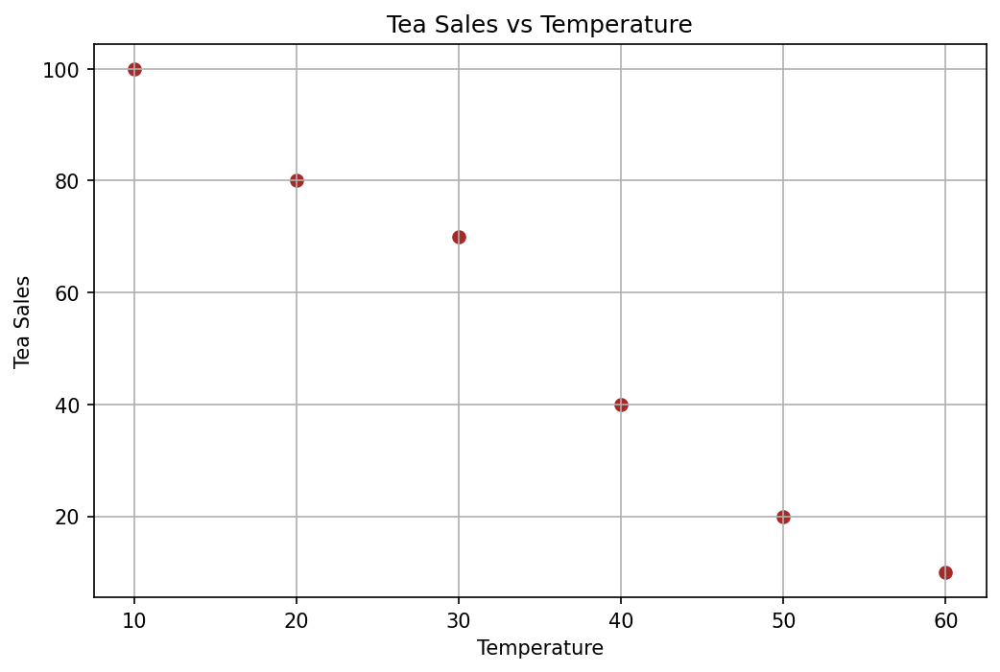
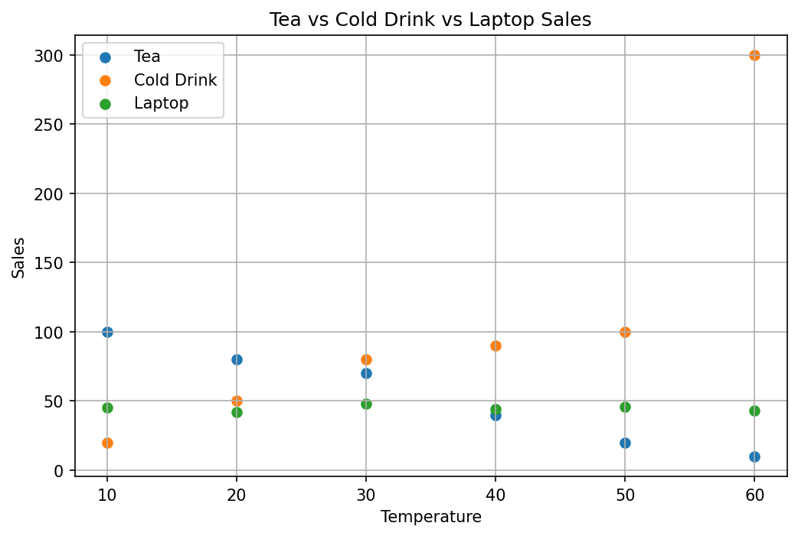
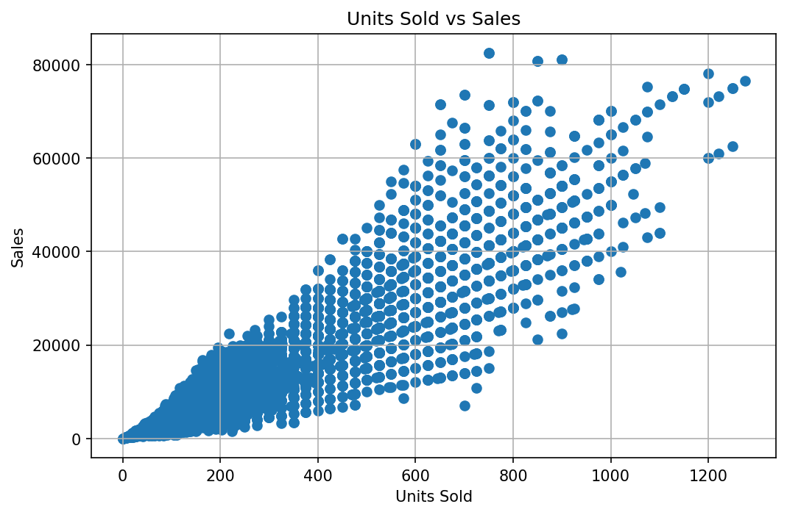
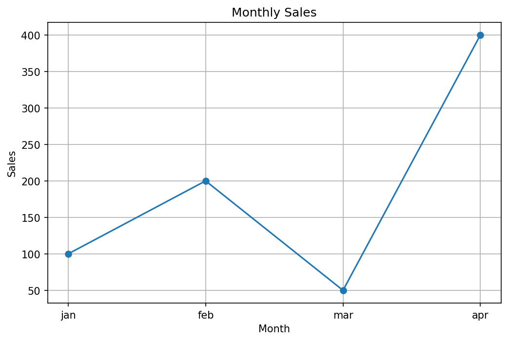
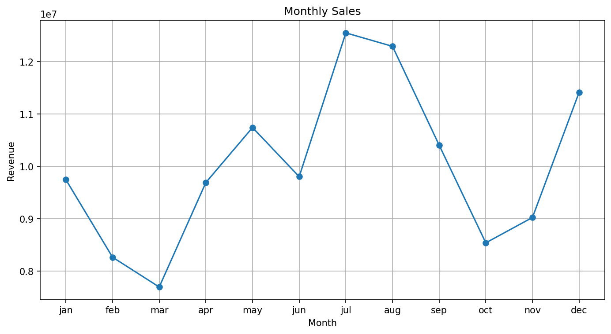
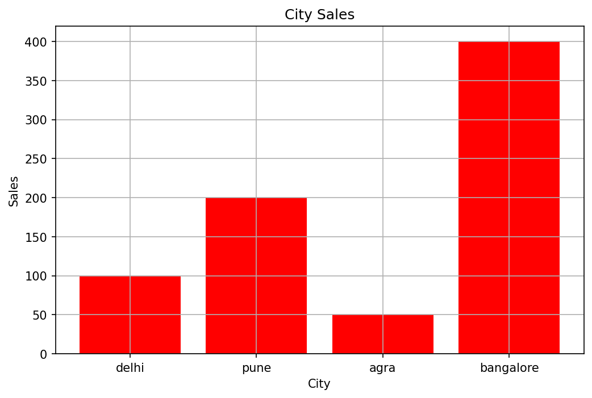
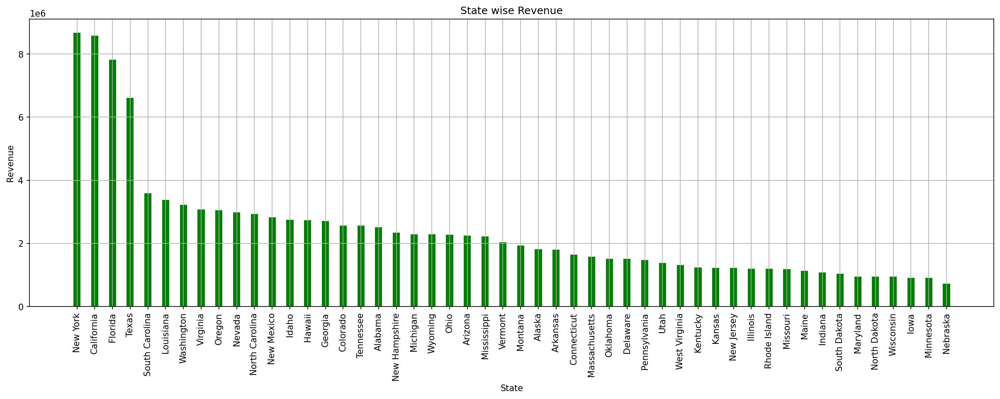
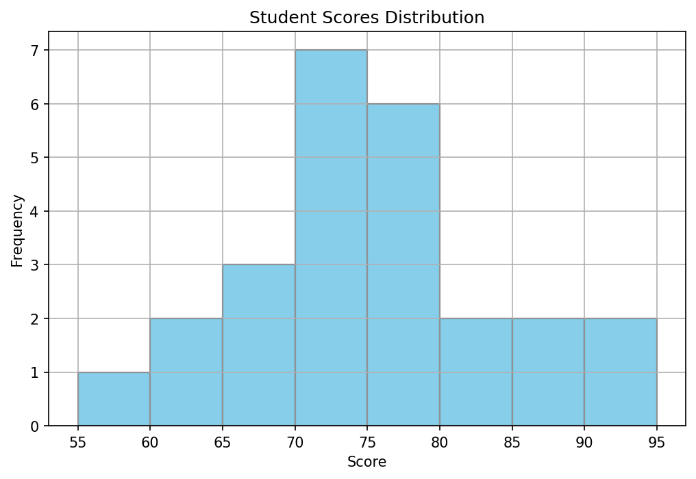

# New Matplotlib

### MATPLOTLIB CHARTS&#x20;

Matplotlib is a library that we use for data visualization. Charts covered in this document:

1. Scatter Plot
2. Line Chart
3. Bar Chart
4. Histogram
5. Pie Chart
6. Stack Plot
7. Box Plot

Install Matplotlib: pip install matplotlib

### How to install pandas? <a href="#how-to-install-pandas" id="how-to-install-pandas"></a>

Run this command in your terminal:

```python
pip install matplotlib
```


## 1.SCATTER PLOT&#x20;

***

### What is a Scatter Plot?

A scatter plot is a chart that shows specific data points on a graph in the form of bubbles, where each bubble represents two values (x and y) for the same record. It is mainly used to see what kind of a relationship (pattern= positive/negative/neutral) exists between two numerical variables.

**When to use it:** Use a scatter plot when you want to check whether two numerical data are dependent on each other - for example, does one go up when the other goes up (positive relationship), does one go down when the other goes up (negative relationship), or is there no relationship at all.

**Real-life example:**

Impact of temperature on sales of tea or cold drink. Impact of sleep duration on stress or healthy     lifestyle.

***

### Example (using list values)

#### Example - 1. Negative Relationship (Tea vs Temperature)

Scatter plots can also show a NEGATIVE relationship - where one value goes down as the other goes up.

```python
temp = [10,20,30,40,50,60]
tea = [100,80,70,40,20,10]

plt.scatter(temp, tea, color='brown')
plt.title('Tea Sales vs Temperature')
plt.xlabel('Temperature')
plt.ylabel('Tea Sales')
plt.grid()
plt.show()
```

<figure><figcaption></figcaption></figure>

As temperature increases, Tea sales keep going down. This is a negative relationship - the two variables move in opposite directions.

***

#### Example - 2. Comparing Multiple Relationships (Tea vs Cold Drink vs Laptop)

Plotting more than one series on the same scatter chart lets you compare different types of relationships at a glance - positive, negative, and neutral.

```python
temp = [10,20,30,40,50,60]
tea = [100,80,70,40,20,10]
colddrink = [20,50,80,90,100,300]
laptop = [45,42,48,44,46,43]

plt.scatter(temp, tea, label='Tea')
plt.scatter(temp, colddrink, label='Cold Drink')
plt.scatter(temp, laptop, label='Laptop')
plt.title('Tea vs Cold Drink vs Laptop Sales')
plt.xlabel('Temperature')
plt.ylabel('Sales')
plt.grid()
plt.legend()
plt.show()
```

<figure><figcaption></figcaption></figure>

Tea shows a negative relationship with temperature (sales drop as it gets hotter). Cold Drink shows a strong positive relationship (sales rise sharply as it gets hotter). Laptop sales stay roughly flat across all temperatures - showing no relationship with temperature at all. This is a good example of how scatter plots help you tell a real relationship apart from no relationship.

***

### Parameters Explanation

plt.scatter(x, y) -> plots x values against y values as dots color='red' -> sets the color of the points label='...' -> name used for that series in the legend (needed when plotting more than one scatter on the same chart)

***

### Example with Dataset (Adidas US Sales Dataset)

Question: Does Units Sold have a relationship with total Sales?

```python
import pandas as pd
import matplotlib.pyplot as plt

df = pd.read_excel('Adidas US Sales Datasets.xlsx')
df['total'] = df['Price per Unit'] * df['Units Sold']

plt.scatter(df['Units Sold'], df['total'])
plt.title('Units Sold vs Sales')
plt.xlabel('Units Sold')
plt.ylabel('Sales')
plt.grid() # By default parameter axis='both' grids means on both axis x and y.
plt.show()
```

<figure><figcaption></figcaption></figure>

***

### Conclusion

The scatter plot shows a strong positive relationship between Units Sold and Sales (correlation \~0.92). As Units Sold increases, total Sales also increases. Most of the data points are clustered in the lower range of Units Sold (roughly 0-600), which means most transactions are of a normal/small size, while a smaller number of large-quantity transactions push sales much higher.

***

### Parameters Explanation

plt.scatter(x, y) -> plots x values against y values as dots color='red' -> sets the color of the points label='...' -> name used for that series in the legend (needed when plotting more than one scatter on the same chart)

## COMMON FUNCTIONS USED IN ALMOST ALL PLOTS

Before moving to the next charts, here are the functions you will see repeated in every chart type from here on. Once you understand these, you only need to learn the "chart function" itself (plt.plot, plt.bar, plt.pie, etc.) for each new chart.

**plt.title('text'):**&#x53;ets the heading/title of the chart.

**plt.xlabel('text'):** Sets the label for the x-axis (horizontal axis).

**plt.ylabel('text'):** Sets the label for the y-axis (vertical axis).

**plt.grid():** Adds gridlines to the chart, making it easier to read values.It has axis parameter that has default value 'both', also we can pass axis='x'  for getting grids only on x-axis and axis='y' for getting   grids on y-axis.

**plt.legend():** Displays a legend box showing which color/line belongs to which label. Only works if you passed label='...' inside the chart function (e.g. plt.plot(..., label='Iphone')). You can control its position, e.g. plt.legend(loc='upper left').

**plt.show():** Renders and displays the chart. Always the last line.

**plt.figure(figsize=(width, height)):** Creates a new figure and controls the size of the chart (in inches). Useful when a chart has many categories/labels and needs more space (e.g. bar chart with 50 states).

**plt.xticks(...):** Controls the tick marks/labels shown on the x-axis. Can be used to rename ticks (e.g. show month names instead of numbers 1-12) or rotate long labels: plt.xticks(rotation=90).

color / colors Sets the color(s) used in the chart. Can be a single color ('red', 'green', 'skyblue') or a list of colors for multiple categories.

**label='...':** Sets the name that will appear for that series/slice in the legend.

Note: You don't have to use all of these in every chart - use the ones that make sense for what you're trying to show.

## 2. LINE CHART

***

### What is a Line Chart?

Definition (simple English): A line chart connects data points with straight lines, in the order they occur, to show how a value changes over time or over a sequence.

**When to use it:** Use a line chart when you want to see a trend - how something increases, decreases, or fluctuates over time (days, months, years) or over an ordered sequence.

**Real-life example:**&#x20;

A business tracking its monthly revenue over the year to spot seasonal patterns, or a fitness app showing your weight trend over the past 6 months.

***

### Example (using list values)

```python
month = ['jan','feb','mar','apr']
isale = [100,200,50,400]

plt.plot(month, isale, marker='o')
plt.title('Monthly Sales')
plt.xlabel('Month')
plt.ylabel('Sales')
plt.grid()
plt.show()
```

<figure><figcaption></figcaption></figure>

***

### Example with Dataset (Adidas US Sales Dataset)

Question: What is the monthly revenue trend for Adidas sales?

```python
import numpy as np

df = pd.read_excel('Adidas US Sales Datasets.xlsx')
df['total'] = df['Price per Unit'] * df['Units Sold']
df['Invoice Date'] = pd.to_datetime(df['Invoice Date'], format='%Y-%m-%d')
df['Month'] = df['Invoice Date'].dt.month

sdf = df.groupby('Month').agg(revenue=('total','sum')).reset_index()

plt.figure(figsize=(10,4))
plt.plot(sdf['Month'], sdf['revenue'], marker='o')
plt.title('Monthly Sales')
plt.xlabel('Month')
plt.ylabel('Revenue')
plt.grid()
plt.xticks(np.arange(1,13),
           ['jan','feb','mar','apr','may','jun','jul','aug','sep','oct','nov','dec'])
plt.show()
```

<figure><figcaption></figcaption></figure>

***

### Conclusion

Monthly revenue shows clear seasonal ups and downs. Revenue drops in the first quarter, hitting its lowest point in March (\~7.69M). From April it climbs steadily, peaking in July (\~12.55M), the highest month of the year. It stays strong in August, dips again from September to October, then recovers to end the year on a high note in December (\~11.42M). This suggests two strong selling windows - the mid-year period (Apr-Jul) and the year-end period (Nov-Dec).

***

### Parameters Explanation

plt.plot(x, y) -> draws a line connecting x,y points in order marker='o' -> puts a circular marker/dot on each data point groupby('col').agg() -> groups rows by a column and calculates a summary (like sum) for each group np.arange(start, stop) -> generates an array of numbers, used here to control custom tick positions

## 3. BAR CHART

***

### What is a Bar Chart?

A bar chart uses rectangular bars to represent and compare values across different categories. The length/height of each bar shows the value for that category.

**When to use it:** Use a bar chart when you want to compare a number across different categories (not over time necessarily, just category vs category).

**Real-life example:**&#x20;

Comparing sales across different stores, comparing population across different cities, or comparing marks scored by different students.

***

### Example (using list values)

```python
city = ['delhi','pune','agra','bangalore']
isale = [100,200,50,400]

plt.bar(city, isale, color='red')
plt.title('City Sales')
plt.xlabel('City')
plt.ylabel('Sales')
plt.grid()
plt.show()
```

<figure><figcaption></figcaption></figure>

***

### Example with Dataset (Adidas US Sales Dataset)

Question: Give state-wise sales for Adidas.

```python
df = pd.read_excel('Adidas US Sales Datasets.xlsx')
df['total'] = df['Price per Unit'] * df['Units Sold']

sdf = df.groupby('State').agg(revenue=('total','sum')).reset_index()
sdf = sdf.sort_values('revenue', ascending=False)

plt.figure(figsize=(20,4))
plt.bar(sdf['State'], sdf['revenue'], width=0.4, color='green')
plt.title('State wise Revenue')
plt.xlabel('State')
plt.ylabel('Revenue')
plt.xticks(rotation=90)
plt.grid()
plt.show()
```

<figure><figcaption></figcaption></figure>

Note: If you have many categories and long names, plt.barh() (horizontal bar chart) is often easier to read than plt.bar():&#x20;

**Try  this:** plt.barh(sdf\['State'], sdf\['revenue'], color='green', height=0.5)

***

### Conclusion

New York (\~8.67M), California (\~8.58M) and Florida (\~7.82M) are the top revenue-generating states, while Nebraska (\~0.73M) and Minnesota (\~0.90M) are the lowest-performing states. This clearly tells the business which states are strong markets and which states may need more marketing focus or investigation into why sales are low.

***

### Parameters Explanation

plt.bar(x, y) -> draws vertical bars plt.barh(x, y) -> draws horizontal bars (good for long category names / many categories) width=0.4 -> controls how thick each bar is height=0.5 -> controls thickness of bars in barh() xticks(rotation=90) -> rotates x-axis labels so long names (like state names) don't overlap sort\_values(ascending=False) -> sorts data so bars appear from highest to lowest (or vice versa)

## 4. HISTOGRAM

***

### What is a Histogram?

Definition (simple English): A histogram shows the distribution of a single numerical column by splitting the data into ranges called "bins" and counting how many values fall into each bin. Unlike a bar chart, a histogram is always about one numeric variable's spread, not categories.

**When to use it:** Use a histogram when you want to understand how data is spread out

* is it evenly distributed, bunched in the middle (normal), or skewed to one side.

Types of distribution: Normal Distribution -> mean = median = mode Right-Skewed Distribution -> mean > median > mode Left-Skewed Distribution -> mean < median < mode

**Real-life example:** Looking at the distribution of exam scores in a class, or the age distribution of users on a social media app, to see if most users are young, old, or evenly spread.

***

### Simple Example (using list values)

```python
scores = [55,60,62,65,66,68,70,70,71,72,72,73,74,75,75,75,
          76,77,78,80,82,85,88,90,95]

plt.hist(scores, color='skyblue', bins=8, edgecolor='black')
plt.title('Student Scores Distribution')
plt.xlabel('Score')
plt.ylabel('Frequency')
plt.grid()
plt.show()
```

<figure><figcaption></figcaption></figure>

***

### Example with Dataset (Sleep Health and Lifestyle Dataset)

Question: What does the Age distribution of people in this dataset look like?

```python
df = pd.read_csv('Sleep_health_and_lifestyle_dataset.csv')

plt.hist(df['Age'], color='orange', bins=15, edgecolor='black')
plt.title('Age Distribution')
plt.xlabel('Age')
plt.ylabel('Frequency')
plt.grid()
plt.show()

df['Age'].mean(), df['Age'].median(), df['Age'].mode()
```

\[IMAGE: 08\_hist\_dataset.png]

***

### Conclusion

Mean Age = 42.18, Median Age = 43.0, Mode = 43. Since mean, median and mode are all very close to each other, the Age column is close to a normal distribution (not heavily skewed). This means it is safe to use the mean (average) age to describe the "typical" person in this dataset, unlike a skewed dataset where median would be more reliable.

***

### Parameters Explanation

plt.hist(data) -> plots the distribution of one numeric column bins=15 -> number of ranges the data is split into (a common rule of thumb: bins = sqrt(number of values)) edgecolor='black' -> adds a border around each bar so bars are clearly separated from each other .mean() / .median() / .mode() -> pandas functions to calculate average, middle value, and most frequent value of a column

## 5. PIE CHART

***

### What is a Pie Chart?

Definition (simple English): A pie chart is a circular chart divided into slices, where each slice represents a category's proportion (percentage) of the whole.

When to use it: Use a pie chart when you want to show how a total is split into parts - i.e. percentage/proportion of a whole. Best for a small number of categories (2-6). Common uses: market share, budget distribution, population split, sales contribution of each product.

Real-life example: Showing what percentage of a company's total sales came from Online vs In-store vs Outlet sales channels, or how a household budget is split across rent, food, and savings.

***

### Simple Example (using list values)

```
quantity = [13.3, 2.2, 8.7, 5.6]
ing = ['sugar','protein','total fat','saturated fat']

plt.pie(quantity, labels=ing, autopct='%1.1f%%',
        colors=['red','blue','green','yellow'])
plt.title('Nutrient Breakdown')
plt.show()
```

\[IMAGE: 09\_pie\_simple.png]

You can also make one slice pop out and add a shadow: plt.pie(quantity, labels=ing, autopct='%1.1f%%', colors=\['red','blue','green','yellow'], explode=\[0.1,0,0,0], shadow=True)

***

### Example with Dataset (Adidas US Sales Dataset)

Question: What is the percentage contribution of each Sales Method in Adidas sales?

```python
rdf = df['Sales Method'].value_counts().reset_index()
rdf.columns = ['Sales Method','count']

plt.pie(rdf['count'], labels=rdf['Sales Method'],
        autopct='%1.1f%%', explode=[0.1,0,0], shadow=True)
plt.title('Sales Method Share')
plt.show()
```

\[IMAGE: 10\_pie\_dataset.png]

***

### Conclusion

Online sales make up the largest share at 50.7%, followed by Outlet at 31.3%, and In-store at only 18.0%. This shows that Adidas sells more than half its volume online, and In-store is the smallest contributing channel - useful for deciding where to focus marketing or logistics investment.

***

### Parameters Explanation

plt.pie(values) -> draws slices sized according to each value's proportion of the total labels=\[...] -> names shown next to each slice autopct='%1.1f%%' -> displays the percentage on each slice, formatted to 1 decimal place explode=\[...] -> pulls a slice out from the center; the number controls how far it's pulled out (0 means it stays in place) shadow=True -> adds a drop shadow for a 3D-ish look value\_counts() -> pandas function that counts how many times each unique value appears in a column

## 6. STACK PLOT

***

### What is a Stack Plot?

Definition (simple English): A stack plot shows how multiple categories/datasets contribute to a running total over time or a sequence. Each dataset is "stacked" on top of the previous one, so the total height of the stack at any point is the sum of all categories at that point.

When to use it: Use a stack plot when you want to show both the individual contribution of each category AND the overall combined total, over time or a sequence, at the same time.

Real-life example: Showing how total company revenue is made up of revenue from Product A, B, and C each month, so you can see both the total trend and which product is driving it.

***

### Simple Example (using list values)

```
months = ['Jan','Feb','Mar','Apr','May']
product_a = [100,120,150,170,200]
product_b = [80,90,100,120,130]
product_c = [50,60,70,80,90]

plt.figure(figsize=(10,6))
plt.stackplot(months, product_a, product_b, product_c,
              labels=['Product A','Product B','Product C'],
              colors=['skyblue','orange','green'])
plt.title('Monthly Sales Stack Plot')
plt.xlabel('Months')
plt.ylabel('Sales')
plt.legend(loc='upper left')
plt.show()
```

\[IMAGE: 11\_stack\_simple.png]

***

### Example with Dataset (Adidas US Sales Dataset)

Question: How do Men's Apparel, Women's Apparel, and Men's Athletic Footwear contribute to monthly average units sold?

```
df['Month'] = df['Invoice Date'].dt.month
mdf = df.pivot_table(index='Month', columns='Product',
                      values='Units Sold').reset_index()

plt.figure(figsize=(10,6))
plt.stackplot(mdf['Month'],
              mdf["Men's Apparel"],
              mdf["Women's Apparel"],
              mdf["Men's Athletic Footwear"],
              labels=["Men's Apparel","Women's Apparel","Men's Athletic Footwear"],
              colors=['skyblue','orange','green'])
plt.title('Monthly Avg Units Sold by Product (Stacked)')
plt.xlabel('Month')
plt.ylabel('Avg Units Sold')
plt.legend(loc='upper left')
plt.show()
```

\[IMAGE: 12\_stack\_dataset.png]

***

### Conclusion

Men's Athletic Footwear consistently contributes the largest share of the stack across most months, peaking around July-August (over 290-345 avg units). Women's Apparel forms the middle layer with a fairly steady contribution throughout the year, and Men's Apparel is the smallest of the three. All three products dip together around March and October-November, and rise together around July-August, showing that the products tend to follow a similar seasonal pattern rather than moving independently.

***

### Parameters Explanation

plt.stackplot(x, y1, y2, y3, ...) -> plots multiple y-series stacked on top of each other for each x value labels=\[...] -> names for each stacked layer (used in legend) colors=\[...] -> one color per layer, in the same order as the y-series legend(loc='upper left') -> positions the legend box in a specific corner of the chart pivot\_table(index=, columns=, values=) -> pandas function that reshapes data - each unique column value becomes its own column, useful to prepare data for a stack plot

## 7. BOX PLOT

***

### What is a Box Plot?

Definition (simple English): A box plot (box-and-whisker plot) summarizes a numeric column using 5 key values: minimum, first quartile (Q1/25%), median (50%), third quartile (Q3/75%), and maximum. The "box" covers the middle 50% of the data, the line inside is the median, the "whiskers" extend to the normal range, and any points outside the whiskers are shown separately as outliers.

When to use it: Use a box plot when you want to quickly see the spread of a numeric column, compare it to other columns/groups, and spot outliers - without needing a full histogram.

Real-life example: Checking if there are unusually large orders in a sales dataset (outliers), or comparing salary spread across different departments in a company.

***

### Simple Example (using list values)

```
scores = [55,60,62,65,66,68,70,70,71,72,72,73,74,75,75,75,
          76,77,78,80,82,85,88,90,95,150]

plt.boxplot(scores, vert=False, showmeans=True, meanline=True)
plt.title('Student Scores Boxplot')
plt.xlabel('Score')
plt.grid()
plt.show()
```

\[IMAGE: 13\_box\_simple.png]

Note: the value 150 was added on purpose - it sits far away from the rest of the scores, so the box plot shows it as an outlier dot.

***

### Example with Dataset (Adidas US Sales Dataset)

Question: How is Units Sold spread out, and are there outlier transactions?

```
plt.boxplot(df['Units Sold'], vert=False, showmeans=True, meanline=True)
plt.title('Units Sold Boxplot')
plt.xlabel('Units Sold')
plt.grid()
plt.show()
```

\[IMAGE: 14\_box\_dataset.png]

***

### Conclusion

Q1 = 106, Median = 176, Q3 = 350, Mean = \~256.9. The box (middle 50% of transactions) sits between 106 and 350 units, meaning most orders are fairly small. However, the mean (256.9) is noticeably higher than the median (176), and there are a large number of points beyond the upper whisker (\~716 units) - these are large, high-quantity transactions pulling the average upward. This tells us the Units Sold data is right-skewed, with a long tail of big orders rather than being evenly spread.

***

### Parameters Explanation

plt.boxplot(data) -> draws the box-and-whisker summary of one numeric column vert=False -> draws the box horizontally instead of the default vertical orientation showmeans=True -> displays the mean as a marker on the plot (in addition to the median line) meanline=True -> draws the mean as a line instead of a dot marker
