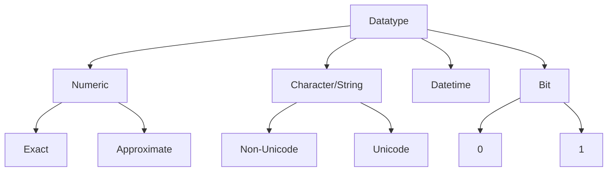

# Datatypes

## What is a Data Type?

When you create a table in SQL, every column needs a **data type** , it tells SQL _what kind of data_ will go in that column.



## 1. Numeric Data Types

Used when you want to store **numbers** like age, price, marks, quantity, etc.

Numeric types are split into two groups:

a. Exact Numeric Types

b. Approximate Numeric Types

### A) Exact Numeric Types

These store numbers **exactly as they are** ,no rounding, no approximation. we use these when accuracy matters (like money).

| Data Type  | What it stores              | Range                               | Real-life Example                             |
| ---------- | --------------------------- | ----------------------------------- | --------------------------------------------- |
| `INT`      | Whole numbers (no decimals) | -2,147,483,648 to 2,147,483,647     | Student roll number, age                      |
| `BIGINT`   | Very large whole numbers    | -9.2 quintillion to 9.2 quintillion | Population of the world, bank transaction IDs |
| `SMALLINT` | Small whole numbers         | -32,768 to 32,767                   | Number of students in a class                 |
| `TINYINT`  | Very small whole numbers    | 0 to 255                            | Star rating (1–5), floor number               |

### B) Approximate Numeric Types

These store numbers with **very large or very small values**, but they may be slightly rounded. Used in science,engineering not for money.

| Data Type | What it stores                      | Range                        | Real-life Example                                 |
| --------- | ----------------------------------- | ---------------------------- | ------------------------------------------------- |
| `FLOAT`   | Large decimal numbers (approximate) | Up to 15 digits of precision | Distance between planets, scientific measurements |
| `REAL`    | Similar to FLOAT but smaller        | Up to 7 digits of precision  | Temperature readings, sensor data                 |

**Simple Example:**

```sql
Temperature   REAL     → 36.6
Distance      FLOAT    → 149600000.5  (distance from Earth to Sun in km)
```

> &#x20;**Important:** Never use FLOAT/REAL for money because 10.10 might get stored as 10.09999... due to approximation. Always use DECIMAL for prices.

### 2.  Character / String Data Types

Used when you want to store **text**  like names, addresses, emails, descriptions, etc.

Character / String Data Types are split into two groups:

A) Non-Unicode (Regular Characters)

B) Unicode (Multi-language Characters)

#### A) Non-Unicode (Regular Characters)

Stores normal **English letters and common symbols** only. Takes **1 byte per character**.

| Data Type    | What it stores                                                                    | Max Size         | Real-life Example                            |
| ------------ | --------------------------------------------------------------------------------- | ---------------- | -------------------------------------------- |
| `CHAR(n)`    | Fixed-length text. Always uses exactly n characters (pads with spaces if shorter) | 8,000 characters | Gender field: 'M' or 'F', Country code: 'IN' |
| `VARCHAR(n)` | Variable-length text. Only uses as much space as needed                           | 8,000 characters | Student name, email address                  |
| `TEXT`       | Very long text                                                                    | Up to 2 GB       | Article content, product description         |

**CHAR vs VARCHAR :**

Imagine you have a box:

* `CHAR(10)` always gives you a box of size 10, even if you put only 3 items. The rest is empty space.
* `VARCHAR(10)` gives you a box that shrinks to fit only what you put in.

sql

```sql
-- If you store 'Ram' in CHAR(10)   → stored as 'Ram       ' (7 spaces added)
-- If you store 'Ram' in VARCHAR(10) → stored as 'Ram' (no extra space)
```

**Simple Example:**

```sql
StudentName   VARCHAR(50)  → 'Rahul Sharma'
Gender        CHAR(1)      → 'M'
Address       VARCHAR(255) → '12, MG Road, Kanpur'
```

#### B) Unicode (Multi-language Characters)

Stores text from **any language** - Hindi, Arabic, Chinese, Japanese, emojis, etc. Takes **2 bytes per character**.

| Data Type     | What it stores               | Max Size         | Real-life Example                      |
| ------------- | ---------------------------- | ---------------- | -------------------------------------- |
| `NCHAR(n)`    | Fixed-length Unicode text    | 4,000 characters | Fixed-length code in any language      |
| `NVARCHAR(n)` | Variable-length Unicode text | 4,000 characters | Name in Hindi, Arabic, or any language |
| `NTEXT`       | Very long Unicode text       | Up to 2 GB       | Multilingual article or content        |

> The **"N"** in front stands for **National** (language support).

**Simple Example:**

> ```sql
> StudentName   NVARCHAR(50)  → N'राहुल शर्मा'-- Hindi name
> CityName      NVARCHAR(100) → N'東京'    -- Tokyo in Japanese
> ```

### 3. Date and Time Data Types

Used to store **dates, times, or both** - like date of birth, order time, joining date, etc.

| Data Type       | What it stores             | Range                    | Real-life Example                                     |
| --------------- | -------------------------- | ------------------------ | ----------------------------------------------------- |
| `DATE`          | Only date (no time)        | 0001-01-01 to 9999-12-31 | Date of birth, joining date                           |
| `TIME`          | Only time (no date)        | 00:00:00 to 23:59:59.999 | Class timing, shop opening time                       |
| `DATETIME`      | Both date and time         | 1753-01-01 to 9999-12-31 | Order placed timestamp, login time                    |
| `DATETIME2`     | More precise date + time   | 0001-01-01 to 9999-12-31 | More accurate than DATETIME, preferred in new systems |
| `SMALLDATETIME` | Date + time (less precise) | 1900-01-01 to 2079-06-06 | When you don't need high precision                    |

**Simple Example:**

```sql
DateOfBirth     DATE          → 2005-08-15
ClassStartTime  TIME          → 09:30:00
OrderPlacedAt   DATETIME      → 2024-03-25 14:45:30
```

**Real-life scenario - Online Order Table:**

```sql
OrderID        INT              → 5001
CustomerName   VARCHAR(100)     → 'Priya Verma'
OrderAmount    DECIMAL(10,2)    → 1299.99
OrderDate      DATETIME         → 2024-03-25 10:30:00
DeliveryDate   DATE             → 2024-03-28
```

### 4. BIT Data Type

| Data Type | What it stores                  | Range          | Real-life Example                           |
| --------- | ------------------------------- | -------------- | ------------------------------------------- |
| `BIT`     | Only two values - true or false | 0, 1 (or NULL) | Is a student active? Is an order delivered? |

Think of it like a **light switch** -it's either ON (1) or OFF (0).

```sql
IsActive       BIT  → 1   (means Yes / True)
IsDelivered    BIT  → 0   (means No / False)
```

