# Hamburger Menu in Power BI Report

## What Is a Hamburger Menu

A **Hamburger Menu** in Power BI is a collapsible navigation menu represented by **three horizontal lines (☰)**. When a user clicks the icon, a hidden menu opens and displays links or buttons to different report pages. Clicking the icon again or the close (✖) button hides the menu. It also allows users to move between report pages while saving screen space.

It is called a **Hamburger Menu** because the three horizontal lines look like the top bun, patty, and bottom bun of a hamburger. It is commonly used in professional dashboards.

## Benefits of Using a Hamburger Menu in Power BI

1. Saves Dashboard Space
2. Provides a Clean and Professional Design
3. Improves Navigation
4. Reduces Screen Clutter
5. Enhances User Experience
6. Keeps Navigation Organized
7. Ideal for Multi-Page Reports
8. Increases Focus on Data
9. Supports Interactive Dashboards
10. Easy to Maintain
11. Provides Consistent Navigation
12. Works Well on Different Screen Sizes
13. Reduces User Confusion
14. Improves Report Presentation
15. Easy to Customize

### How to Create a Hamburger Menu

**Click on Box -----> Go to Insert option -----> Click on Image -----> Upload the horizontal lines (☰) image**

<figure>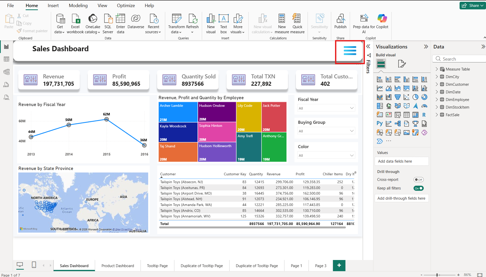<figcaption></figcaption></figure>

**Insert a rectangle from Shape -----> Drag the button over the rectangle -----> Insert the close (✖) image**

<figure>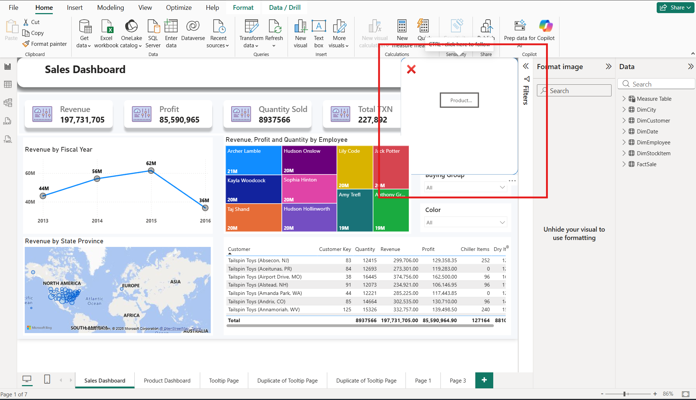<figcaption></figcaption></figure>

**Select close (✖) -----> Go to View option ------> Select Bookmarks and Section Option -----> In Selection Page select all Buttons, Images, and Shapes**&#x20;

<figure>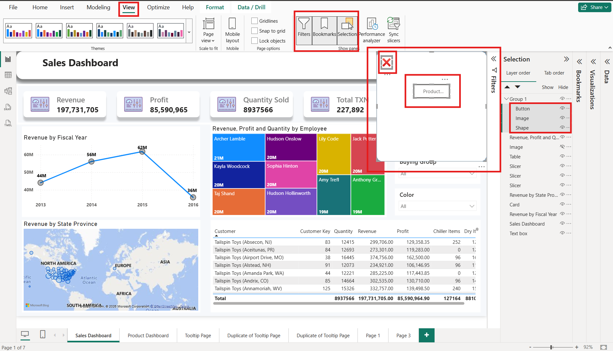<figcaption></figcaption></figure>

<strong>Create a group of all selected items over the Selection Page</strong>

<figure>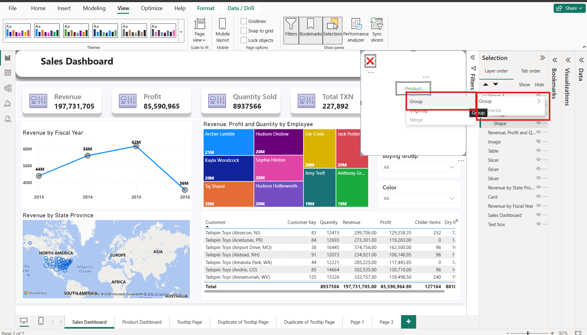<figcaption></figcaption></figure>

**Select Group1 and Image -----> Hide the Image in Selection Window -----> Show Group1 in Selection Window**&#x20;

<figure><figcaption></figcaption></figure>

**In Bookmark Window -----> Click on Add option -----> Rename the Bookmarks tab(Show Menu)**

<figure>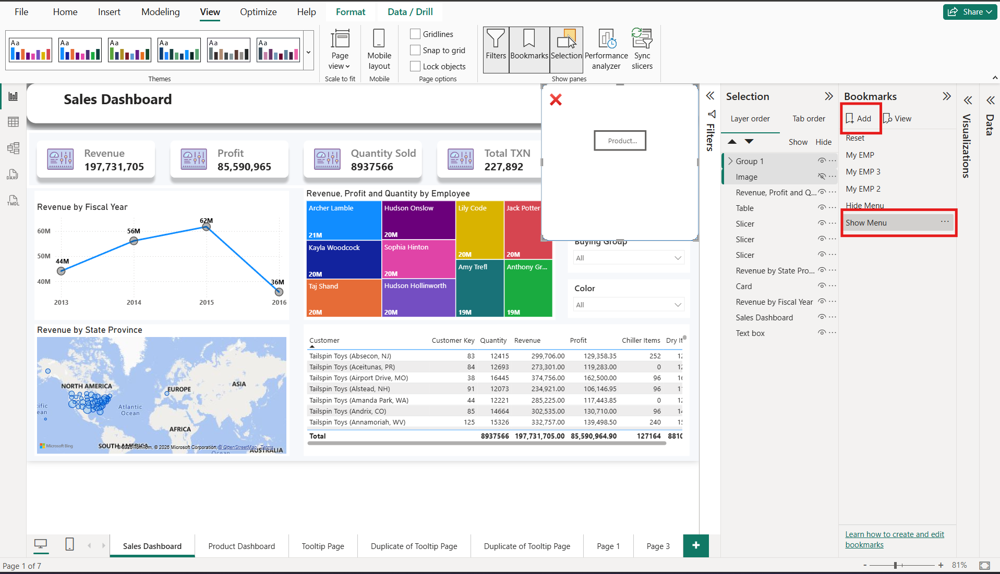<figcaption></figcaption></figure>

**Click the 3 dots on Show Menu in Bookmarks -----> First tick the Selected Visuals -----> Second un-tick the Data  -----> And last click on Update**&#x20;

<figure>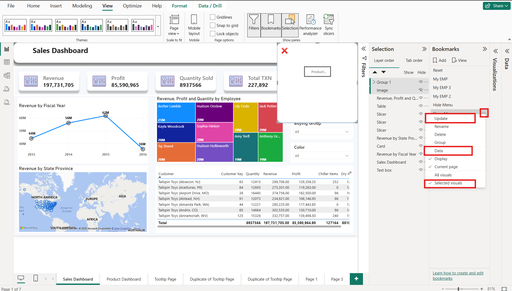<figcaption></figcaption></figure>

**Select Group1 and Image -----> Hide Group1 in Selection Window  -----> Show the Image in Selection Window**

<figure>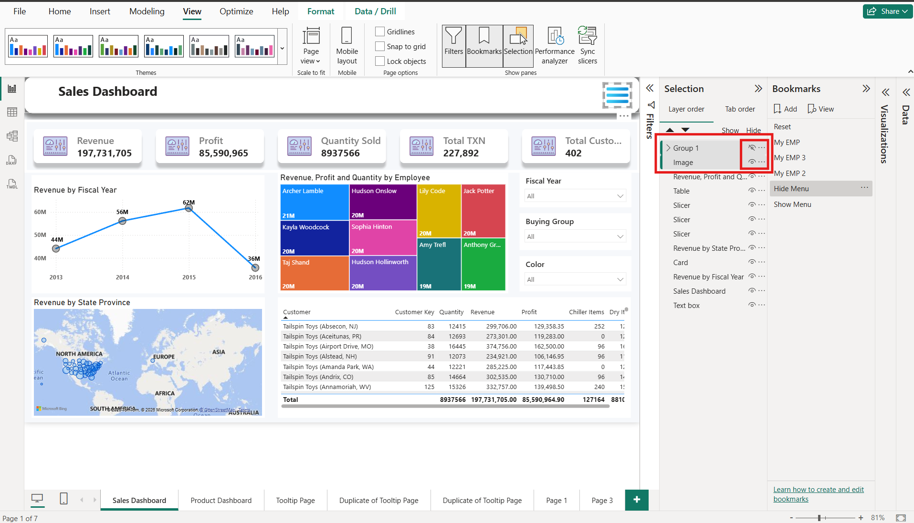<figcaption></figcaption></figure>

**In Bookmark Window -----> Click on Add option -----> Rename the Bookmarks tab(Hide Menu)**

<figure><figcaption></figcaption></figure>

**Click the 3 dots on Hide Menu in Bookmarks -----> First tick the Selected Visuals -----> Second un-tick the Data  -----> And last click on Update**&#x20;

<figure><figcaption></figcaption></figure>

<strong>Go to View Menu -----> Un-tick Bookmarks and Selection ----->Go to Format Image</strong> 

<figure>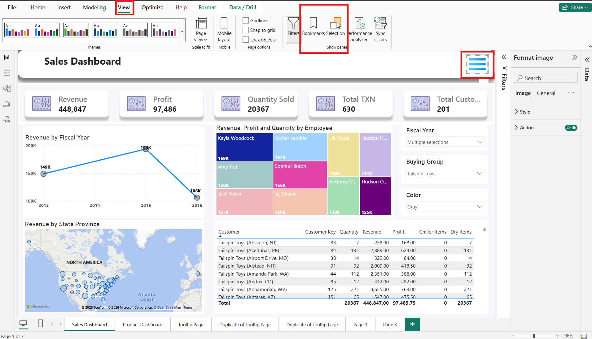<figcaption></figcaption></figure>

<strong>In Format Image -----> in Action option -----> Click "ON" option in Action</strong>

<figure>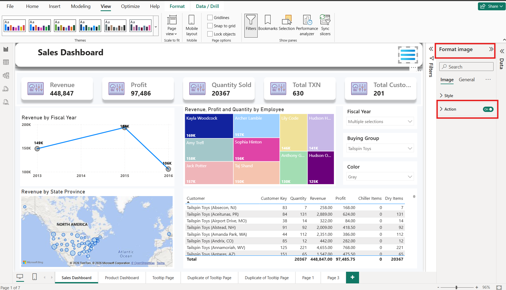<figcaption></figcaption></figure>

<strong>In Action -----> Select Action Type -----> Select Bookmark Option</strong>  

<figure>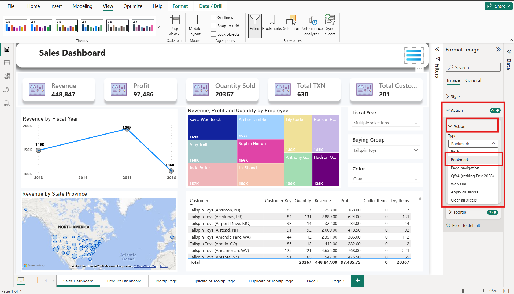<figcaption></figcaption></figure>

<strong>In Action -----> Go to Bookmark option -----> Select Show Menu</strong>

<figure>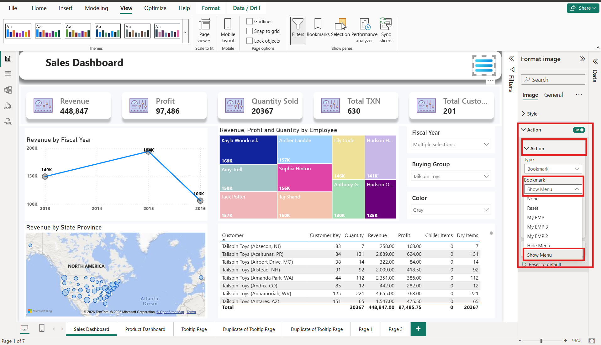<figcaption></figcaption></figure>

**Open Group1 Image -----> In Format Image -----> in Action option -----> Click "ON" option in Action** &#x20;

<figure>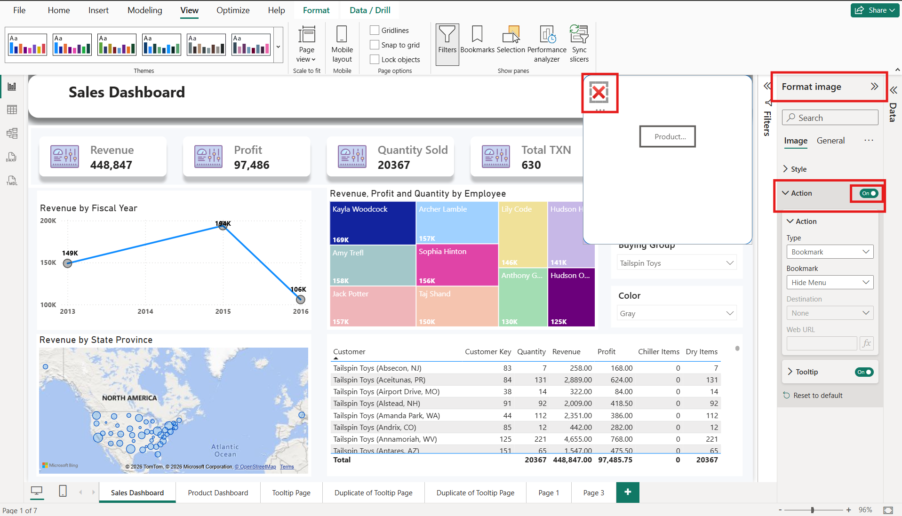<figcaption></figcaption></figure>

<strong>In Action -----> Select Action Type -----> Select Bookmark Option</strong>  

<figure>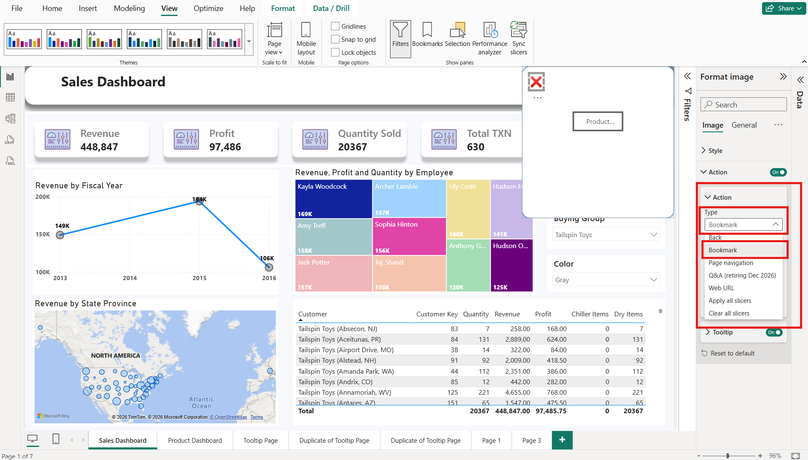<figcaption></figcaption></figure>

<strong>In Action -----> Go to Bookmark option -----> Select Hide Menu</strong>

<figure>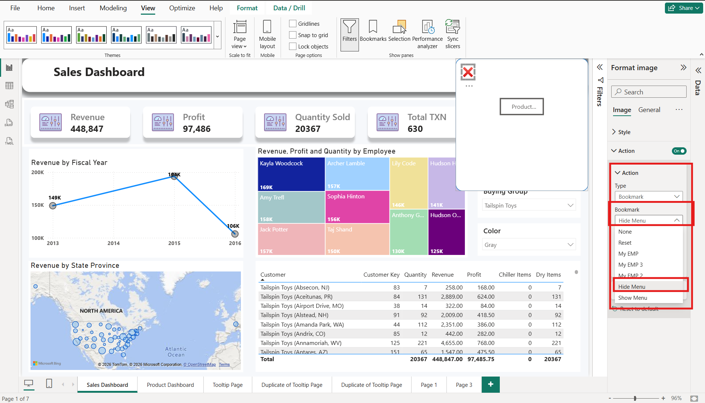<figcaption></figcaption></figure>

**Now, click on the Hamburger Menu by pressing Ctrl+left mouse click; you can access the Hamburger icon.**

## How the Hamburger Works Internally

Dashboard Opens ↓ Menu Hidden ↓ User Clicks on "☰" (CTRL + Left mouse click) ↓ Bookmark Open (Menu_Open) ↓ Menu Group Visible ↓ Navigate to Selected Page (Click on Buttons) ↓ Dashboard Opens ↓ User Clicks on Close (✖)  (CTRL + Left mouse click)  

