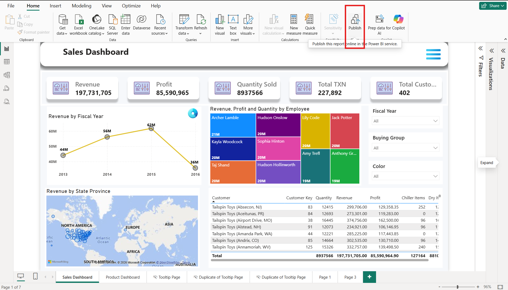
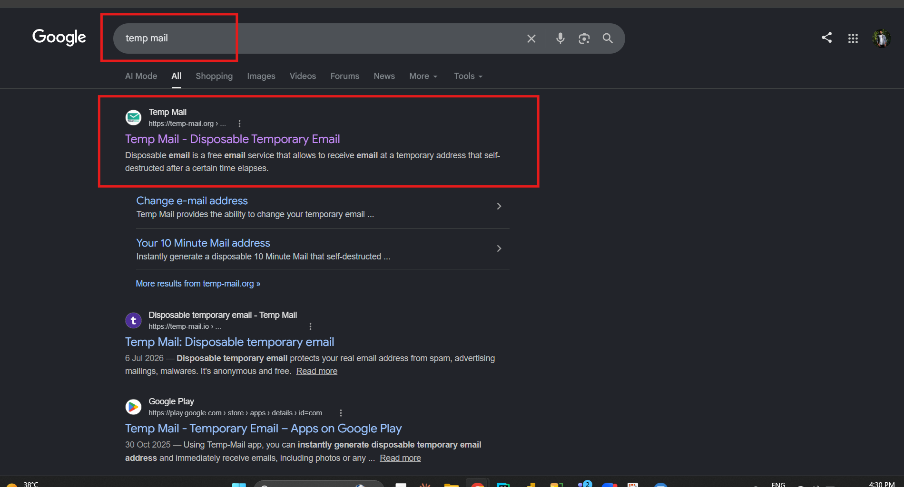
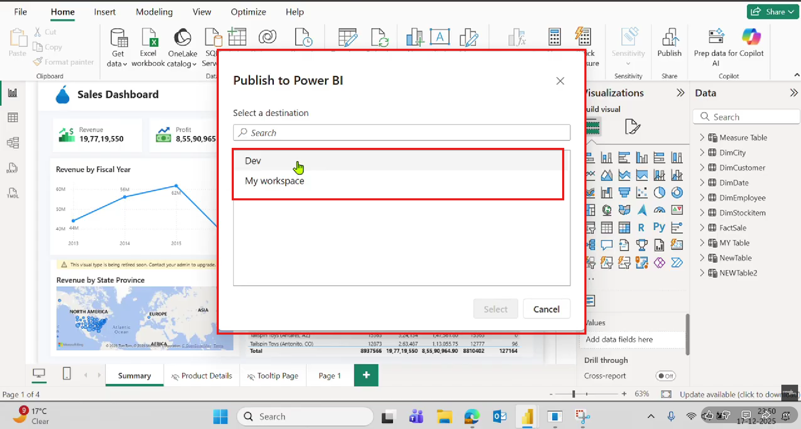
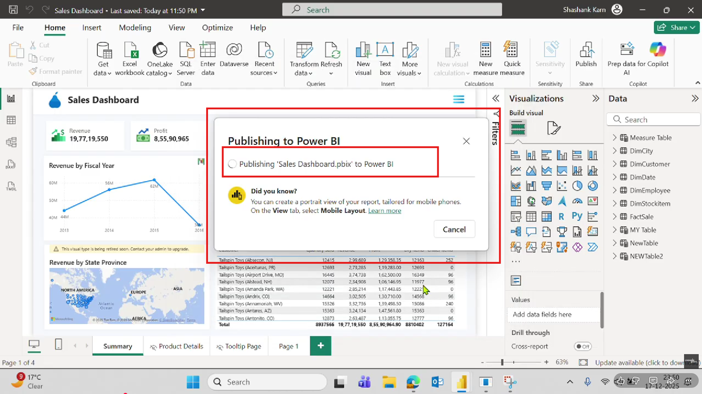

# 14. Power BI Service

## What is Power BI Service?

**Power BI Service** is Microsoft's **cloud-based online platform** where you can publish, store, share, refresh, and collaborate on Power BI reports and dashboards.

In simple words, Power BI Desktop is used to create reports, while Power BI Service is used to publish, access, share, and manage those reports online.

#### **Think of it like this:**

* **Power BI Desktop = Designing a report on your computer.**
* **Power BI Service = Publishing the report online so it can be accessed from anywhere.**

### Why Do We Upload Reports to Power BI Service?

Suppose you create a Sales Dashboard in Power BI Desktop.

If you keep it only on your laptop:

* Only you can see it.
* Nobody else can access it.
* Reports cannot be viewed online.
* Sharing becomes difficult.

If you publish it to Power BI Service:

* Your team can access it online.
* Managers can open it in a browser.
* Reports can be refreshed automatically.
* Dashboards can be created.
* Reports can be shared securely.

### Prerequisites Before Publishing

Before publishing, make sure you have:

✔ Power BI Desktop installed

✔ Microsoft account (Work or School Account)

✔ Power BI Service account

✔ Internet connection

✔ Saved Power BI (.pbix) file      &#x20;

### Workflow of Publishing a Report

Create Report in Power BI Desktop ↓ Save (.pbix) File ↓ Click Publish ↓ Sign in to Microsoft Account ↓ Select Workspace ↓ Upload to Power BI Service ↓ Open Report in Web Browser ↓ Share with Team Members

## Step-by-Step Guide to Upload a Report

### Step 1: Open Power BI Desktop

Open your completed Power BI report.

**Example**:

File = Sales Dashboard.pbix

<figure><figcaption></figcaption></figure>

### Step 2: Save the Report

**Click**

File ↓ Save or  Press <strong>(Ctrl + S)</strong>

<figure><figcaption></figcaption></figure>

### Step 3: Click Publish

At the top ribbon

Home ↓ Publish

Power BI asks you to sign in if you haven't already.

<figure><figcaption></figcaption></figure>

### Step 4: Sign In

Enter your Microsoft account

**Example** :-   abc@consoleflare.com -----> Click (Sign In)

<figure><figcaption></figcaption></figure>

<figure><figcaption></figcaption></figure>

### Step 5: Select Workspace

Power BI shows available workspaces.

**Example:**

* My Workspace
* Sales Team
* Finance Team
* HR Workspace

Choose the destination

**Click (Select)**

<figure><figcaption></figcaption></figure>

### Step 6: Publishing Starts

Power BI uploads

* Report
* Dataset
* Relationships
* Measures
* Visuals

to Power BI Service

You'll see...... Publishing... 

<figure><figcaption></figcaption></figure>

### Step 7: Success Message

Power BI displays

Success!

Your report has been published.

Click ------> Open in Power BI

### Step 8: View in Browser

Power BI opens



Your report is now online.

## What Gets Uploaded?

When you publish a report, Power BI uploads:

<table data-search="false"><thead><tr><th>Component</th><th>Uploaded</th></tr></thead><tbody><tr><td>Report Pages</td><td>✅ Yes</td></tr><tr><td>Charts</td><td>✅ Yes</td></tr><tr><td>Tables</td><td>✅ Yes</td></tr><tr><td>Measures</td><td>✅ Yes</td></tr><tr><td>DAX</td><td>✅ Yes</td></tr><tr><td>Relationships</td><td>✅ Yes</td></tr><tr><td>Dataset</td><td>✅ Yes</td></tr><tr><td>Images</td><td>✅ Yes</td></tr><tr><td>Bookmarks</td><td>✅ Yes</td></tr><tr><td>Buttons</td><td>✅ Yes</td></tr><tr><td>Tooltips</td><td>✅ Yes</td></tr></tbody></table>

## What Can You Do After Publishing?

After uploading, you can:

* Open reports anywhere.
* Create dashboards.
* Share with users.
* Schedule automatic refresh.
* Export reports.
* Pin visuals to dashboards.
* Collaborate with colleagues.
* Access reports from mobile devices.

## Business Example

Suppose a company has:

* 1 CEO
* 10 Managers
* 200 Employees

The Data Analyst creates a Sales Dashboard in Power BI Desktop.

Instead of emailing the `.pbix` file to everyone, they publish it to Power BI Service.

Now:

* The CEO can view it in a web browser.
* Managers can check sales from different locations.
* Employees with permission can access the latest data.
* Everyone sees the same version of the report.

## Benefits of Uploading to Power BI Service

* Access reports from any location with an internet connection.
* View reports on laptops, tablets, and smartphones.
* Share reports securely with colleagues.
* Create interactive dashboards by pinning visuals.
* Schedule automatic data refreshes.
* Work together using shared workspaces.
* Centralize reports in one secure location.
* Maintain version consistency across teams.
* Integrate with Microsoft Teams and other Microsoft services.
* Reduce the need to send report files by email.

## Advantages

<table data-search="false"><thead><tr><th>Advantage</th><th>Description</th></tr></thead><tbody><tr><td>Cloud Storage</td><td>Reports are stored online.</td></tr><tr><td>Easy Sharing</td><td>Share reports using permissions.</td></tr><tr><td>Mobile Access</td><td>View reports from mobile devices.</td></tr><tr><td>Scheduled Refresh</td><td>Keep data up to date automatically.</td></tr><tr><td>Collaboration</td><td>Multiple users can work together.</td></tr><tr><td>Security</td><td>Control who can view or edit reports.</td></tr><tr><td>Dashboards</td><td>Combine visuals from multiple reports.</td></tr><tr><td>Centralized Management</td><td>Store reports in one place.</td></tr><tr><td>Real-Time Access</td><td>Users always see the latest published version.</td></tr></tbody></table>

## Power BI Desktop vs Power BI Service

| Power BI Desktop        | Power BI Service                    |
| ----------------------- | ----------------------------------- |
| Create reports          | Publish and share reports           |
| Installed on a computer | Runs in a web browser               |
| Offline development     | Online collaboration                |
| Save `.pbix` files      | Store reports in the cloud          |
| Design visuals          | Build dashboards and manage sharing |

## Common Mistakes to Avoid

* Not saving the report before publishing.
* Publishing to the wrong workspace.
* Using a personal account instead of an organizational account (if required by your company).
* Forgetting to configure scheduled refresh after publishing.
* Not verifying that all visuals work correctly in the Power BI Service.

## Best Practices

* Use clear report and dataset names.
* Organize reports into appropriate workspaces.
* Test reports in Power BI Service after publishing.
* Set up scheduled refresh for reports connected to changing data.
* Use row-level security (RLS) if different users should see different data.
* Keep your Power BI Desktop file as a backup.

## Real-Life Workflow

Excel / SQL / CSV ↓ Import into Power BI Desktop ↓ Clean Data (Power Query) ↓ Create Relationships ↓ Build Visuals ↓ Create Dashboard ↓ Save Report (.pbix) ↓ Publish to Power BI Service ↓ Share with Team ↓ Schedule Refresh ↓ Users Access the Latest Report Online

