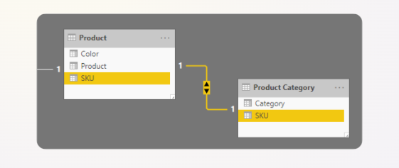
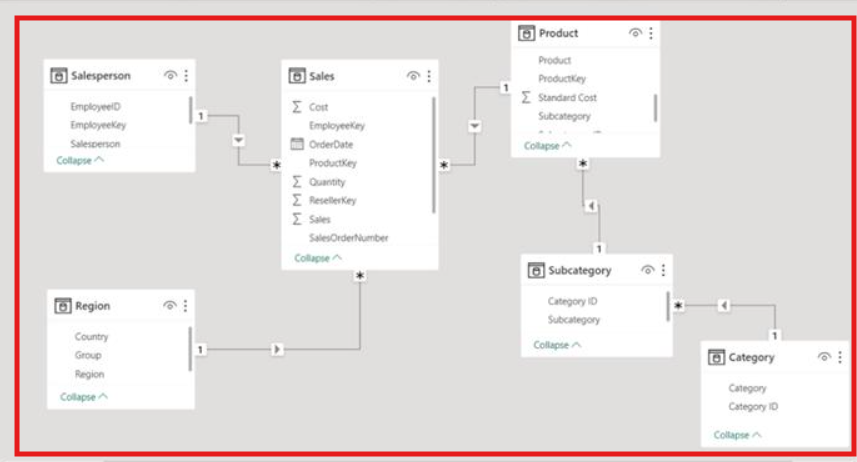

# 4. Report View, Table View and Model View

In **Power BI Desktop**, there are **3 main views**:

**1. Report View**

**2. Table View** or **Data View**

**3. Model View**

Each view has a different job.

* **Report View** is used to create charts and dashboards.
* **Table View** is used to inspect data row by row.
* **Model View** is used to connect tables.

If you are new to BI, remember this order:

1. Check the data.
2. Connect the tables.
3. Build the report.

## 1. Report View

**Report View** is where you build charts and dashboards.

You use it to:

* create visuals
* compare values
* find trends
* present business insights clearly

<figure><figcaption></figcaption></figure>

## 2. Table View or Data View

**Table View** (also called **Data View**) is the place in Power BI where we can see the data stored inside each table in rows and columns, just like an Excel sheet. **Table View** shows the actual data inside each table.

You use it to:

* inspect rows and columns
* verify values
* check data types
* create calculated columns

This view helps you confirm that the data is correct before building visuals.

<figure><figcaption></figcaption></figure>

### How Does Table View Work?

When you import data into Power BI:

1. Data is first loaded into the **Power Query Editor**.
2. In Power Query Editor, you clean and transform the data.
3. After clicking **Close & Apply**, the transformed data is loaded into the Power BI model.
4. Then you can see the final data in **Table View**.

#### Working Process :

Excel / CSV / SQL Database   ↓ Power Query Editor (Data Cleaning &#x26; Transformation)   ↓ Close &#x26; Apply   ↓ Table View (View Final Data)   ↓ Model View (Create Relationships between the Tables) 

## 3. Model View :

**Model View** shows the relationships between different tables in the Power BI data model.

#### Why is it important

* Create relationships between tables.
* Manage star and snowflake schemas.
* Define cardinality like `1:*`  and  `*:1`.
* Improve report logic and performance.

<figure><figcaption></figcaption></figure>

* #### Difference between Report View, Table View, and Model View :

Basic difference between Power BI reports-

| **View**          | **What it's for**                                                                                 |
| ----------------- | ------------------------------------------------------------------------------------------------- |
| Report View       | Build and design visuals, pages, and the final dashboard layout — the view your screenshots show. |
| Table (Data) View | Inspect raw rows of data in each table, exactly as they exist after loading.                      |
| Model View        | Manage relationships between tables (the star schema) — primary keys, foreign keys, cardinality.  |

* ### Types of tables

In Power BI, the two main table types are:

1. Fact Table
2. Dimension Table

#### 1. Fact Table

A **Fact Table** stores measurable business data.

**Main points:**

* It stores numeric values such as Sales, Profit, Quantity, and Cost.
* It usually has many rows.
* It contains keys that connect to dimension tables.
* It represents transactions or business events.

**Example:** Sales Fact Table

| OrderID | ProductID | CustomerID | DateID | SalesAmount | Quantity |
| ------- | --------- | ---------- | ------ | ----------- | -------- |
| 101     | P01       | C01        | D01    | 5000        | 2        |
| 102     | P02       | C02        | D02    | 3000        | 1        |

Here, **SalesAmount** and **Quantity** are the facts.

#### 2. Dimension Table

A **Dimension Table** stores descriptive information about the business.

Examples include product, customer, date, city, and region data.

**Main points:**

* It contains text or descriptive columns.
* It usually has fewer rows than a fact table.
* It is used for filtering, grouping, and slicing.
* It connects to fact tables.

**Example:** Product Dimension Table

| ProductID | ProductName          | Category    |
| --------- | -------------------- | ----------- |
| P01       | ConsoleFlare\_Laptop | Electronics |
| P02       | ConsoleFlare\_Mobile | Electronics |

**Example:** Customer Dimension Table

| CustomerID | CustomerName    | City   |
| ---------- | --------------- | ------ |
| C01        | ConsoleFlare\_A | Delhi  |
| C02        | ConsoleFlare\_B | Mumbai |

#### How to Create Relationships Between the Tables:

After data is loaded, Power BI may create some relationships automatically. You should still check them manually. Make sure the correct columns are connected. You can also delete wrong relationships.

You can also create relationships manually in two ways:

* Drag and Drop
* Manage Relationships

1. **Drag and Drop** creates a relationship by connecting a common column from one table to the matching column in another table.

* Quickly create relationships.
* Connect fact and dimension tables.
* Enable filtering across tables.

<figure><figcaption></figcaption></figure>

#### Example

Suppose you have:

**Sales Table**

* Customer\_ID
* Product\_ID
* Sales\_Amount

**Customer Table**

* Customer\_ID
* Customer\_Name

You can drag **Customer\_ID** from the Sales table to **Customer\_ID** in the Customer table. This creates a relationship between both tables.

<figure><figcaption></figcaption></figure>

2. **Manage Relationships** lets you create, edit, delete, and view relationships manually.

* Create relationships when Power BI does not detect them automatically.
* Modify existing relationships.
* Set cardinality.
* Configure cross-filter direction.

<figure><figcaption></figcaption></figure>

<strong>Click on Manage Relationships ------> Select New Relationships</strong>

<figure><figcaption></figcaption></figure>

In this example, **FactSale** is connected to **DimDate** by the date column. This is a **Many-to-One (`*:1`)** relationship. Many sales rows can match one date row.

The cross-filter direction is **Single**. This means the Date table can filter the Sales table. This helps with monthly, quarterly, and yearly analysis.

<figure><figcaption></figcaption></figure>

* ### Types of relationships between tables

In Power BI, there are 4 main relationship types.

| Relationship Type | Symbol | Simple meaning                               |
| ----------------- | ------ | -------------------------------------------- |
| **One-to-One**    | `1:1`  | One row matches one row.                     |
| **One-to-Many**   | `1:*`  | One row matches many rows.                   |
| **Many-to-One**   | `*:1`  | Many rows match one row.                     |
| **Many-to-Many**  | `*:*`  | Many rows in both tables can match together. |

### 1. One-to-One Relationship (`1:1`)

Each record in one table matches only one record in another table.

**Example:**

**Employee Table**

| EmployeeID | Name            | City   | Area  |
| ---------- | --------------- | ------ | ----- |
| 101        | ConsoleFlare\_1 | Mumbai | Dadar |
| 102        | ConsoleFlare\_2 | Pune   | Baner |

**Salary Table**

| EmployeeID | Salary | Provident\_Fund | Years\_of\_Experence |
| ---------- | ------ | --------------- | -------------------- |
| 101        | 50,000 | 4800            | 5                    |
| 102        | 60,000 | 5600            | 7                    |

* Employee **101** has one salary record.
* Employee **102** has one salary record.

**Use case:** Employee details ↔ Employee salary

This relationship is less common in Power BI.

<figure><figcaption></figcaption></figure>

### 2. One-to-Many Relationship (`1:*`)

One record in the first table can match many records in the second table.

**Example:**

**Customer Table**

| CustomerID | CustomerName |
| ---------- | ------------ |
| C01        | Rahul        |
| C02        | Priya        |

**Orders Table**

| OrderID | CustomerID | Amount |
| ------- | ---------- | ------ |
| O101    | C01        | 1000   |
| O102    | C01        | 1500   |
| O103    | C02        | 2000   |

* Customer **C01** has multiple orders.
* Customer **C02** has one order.

**Use case:** Customer → Orders

This is the most common relationship in Power BI.

<figure><figcaption></figcaption></figure>

### 3. Many-to-One Relationship (`*:1`)

Many records in the first table match one record in the second table.

**Example:**

**Sales Table**

| ProductID | Quantity |
| --------- | -------- |
| P01       | 5        |
| P01       | 8        |
| P02       | 10       |

**Product Table**

| ProductID | ProductName |
| --------- | ----------- |
| P01       | Laptop      |
| P02       | Mobile      |

* Many sales records belong to one product.

**Use case:** Sales → Product

<figure><figcaption></figcaption></figure>

### 4. Many-to-Many Relationship (`*:*`)

Many records in both tables can be related to each other.

**Example:**

**Student Table**

| StudentID | StudentName |
| --------- | ----------- |
| S01       | Rahul       |
| S02       | Priya       |

**Course Table**

| CourseID | CourseName |
| -------- | ---------- |
| C01      | Python     |
| C02      | SQL        |

**Enrollment Table**

| StudentID | CourseID |
| --------- | -------- |
| S01       | C01      |
| S01       | C02      |
| S02       | C01      |

* Rahul can enroll in many courses.
* Python course can have many students.

**Use case:** Students ↔ Courses

<figure><figcaption></figcaption></figure>

### Types of Schema in Power BI

In Power BI, a **Schema** is the way tables are organised and connected with each other in the data model. There are mostly 3 types of schema in Power BI:

1. Star Schema
2. Snowflake Schema
3. Hybrid Schema

#### 1. Star Schema  ⭐

A Star Schema is a data model in which one central Fact Table is connected directly to multiple Dimension Tables. The structure looks like a star, so it is called a Star Schema.

<figure><figcaption></figcaption></figure>

**Structure:**

* One Fact Table (contains numeric values or transactions)
* Multiple Dimension Tables (contain descriptive information)

**Example:**

**Fact\_Sales**

| Product\_ID | Customer\_ID | Date\_ID | Sales |
| ----------- | ------------ | -------- | ----- |
| P101        | C001         | D001     | 5000  |
| P102        | C002         | D002     | 3000  |

**Dim\_Product**

| Product\_ID | Product\_Name |
| ----------- | ------------- |
| P101        | Laptop        |
| P102        | Mobile        |

**Dim\_Customer**

| Customer\_ID | Customer\_Name |
| ------------ | -------------- |
| C001         | Amit           |
| C002         | Priya          |

**Narrative:**\
A company stores sales transactions in **Fact\_Sales** and product/customer details in separate dimension tables. The Fact table is directly connected to all dimensions, forming a star shape.

#### 2. Snowflake Schema  ❄️

A Snowflake Schema is an extension of Star Schema where dimension tables are further divided into additional tables. The structure looks like a snowflake.

<figure><figcaption></figcaption></figure>

**Example:**

**Fact\_Sales**

| Product\_ID | Sales |
| ----------- | ----- |
| P101        | 5000  |
| P102        | 3000  |

**Dim\_Product**

| Product\_ID | Category\_ID | Product\_Name |
| ----------- | ------------ | ------------- |
| P101        | C01          | Laptop        |
| P102        | C02          | Mobile        |

**Dim\_Category**

| Category\_ID | Category\_Name |
| ------------ | -------------- |
| C01          | Electronics    |
| C02          | Smartphones    |

**Narrative:**\
Instead of storing category information in the Product table, it is stored separately in **Dim\_Category**. This creates extra relationships and a snowflake-like structure.

#### 3. Hybrid Schema

A Hybrid Schema is a data model that combines the features of Star Schema and Snowflake Schema to achieve both simplicity and better data organization.

<figure><figcaption></figcaption></figure>

**Example:**

Suppose a company maintains sales data.

**Fact\_Sales**

| Product\_ID | Customer\_ID | Date\_ID | Sales |
| ----------- | ------------ | -------- | ----- |
| P101        | C001         | D001     | 5000  |
| P102        | C002         | D002     | 3000  |

**Dim\_Customer (Star Part)**

| Customer\_ID | Customer\_Name | City   |
| ------------ | -------------- | ------ |
| C001         | Amit           | Delhi  |
| C002         | Priya          | Mumbai |

**Dim\_Date (Star Part)**

| Date\_ID | Month | Year |
| -------- | ----- | ---- |
| D001     | Jan   | 2026 |
| D002     | Feb   | 2026 |

**Dim\_Product (Snowflake Part)**

| Product\_ID | Category\_ID | Product\_Name |
| ----------- | ------------ | ------------- |
| P101        | C01          | Laptop        |
| P102        | C02          | Mobile        |

**Dim\_Category**

| Category\_ID | Department\_ID | Category\_Name |
| ------------ | -------------- | -------------- |
| C01          | D01            | Electronics    |
| C02          | D02            | Smartphones    |

**Dim\_Department**

| Department\_ID | Department\_Name |
| -------------- | ---------------- |
| D01            | IT Products      |
| D02            | Mobile Devices   |

#### Narrative Theory

In a Hybrid Schema, the **Fact Table** stores transactional or numerical data such as sales, profit, or quantity.

* Some dimensions, such as **Customer** and **Date**, are kept as single tables and connect directly to the Fact table.
* Other dimensions, such as **Product**, are normalized into multiple tables like

Product → Category → Department.

## C. Report View :

**Report View** is the main workspace in Power BI where we create **charts, graphs, tables, maps, and dashboards** to analyze and present data visually.

#### Why Do We Use Report View?

We use Report View to:

* Create charts and graphs.
* Build interactive dashboards.
* Add filters and slicers.
* Compare data visually.
* Share business insights with others.

### Common visuals used in Report View

In Report View, charts help you analyse data visually. They make it easier to compare values, find patterns, and explain results.

The most commonly used visuals are:

1. **Table Visual** – To verify imported data, display detailed records.
2. **Matrix Visual** – To analyze relationships between dimensions and facts.
3. **Bar/Column Chart** – To compare measures across categories.
4. **Line Chart** – To analyze trends over time.
5. **Scatter Chart** – To study correlations between variables.
6. **Treemap** – To analyze hierarchical data.
7. **Decomposition Tree** – To drill down into measures and dimensions.
8. **Pie/Donut Chart** – Show percentages.
9. **Map** – Show location-based data.
10. **Gauge Chart** – Track targets and performance.
11. **Card** – Show KPIs.
12. **Slicer** – Filter reports.

## Complete Flow of Power BI :

Data Source (Excel / CSV / SQL) ↓ Power Query Editor (Clean &#x26; Transform Data) ↓ Close &#x26; Apply ↓ Table View (Data View) (View Loaded Data) ↓ Model View (Create Relationships) ↓ Report View (Create Charts &#x26; Dashboard)

