# 7. Customize Tooltip in Power BI

## Customize Tooltip&#x20;

**Customize Tooltip** is a feature in **Power BI** that allows you to create a **custom tooltip page** with additional visuals and information. When a user **hovers the mouse over a data point**, the custom tooltip appears and shows more details than the default tooltip.

### Why Use Customize Tooltip?

* Displays more information without opening another page.
* Makes reports more interactive.
* Saves report space.
* Improves user experience.
* Helps users understand data quickly.

<figure>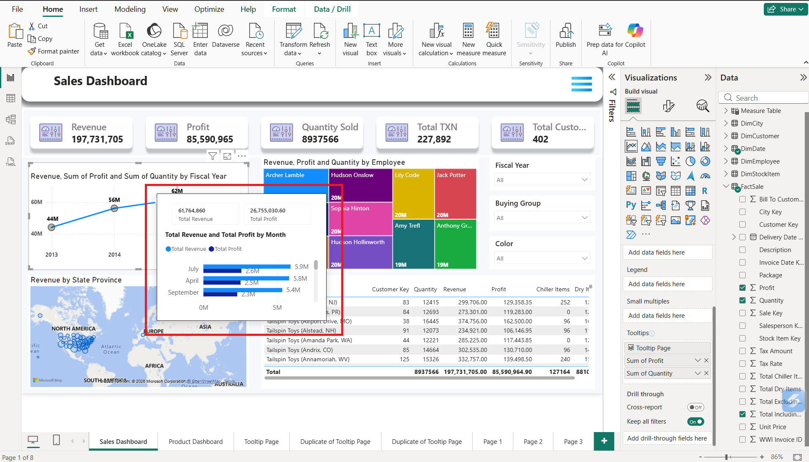<figcaption></figcaption></figure>

#### How to Create Customize Tooltip?

* Create a new page, and go to **Format Page**, then on **Page Information.**

<figure>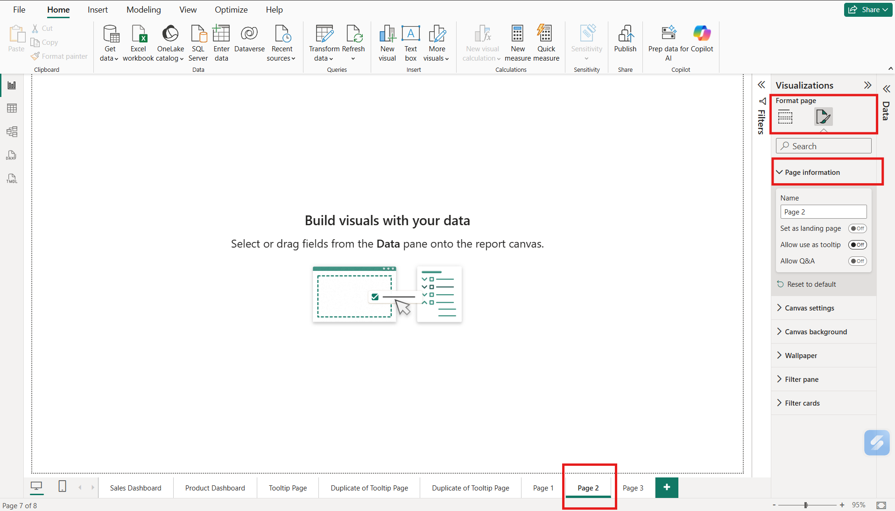<figcaption></figcaption></figure>

* Click the "**ON"** option in **Allow use as tooltip**; a new tooltip page opens on the page.

<figure>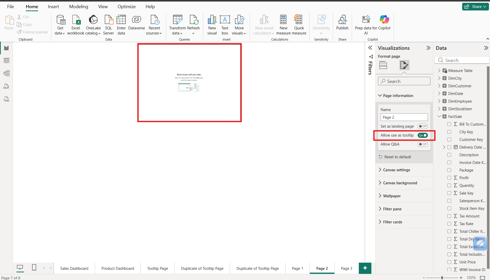<figcaption></figcaption></figure>

* On Visualization page, go to **Build Visual** and select **Table Chart**.

<figure>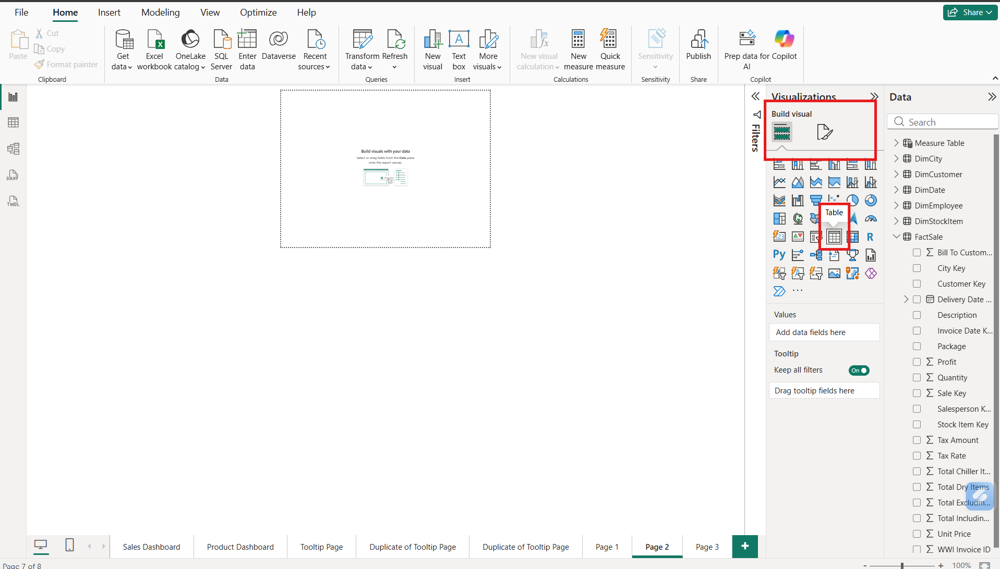<figcaption></figcaption></figure>

* Drag the values from Data to Chart Visual, like Total Including Tax and Profit from **Fact Sales.**&#x20;

<figure>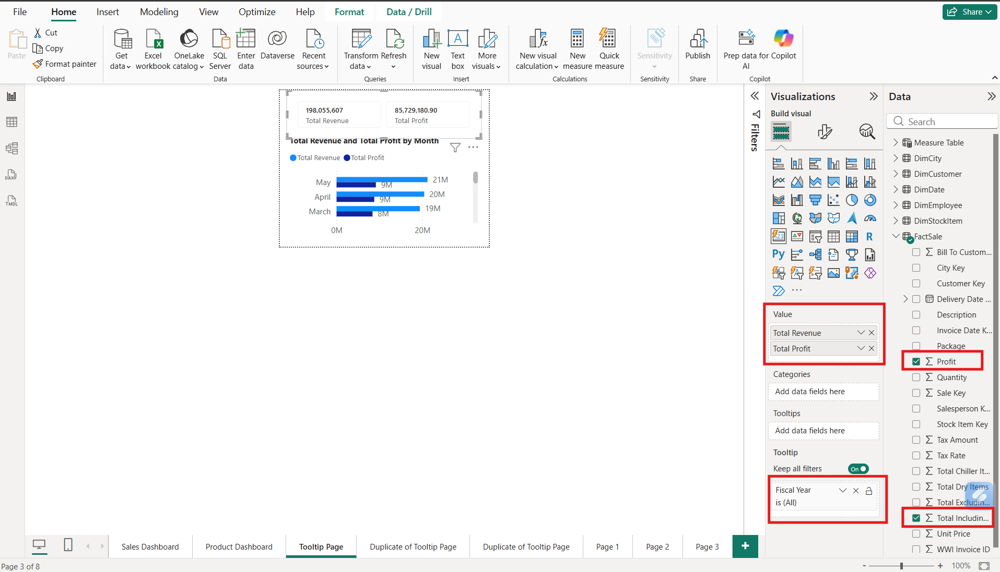<figcaption></figcaption></figure>

* Add another chart, which is a Cluster Bar Chart. Drag the values from Data to Chart Visual, like Total Including Tax and Profit from **Fact Sales.**&#x41;nd from **Dim Date,** select **Fiscal Year.**

<figure>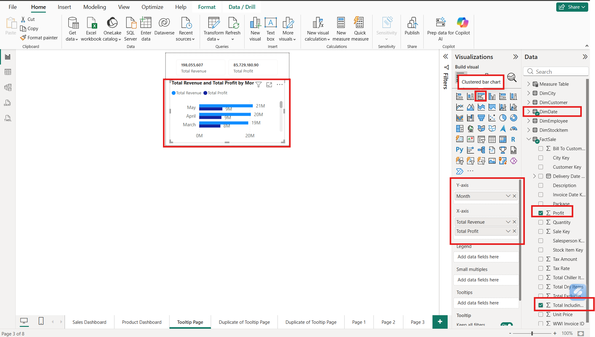<figcaption></figcaption></figure>

* Then go to the **Sales Dashboard Pag**e, select any visuals to connect with the **Customioze Tooltip**.

Select Visual ---------> Go to Visualization  ---------> Format Visual --------> <strong>ON</strong> Tooltips ---------> Go to <strong>Options Type</strong>

<figure>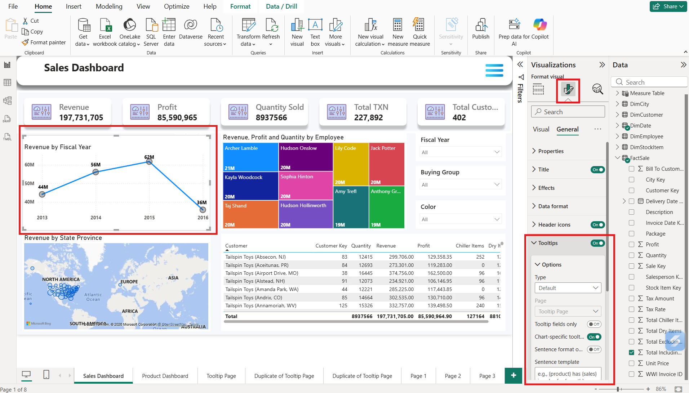<figcaption></figcaption></figure>

Go to <strong>Options Type ------></strong> Select <strong>Report page</strong> in <strong>Type</strong>

<figure>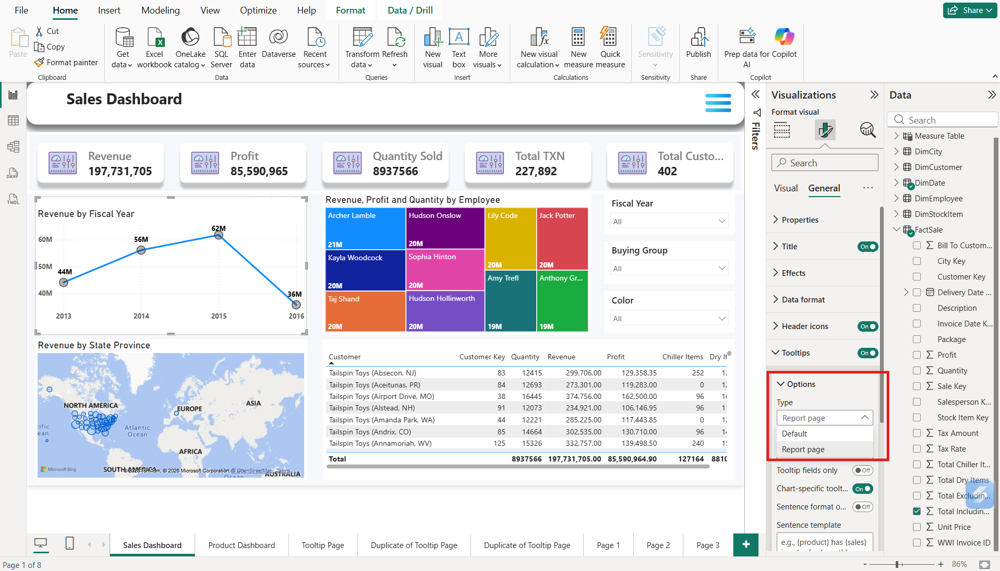<figcaption></figcaption></figure>

In <strong>Options</strong> -----> <strong>Page</strong> ----->Select Created <strong>Tooltip page</strong>

<figure>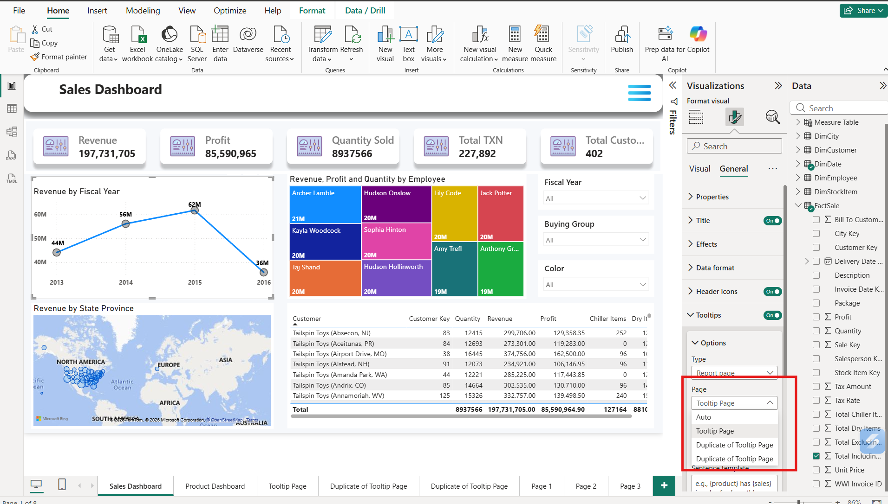<figcaption></figcaption></figure>

* **Hover** over the **Line Chart**, **Customized Tooltip** appers over the chart contins with details.

<figure><figcaption></figcaption></figure>

* We can create multiple duplicate tooltip pages to connect with more visuals in the **Sales dashboard Page**.

Create a duplicate page of Custamize Tooltip -----> Select different Chart Visual -----> Go to Visualization -----> Select Format Visual -----> **ON** the Tooltip option -----> Go to **Options Type        ------>** Select **Report page** in **Type -----> Page** ----->Select the **Duplicate Tooltip page**

<figure>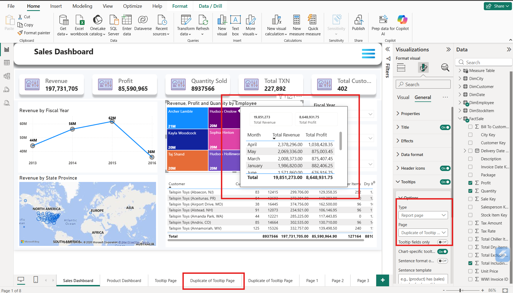<figcaption></figcaption></figure>

* Same as Above.

<figure>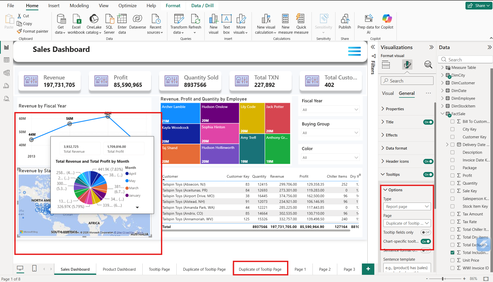<figcaption></figcaption></figure>

## How the Customize Tooltip Works Internally

Create New Page ↓ Go to Format Page ↓ Page Information ↓ Click the "<strong>ON"</strong> option in Allow use as tooltip ↓ Go to Build Visual and select Table Chart ↓ Drag the values on Built Visual ↓ Go to Sales Dashboard ↓ Select Visual ↓ Go to Format Visual  ↓ Click the "<strong>ON"</strong> option in Tooltip ↓ Go to Options Type (Select Report Page) ↓ Go to Options Page  (Select Created Tooltip page) ↓ Hover on "Line Chart" ↓ Power BI Detects (Revenue and Profit ) ↓ Reads Customize Tooltip ↓ Applies to Current Filters ↓ Shows Customize Tooltip

