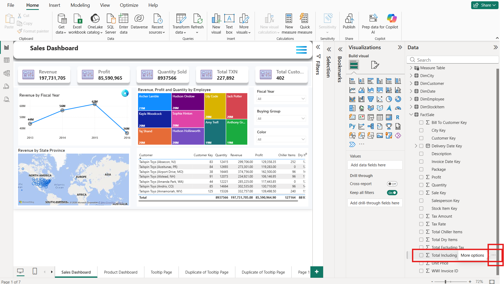
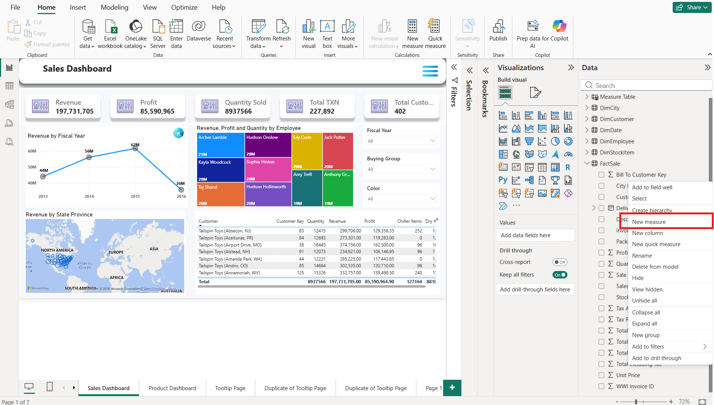
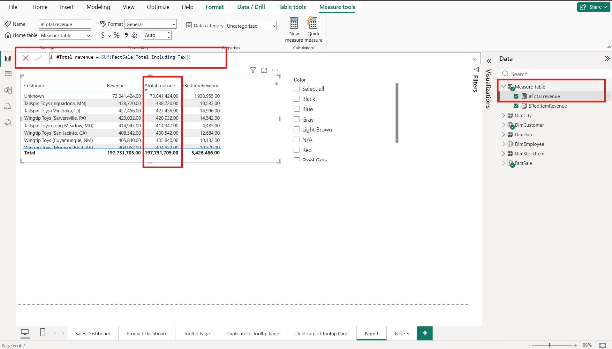
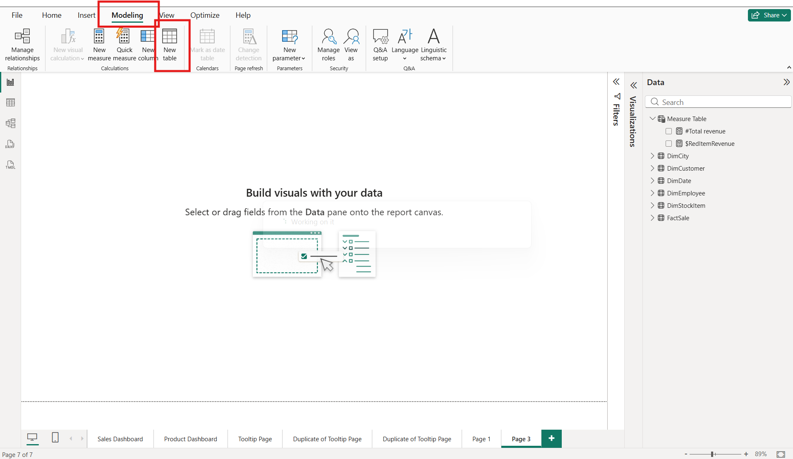
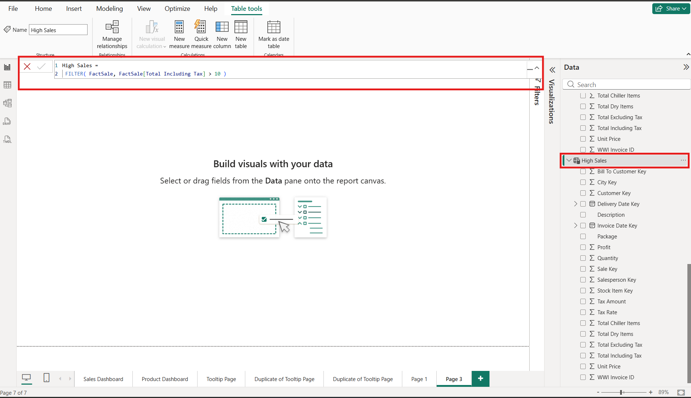

# 9. Measures & Calculated Tables In Power BI Report

## What is a Measure in Power BI?

A **Measure** is a **calculation created using DAX (Data Analysis Expressions)** that calculates results **only when needed** based on the data shown in a report.

**Example:**

* Total Sales
* Total Profit
* Average Sales
* Number of Customers
* Maximum Sales
* Minimum Sales
* Growth Percentage
* Profit Margin
* Running Total
* Year-to-Date Sales
* Previous Year Sales

### How to Create Measures&#x20;

Open your report ↓ Go to the <strong>Modeling</strong> tab ↓ Click <strong>New Measure</strong> ↓ A formula bar appears ↓ Write your DAX formula Total Sales = SUM(Sales[Sales Amount]) ↓ Press <strong>Enter</strong> <strong>(</strong>Your measure appears under the selected table with a calculator icon)

<figure><figcaption></figcaption></figure>

<figure><figcaption></figcaption></figure>

<figure><figcaption></figcaption></figure>

### Benefits of Measures

* Dynamic calculations based on filters and slicers.
* Faster and more memory-efficient than calculated columns.
* Reusable across multiple visuals.
* Ideal for KPIs, totals, averages, percentages, and ratios.
* Automatically updates when report filters change.
* Supports advanced DAX functions like `CALCULATE`, `FILTER`, `ALL`, and `DIVIDE`.

### Structure of a Measure

Measure Name = DAX Function(Table\[Column])

Example:&#x20;

Average Sales = AVERAGE(Sales\[Sales Amount])

Here

* Measure Name = Average Sales
* DAX Function = AVERAGE()
* Table = Sales
* Column = Sales Amount

### Difference Between Measure and Calculated Column

<table><thead><tr><th>Feature</th><th>Measure</th><th width="290.800048828125">Calculated Column</th></tr></thead><tbody><tr><td>Calculation</td><td>Dynamic</td><td>Static</td></tr><tr><td>Storage</td><td>Not stored</td><td>Stored in model</td></tr><tr><td>Depends on Filters</td><td>Yes</td><td>No</td></tr><tr><td>Memory Usage</td><td>Low</td><td>High</td></tr><tr><td>Updates Automatically</td><td>Yes</td><td>No</td></tr><tr><td>Used In</td><td>Charts, Cards, KPIs</td><td>Rows, Relationships, Categories</td></tr></tbody></table>

### Where Measures Are Used

Measures are commonly used in:

* Card Visuals
* KPI Visuals
* Tables
* Matrix
* Bar Charts
* Column Charts
* Pie Charts
* Line Charts
* Area Charts
* Gauge Charts
* Slicer-driven dashboards

### How Measures Work

Data Tables ↓ Create Measure (DAX Formula) ↓ Measure calculates values ↓ Filters/Slicers applied ↓ Result changes automatically ↓ Display in Charts, Cards and Tables

### Calculated Tables in Power BI

#### What is a Calculated Table?

A **Calculated Table** in Power BI is a new table created using **DAX (Data Analysis Expressions)** instead of importing data from an external source. It is stored in the Power BI data model and is **calculated when the data model is refreshed**.

### Why Do We Use Calculated Tables?

Use calculated tables when you need to:

* Create a new table from existing data.
* Filter and store only required records.
* Combine multiple tables into one.
* Create lookup (dimension) tables.
* Build calendar/date tables.
* Create summary tables.
* Remove duplicate records.
* Support advanced data modeling.

### How to Create a Calculated Table

Open your report ↓ Go to the <strong>Modeling</strong> tab ↓ Click <strong>New Table</strong> ↓ A formula bar appears ↓ Write your DAX formula (Sales Copy =Sales) ↓ Press <strong>Enter</strong> <strong>(</strong>Power BI creates a new table in the <strong>Fields</strong> pane<strong>)</strong>

<figure><figcaption></figcaption></figure>

<figure><figcaption></figcaption></figure>

### Benefits of Calculated Tables

* Create new tables without modifying the original data source.
* Simplify complex data models.
* Build reusable lookup and dimension tables.
* Prepare data for relationships and reporting.
* Support advanced DAX calculations.
* Improve report organization.

### Structure of a Calculated Table

Table Name =
&#x20;DAX Function(...)

Example:

High Sales =
&#x20;FILTER( Sales, Sales\[Sales Amount] > 5000 )

Here:

* **Table Name** = High Sales
* **DAX Function** = FILTER()
* **Source Table** = Sales

### Difference Between an Imported Table and a Calculated Table

| Imported Table                      | Calculated Table                         |
| ----------------------------------- | ---------------------------------------- |
| Imported from Excel, SQL, CSV, etc. | Created using DAX                        |
| Data comes from external sources    | Data comes from existing Power BI tables |
| Refreshed from the data source      | Recalculated during model refresh        |
| No DAX required                     | Requires DAX formulas                    |
| Can be transformed in Power Query   | Created in the Modeling view             |

### Where Calculated Tables Are Used

Calculated tables are commonly used for:

* Date (Calendar) tables
* Product lookup tables
* Customer lookup tables
* Summary reports
* KPI support tables
* What-if parameter tables
* Bridge tables in many-to-many relationships
* Filtered subsets of large datasets

### How a Calculated Table Works

Import Data ↓ Existing Tables ↓ Write DAX Formula ↓ Power BI Creates New Table ↓ New Table Stored in Model ↓ Use in Reports, Relationships, and Visuals 

### Difference Between Calculated Table, Calculated Column, and Measure

| Feature                | Calculated Table | Calculated Column | Measure                      |
| ---------------------- | ---------------- | ----------------- | ---------------------------- |
| Creates a new table    | ✅                | ❌                 | ❌                            |
| Creates a new column   | ❌                | ✅                 | ❌                            |
| Returns a single value | ❌                | ❌                 | ✅                            |
| Uses DAX               | ✅                | ✅                 | ✅                            |
| Stored in the model    | ✅                | ✅                 | ❌ (calculated at query time) |
| Updates on refresh     | ✅                | ✅                 | Dynamic with filter context  |

