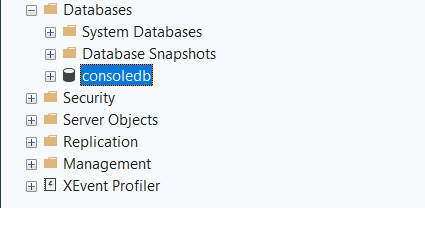
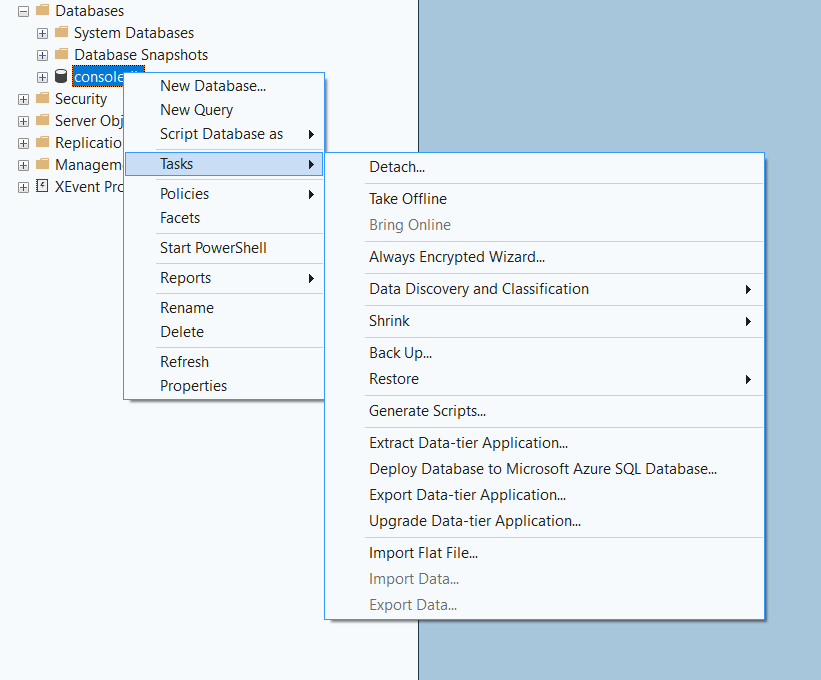
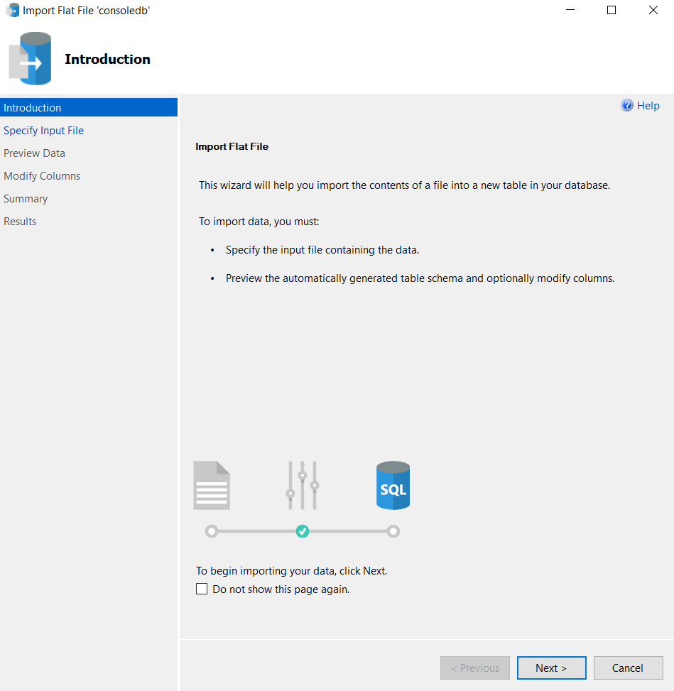
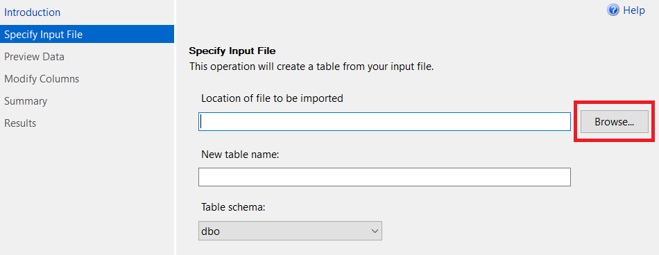
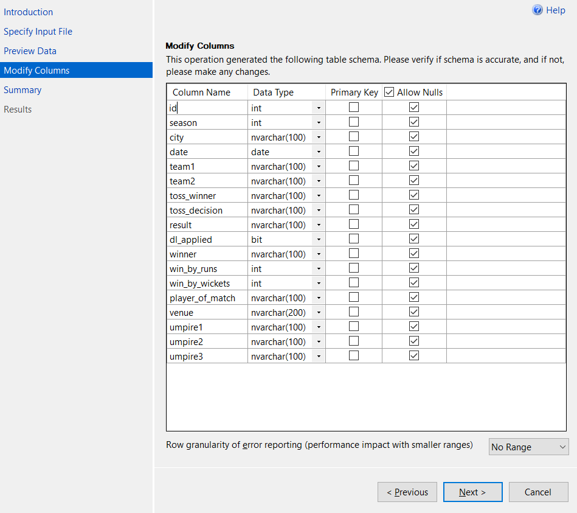
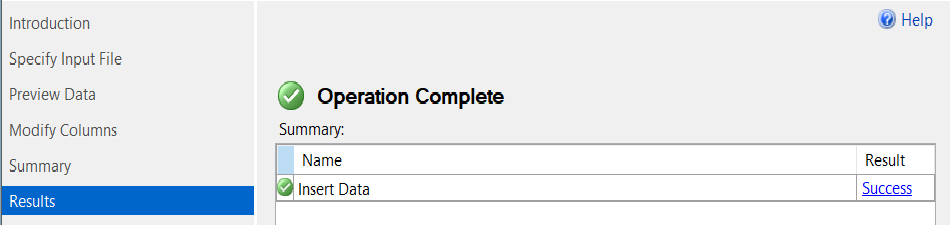
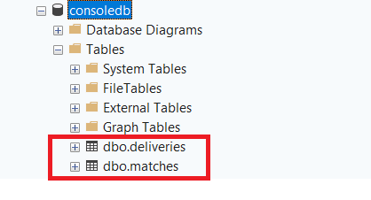

# Importing file in Database

### What is Data Import?

When you have data sitting in an Excel or CSV file outside the database, it is not useful to SQL yet. Importing means **bringing that outside data into SQL Server** so you can query, analyze and work with it.

Think of it like this: You have a notebook full of student marks but until you enter those marks into the school system, no one can use them. Importing is that process of bringing data **into the system.**

#### Files We Are Importing





### Step 1 : Open SSMS and Connect to Database

1. Open **SQL Server Management Studio (SSMS)**
2. Connect to your server
3. In the **Object Explorer** on the left ,select the database where you want to import the data
4. If you do not have a database yet, create one first.

### Step 2 : Import the File Using Import Wizard

* In **Object Explorer** ,right click on your database

<figure><figcaption></figcaption></figure>

* Go to **Tasks**
* Click on **Import Flat File**&#x20;

<figure><figcaption></figcaption></figure>

* Click **Next**

<figure><figcaption></figcaption></figure>

* Click **Browse** and select your file

<figure><figcaption></figcaption></figure>

After selecting the file you need to import,click **Next**

* SSMS will show you a **preview of the data** ,check if it looks correct.
* Click **Next** ,now  it will show you the **column names and data types** it has detected automatically
* Review the data types,change them if needed

> after reviewing,it will look like this :&#x20;

<figure><figcaption></figcaption></figure>

* Click **Next** and then **Finish**

<figure><figcaption></figcaption></figure>

> Repeat the same steps for the `deliveries` file.

> On you object explorer,click on your **Databases,** then click on your **database** (**consoledb),**&#x79;ou will see **Tables ,**&#x63;lick on **Tables,**
>
> **You can see the files you have imported**

<figure><figcaption></figcaption></figure>

### Step 3 : Verify the Import

After importing, always check if the data came in correctly:

Check if the table was created:

```sql
SELECT * FROM matches;
SELECT * FROM deliveries;
```

If data looks correct ,your import is complete and the data is ready to use.
