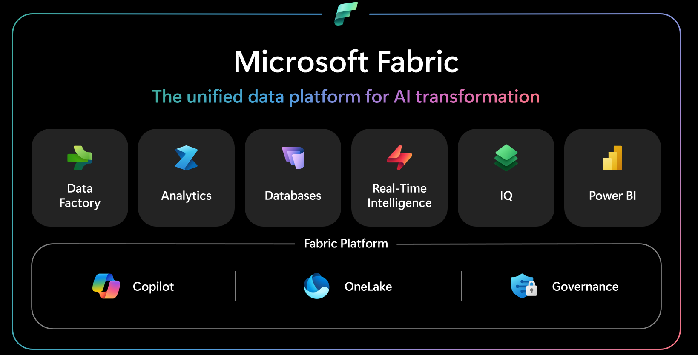

# Introduction to Microsoft Fabric

Microsoft Fabric is an end-to-end analytics platform that integrates multiple data tools into a single SaaS platform. It combines services like:

* Data Engineering
* Data Factory (ETL)
* Data Science
* Data Warehouse
* Real-Time Analytics
* Power BI

All these services work on one shared storage called OneLake.

**Note:**

* Earlier we needed multiple tools (Azure Synapse, Data Factory, Power BI).
* Fabric provides one unified platform.

<figure><figcaption></figcaption></figure>

**OneLake Architecture**

OneLake is built into the platform and serves as a single store for all organizational data.

OneLake is built on ADLS (Azure Data Lake Storage) Gen2. It simplifies the user experience by removing the need to understand complex infrastructure details like resource groups, RBAC, Azure Resource Manager, redundancy, or regions. You don't need an Azure account to use Fabric.

**Nutshell:**

OneLake is the central storage layer of Microsoft Fabric. It is similar to OneDrive for Data.

**Features:**

* Single storage for entire organization
* Based on Delta Lake format
* Supports structured & unstructured data
* No need to move data between services



**OneLake Catalog**

**OneLake Catalog** helps users **discover and manage data assets**.

**Functions**

* Data discovery
* Metadata management
* Data lineage
* Governance

**Example:**

You can search datasets like:

```
Sales_Data
Customer_Data
Product_Data
```

and see **where the data came from and how it is used**.

<figure><figcaption></figcaption></figure>

