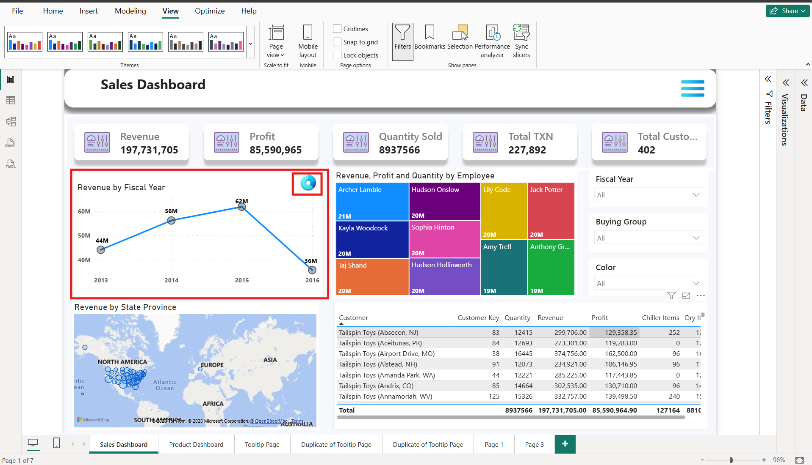
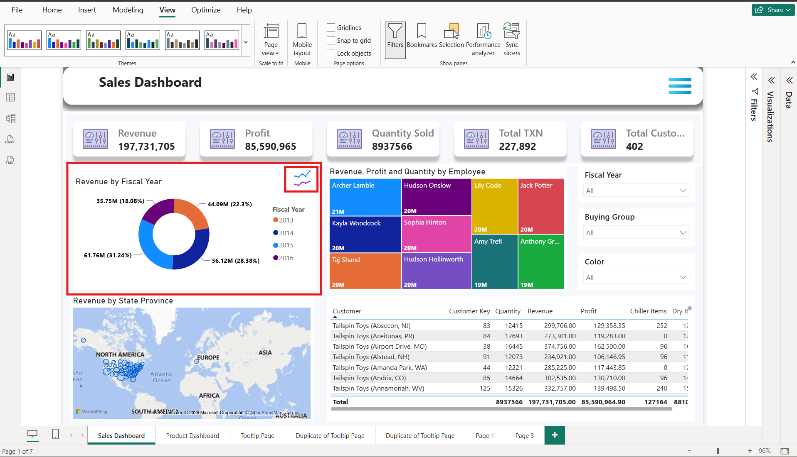
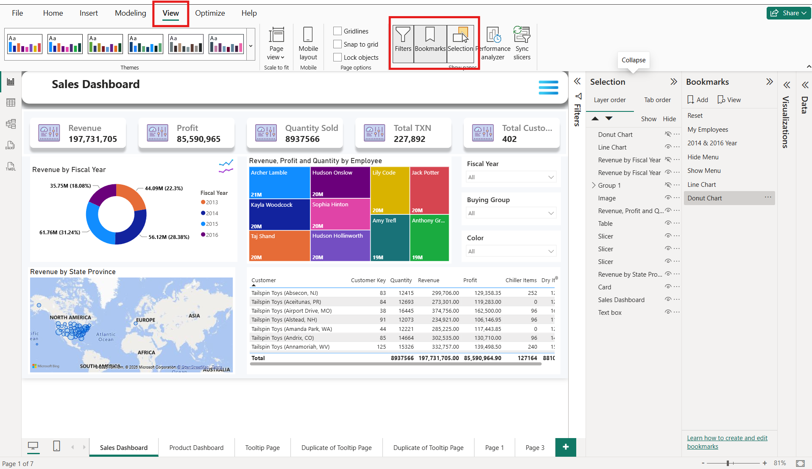
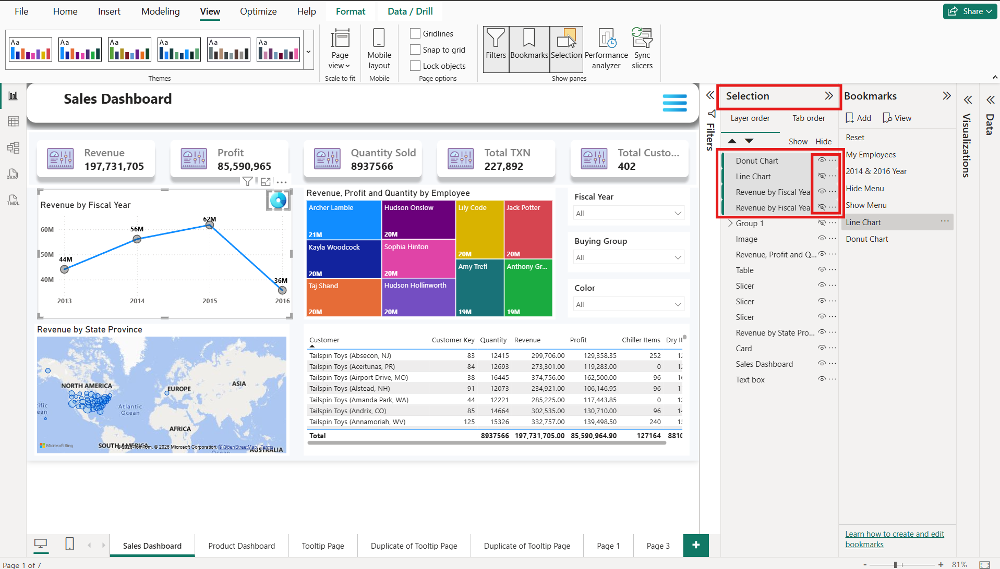
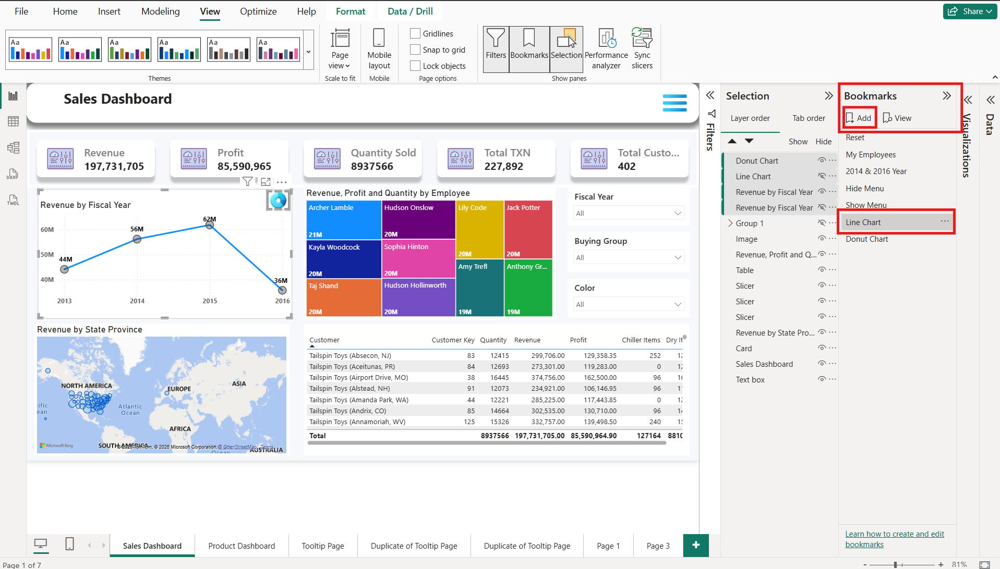
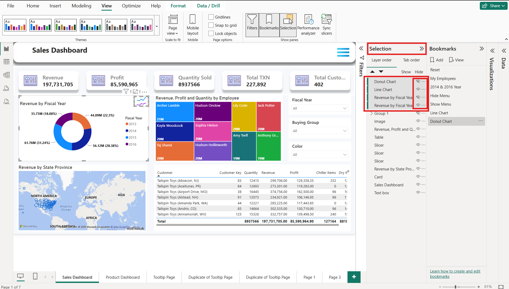
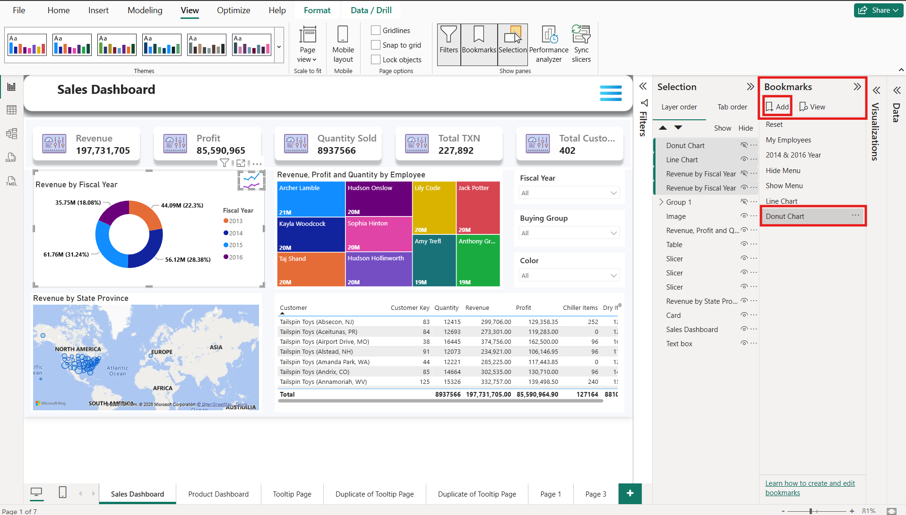
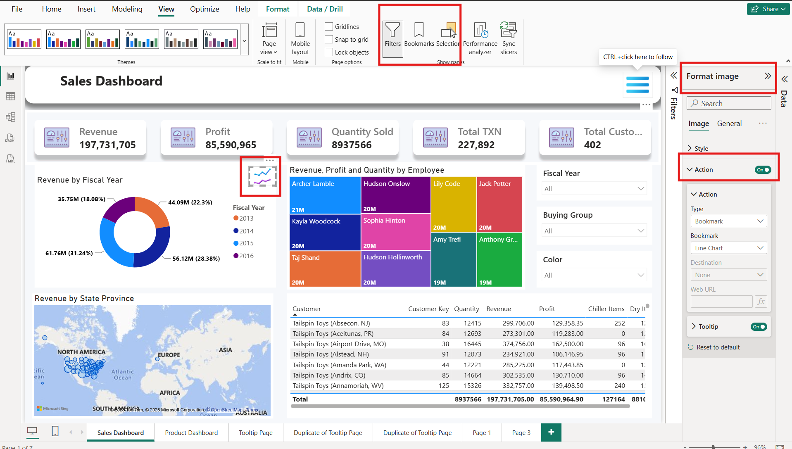
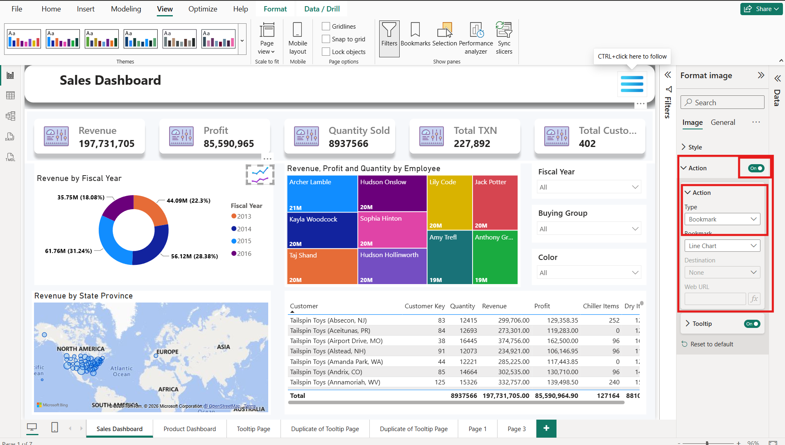

# Bookmark In Charts Visual

### What are Bookmarks in Chart Visuals?

**Bookmarks in Chart Visuals** are used to **save different views of charts** in a Power BI report. They allow users to switch between charts (such as Bar Chart, Pie Chart, Line Chart, or Table) with a single click without leaving the current report page.

#### Benefits of Using Bookmarks with Chart Visuals

These are some benefits given below :

1. Creates Interactive Dashboards
2. Improves User Experience
3. Reduces Page Navigation
4. Provides a Clean Dashboard Layout
5. Allows Multiple Views of the Same Data
6. Enhances Data Analysis
7. Supports Interactive Storytelling
8. Works with Buttons, Icons, and Images
9. Improves Dashboard Performance
10. Easy to Maintain
11. Professional Dashboard Design
12. Saves User Time
13. Supports Show/Hide Visuals
14. Ideal for Executive Reports
15. Reduces Report Complexity
16. Increases Report Flexibility
17. Improves Presentation Quality

### How to Create Bookmarks in Chart Visuals

Below mentioned step to guide how to create Chart Bookmarks as follows:

First of all, copy the line chart and then paste over the same visual with the help of **"CTRL+C"** and **"CTRL+V".**

<figure><figcaption></figcaption></figure>

 <strong>Insert a Line chart image and a Doughnut chart image over the Line Chart</strong> 

<figure><figcaption></figcaption></figure> <figure><figcaption></figcaption></figure>

<figure><figcaption></figcaption></figure>

<strong>Go to the View Option in the title bar ------> Select Filters, Bookmarks, and Selection</strong>

<figure><figcaption></figcaption></figure>

<strong>Go to the Selection option -----> Select Doughnut Chart Image, Line Chart Image, Line Chart Visual, and Doughnut Chart Visual -----> Hide Line Chart Image and Doughnut Chart Visual</strong>

<figure><figcaption></figcaption></figure>

<strong>Go to the Bookmarks option -----> Click on Add Bookmark -----> Rename the tab(Line Chart)</strong>

<figure><figcaption></figcaption></figure>

<strong>Go to the Selection option -----> Select Doughnut Chart Image, Line Chart Image, Line Chart Visual, and Doughnut Chart Visual -----> Hide Doughnut Chart Image and Line Chart Visual</strong>

<figure><figcaption></figcaption></figure>

<strong>Go to Bookmarks option -----> Click on Add Bookmark -----> Rename the tab(Doughnut Chart)</strong>

<figure><figcaption></figcaption></figure>

<strong>Unclick on Bookmarks option and Selection Option in View Option -----> Select the inset Line Chart image on Visual -----> Go to Format Image</strong>

<figure><figcaption></figcaption></figure>

<strong>Click "ON" at the Action option -----> In Action -----> Select Action Type -----> Select Bookmark Option</strong>  

<figure><figcaption></figcaption></figure>

<strong>In Action -----> Go to Bookmark option -----> Select Line Chart</strong>

<figure><figcaption></figcaption></figure>

<strong>Select the inset Doughnut Chart image on Visual -----> Go to Format Image</strong>

<figure><figcaption></figcaption></figure>

<strong>Click "ON" at the Action option -----> In Action -----> Select Action Type -----> Select Bookmark Option</strong>  

<figure><figcaption></figcaption></figure>

<strong>In Action -----> Go to the Bookmark option -----> Select Doughnut Chart</strong>

<figure><figcaption></figcaption></figure>

**Now, click on the Doughnut Chart image over the Line Chart Visual by pressing Ctrl+left mouse click; you can access the Bookmarks on the Chart Visual.**

## How the Hamburger Works Internally

 Create a duplicate of the Line Chart Visual ↓ Paste the duplicate chart over the Line Chart (Change the chart visual of the duplicate Line Chart like, Doughnut chart) ↓ Insert a Line Chart image and a Doughnut Chart image over the Line Chart  ↓ Open the View Tab ↓ Click "Add Bookmark" &#x26; "Add Selection" ↓ Open Selection Pane ↓ Selection Pane Displays All Report Visuals ↓ Select the Following Visuals                                                          ├── Doughnut Chart Image (Show)                                                ├── Line Chart Image (Show)                                              ├── Line Chart Visual (Hide)                                                       └── Doughnut Chart Visual (Hide) ↓ Required Visuals are Selected ↓ Create <strong>Bookmark 1</strong> <strong>(Line Chart)</strong> ↓ Change the visual to a <strong>Doughnut Chart</strong> ↓ Selection Pane Displays All Report Visuals ↓ Select the Following Visuals                                                          ├──  Doughnut Chart Image (Hide)                                                ├── Line Chart Image (Hide)                                                 ├── Line Chart Visual (Show)                                                          └── Doughnut Chart Visual (Show) ↓ Required Visuals are Selected ↓ Create <strong>Bookmark 2</strong> <strong>(Doughnut Chart)</strong> ↓ User Clicks on Line Chart Image (CTRL + Left mouse click) ↓ Applies to the Current page (Sales Dashboard)  

