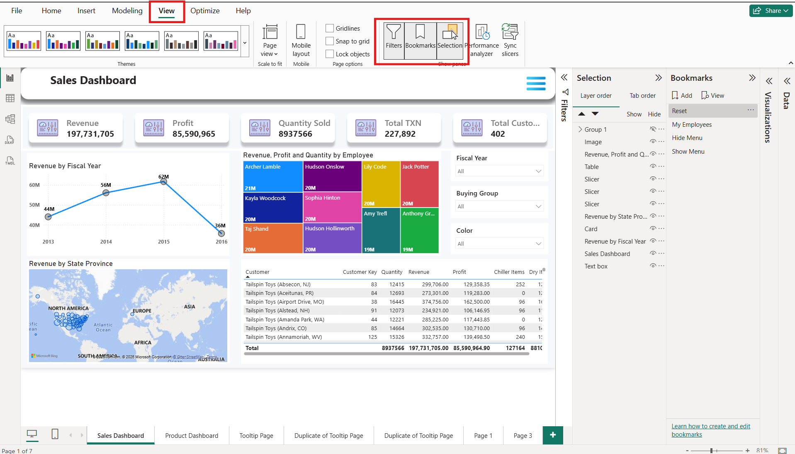
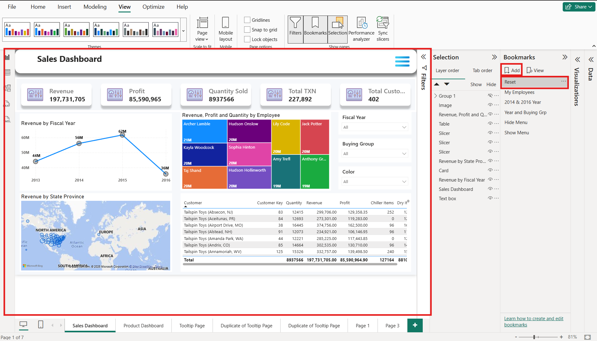
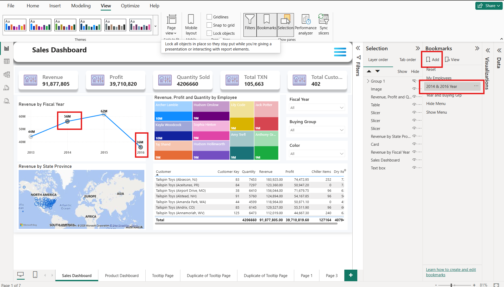
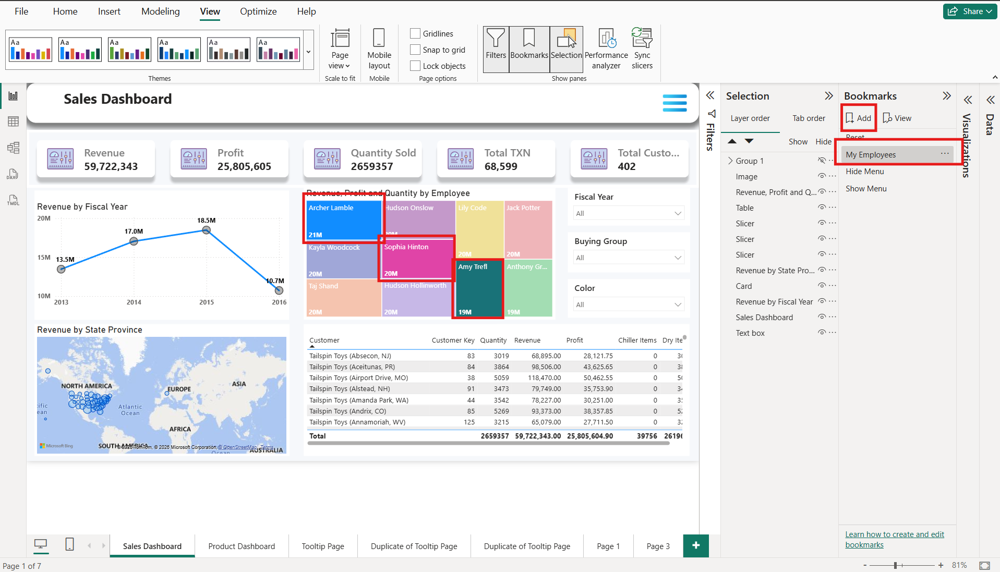

# Bookmarks In Power BI

### What are Bookmarks?

A **Bookmark** in Power BI is a feature that **saves the current state of a report page**. It remembers how the report looks at a particular moment, including filters, slicers, visual visibility, drill position, spotlight, and sorting. Later, users can return to the same saved view with a single click.

When you create a **Bookmark** in Power BI, there are three important bookmark options:

1. **Data**
2. **Display**
3. **Current Page**

Each option controls what the bookmark will save and restore.

### 1. Data

**Data** saves the current **filters, slicers, sorting, and drill position** of the report.

If the **Data** option is checked, Power BI remembers how the data is filtered and displayed.

#### What Data Captures

* Report filters
* Page filters
* &#x20;Visual filters
* &#x20;Slicer selections
* &#x20;Drill Down / Drill Up state
* &#x20;Sort order

### 2. Display

**Display** saves the **appearance of the report**, such as which visuals are visible or hidden and whether a visual is spotlighted.

It controls **how the report looks**, not the data.

#### What Display Captures

* &#x20;Show or Hide visuals
* &#x20;Spotlight status
* &#x20;Selection Pane visibility

### 3. Current Page

**Current Page** saves the report page that is open when the bookmark is created.

If enabled, clicking the bookmark automatically navigates to that page.

#### What  Current Page Captures

* &#x20;The active report page&#x20;
* &#x20;The page to open when the bookmark is selected

### How to Create a Bookmark

* Open the Power BI report where you want to create a bookmark. 

<strong>Go to the View Options ------> Select Filters, Bookmarks, and Selection</strong>

<figure><figcaption></figcaption></figure>

* First, we have to create a Reset page so that after creating any bookmark, we can reset our **Sales Dashboard Visuals**  Page&#x20;

<strong>Without any Visual selection -----> Go to Bookmarks ------> Click on Add option -----> Rename Tab(Reset)</strong>

<figure><figcaption></figcaption></figure>

<strong>Select the values over the Visuals -----> Go to Bookmarks ------> Click on Add option -----> Rename Tab(2014 &#x26; 2016 Year)</strong>

<figure><figcaption></figcaption></figure>

<strong>Select the values over the Visuals -----> Go to Bookmarks ------> Click on Add option -----> Rename Tab(My Employees)</strong>

<figure><figcaption></figcaption></figure>

## How  Edit Interaction Works Internally

Sales Dashboard ↓ Search in the title bar  ↓ Click on View Option ↓ Select Filters, Bookmarks, and Selection ↓ Select any Data on any Visuals ↓ Go to Bookmarks ↓ Click on Add option ↓ Rename the tab name (My Employees) ↓ Click on "My Employees" Bookmark ↓ Applies on Current Page (Sales Dashboard) 

