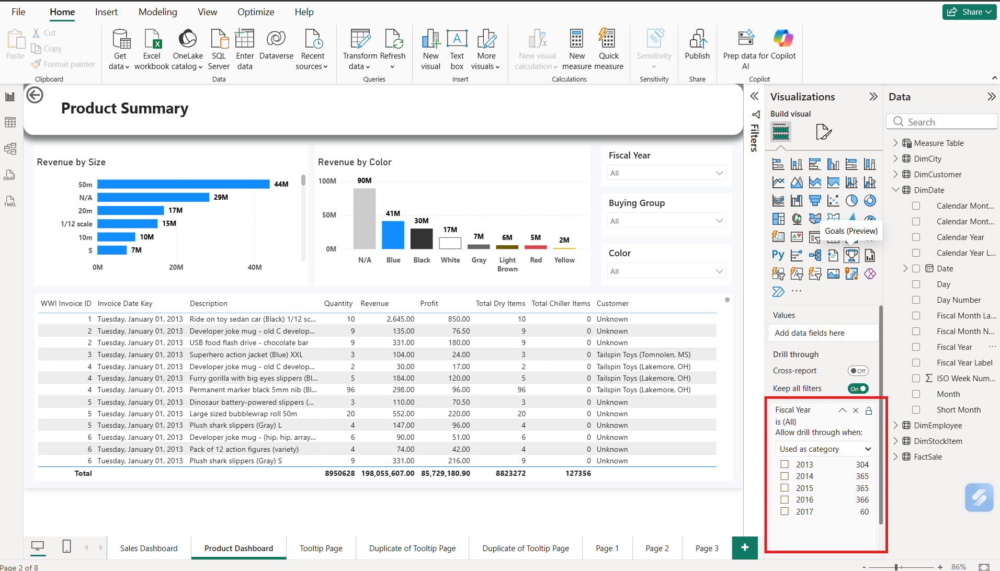
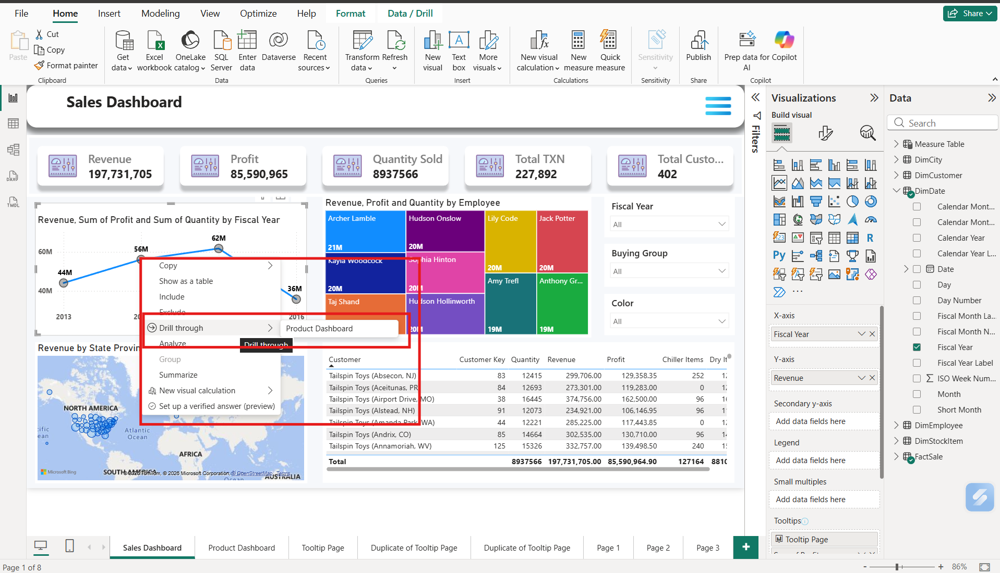
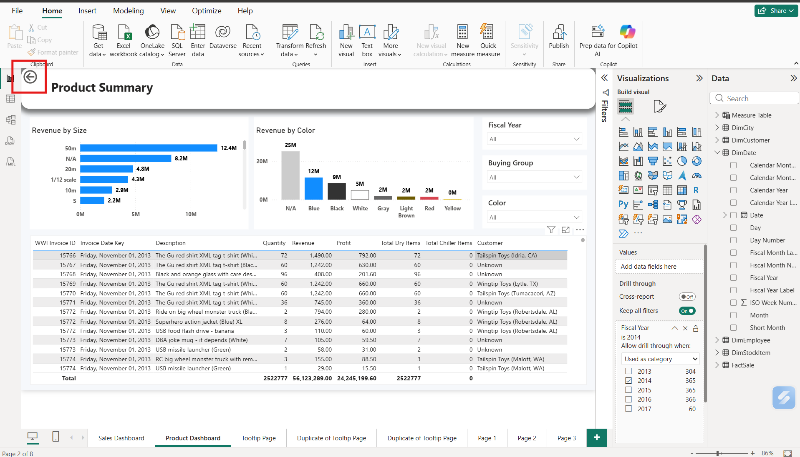
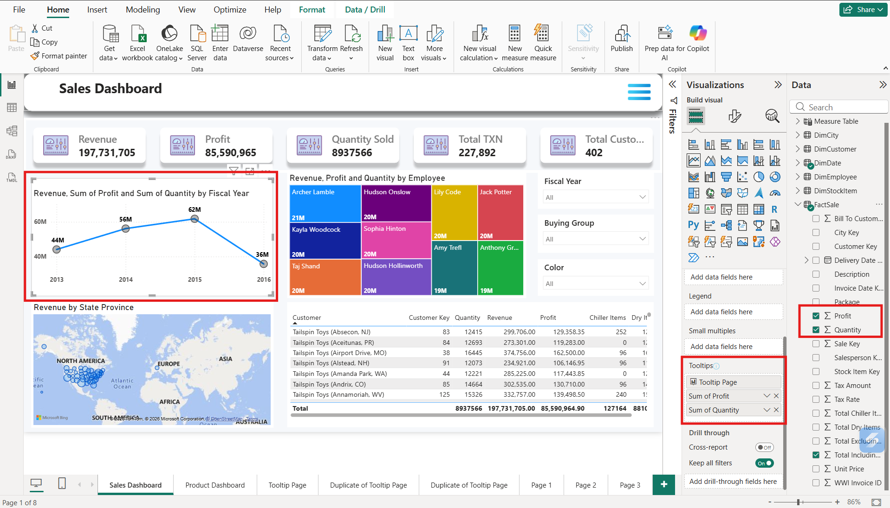

# Drill Through, Tooltips,  and Edit Interaction

### 1. Drill Through

**Drill Through** is a Power BI feature that allows users to **go from a summary report to a detailed report** by clicking on a specific data item.

In simple words, it helps you **see detailed information about one selected record** without creating a new report.

#### Benefits:

* Shows detailed information.
* Makes reports interactive.
* Helps analyze specific records.
* To reduce the number of steps in page navigation.

#### Example:

Suppose you have:

* **Page 1:** Sales Dashboard
* **Page 2:** Product Dashboard (Drill Through Page)

<figure><figcaption></figcaption></figure>

* We can drag any data into the Drill Through field. It depends on which data we want to filter out on the 2nd Page, according to the 1st Page data visuals.

<figure><figcaption></figcaption></figure>

* When you right-click on the **Line chart visual** for the year on Page 1, Power BI opens a tab of the **Drill Through** option, which redirects us to Page 2 and displays only the selected **Drill Through detailed data.**

<figure><figcaption></figcaption></figure>

* Drill through automatically creates a **Back Button** over the page where the Drill through is created.
* And according to the 1st Page Drill Through selection, it filters out the **entire** **2nd Page data visuals**.

<figure><figcaption></figcaption></figure>

## How Drill Through Works Internally

User Clicks Data Point ↓ Right-click on Visual ↓ Choose Drill Through ↓ Power BI Reads Selected Value (Fiscal Year = 2014) ↓ Passes Filter to Drill Through Page ↓ Detail Page Opens ↓ Only Matching Records Are Displayed

## 2. Tooltips

A **Tooltip** is a small information box that appears when you **move the mouse pointer over a visual**.

It provides additional details without taking extra space on the report page.

#### Benefits:

* Shows extra information without opening another page.
* Makes reports more interactive.
* Saves report space.
* Improves user experience.
* Displays additional details instantly.

* In the visual below, first select the visuals, then find the **Tooltip Option** in Visualization, and then drag the values in the **Tooltip Option**.&#x20;

<figure><figcaption></figcaption></figure>

* Hover over the selected visuals, and the created Tooltip will appear.

<figure><figcaption></figcaption></figure>

## How the Tooltip Works Internally

Sales Dashboard ↓ Select Line Chart (Revenue, Sum of Profit and Sum of Quantity by Fiscal Year) ↓ Go to Visualisation Option ↓ Search for Tooltip Option ↓ Drag the values from Data () ↓ Hover on "Electronics" ↓ Power BI Detects Electronics ↓ Reads Sales Data ↓ Applies Current Filters ↓ Shows Tooltip

## 3. Edit Interaction

**Edit Interaction** is a feature in **Power BI** that controls **how one visual affects another visual** on the same report page.

Edit Interaction allows you to decide whether clicking one chart should filter, highlight, or have no effect on other charts in the report.

