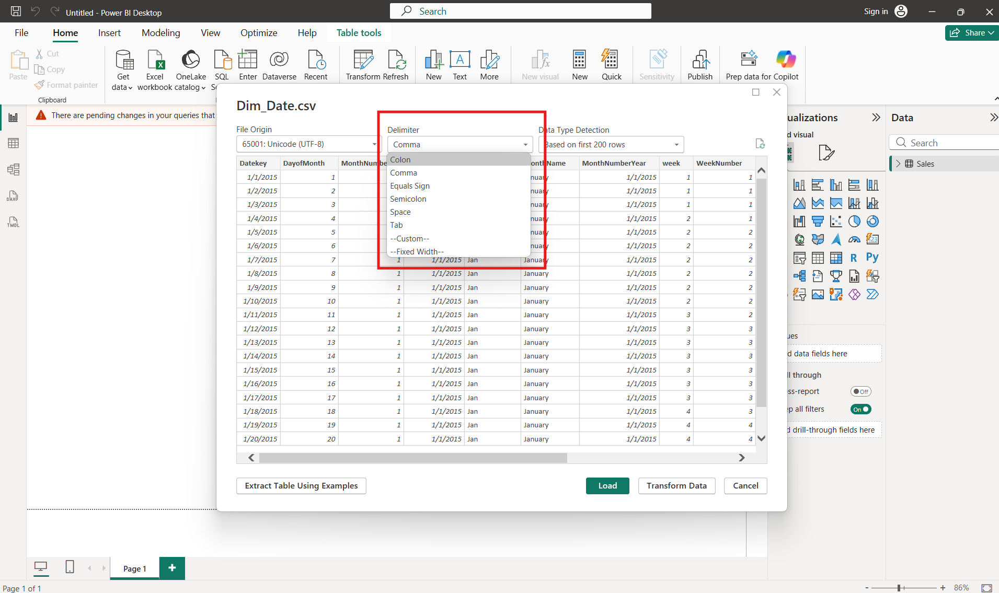

# Loading the Data

**Loading data** means bringing data from a source (Excel, CSV, SQL Database, etc.) into Power BI so that you can analyze and visualize it.

### Steps to Load Data

* **Open Power BI Desktop**
  * Start the Power BI application, and click on the **Blank Report** option

<figure><figcaption></figcaption></figure>

* **Click "Get Data"**
  * This option is available on the Home tab.      &#x20;

<figure><figcaption></figcaption></figure>

* **Choose Data Source**
  *   Select where your data is stored:

      * Excel
      * CSV
      * SQL Server
      * Web
      * Other sources

* **Select the File or Database**
  * Browse and choose the file or select the file from your storage, and click on open.

<figure><figcaption></figcaption></figure>

* **Preview the Data**
  * Power BI shows a preview of the tables available.

<figure><figcaption></figcaption></figure>

*   **Load or Transform**

    * **Load**: Directly import the data into Power BI (if file required, no cleaning).&#x20;
    * **Transform Data**: Clean or modify the data first using Power Query (in most cases, we have to transform the data first, then load it into Power BI).

    **Note**: To understand each and every data type of rows and columns, we always transform the data first. In the Power Query Editor, we transform the data and its data type.

* **Data is Loaded**
  * The tables appear in the Fields pane and are ready for reporting and visualization.

<figure><figcaption></figcaption></figure>

* ### Check File for Column Names, Delimiters, Data Type Detection&#x20;

**1. Column Name**

**Column Name** is the heading or title of a column that describes the data stored in that column. If the column name heading line is not the 1st line, it can't be shown as a heading.     &#x20;

<figure><figcaption></figcaption></figure>

Convert the first row into a header because without a header, we can't identify data and their data type.\
 

**2. Delimiter**\
\
A **delimiter** is a special character used to separate data values into different columns.&#x20;

<figure><figcaption></figcaption></figure>

**Note:** The Delimiter can be any character, like a comma, semicolon, equal sign, space, or tab. Any other character can also be added with the help of **the Custom** option (click on the Custom option and add the character by which the file is separated).

**3. Data Type Detection**\
\
Data Type Detection is the feature in Power BI that automatically identifies the correct data type of a column, such as Text, Number, or Date, when data is loaded.

<figure><figcaption></figcaption></figure>

It shows the data type preview based on the data of the top 200 rows. We can also change the type and select the entire datasheet (but it takes some time to load, affecting data processing speed).

### Types of Reports

There are 3 types of reports in Power BI :

1. Report View
2. Data View or Table View
3. Model View

## 1. Report View

**Report View** is the area where we create and design reports using charts, tables, maps, and other visualizations. It is the workspace where we create dashboards and reports to analyze data visually, like : Bar chart, Line chart, Pie chart, and KPI cards etc.

<figure><figcaption></figcaption></figure>

## 2. Data View

**Data View** (also called Table View) is the area where we can see the actual data stored in tables. It is used to view, inspect, and understand the data row by row and column by column.

<figure><figcaption></figcaption></figure>

**Note**: You can check data, create calculated columns, and verify values here (re-shape the data).

## 3. Model View

**Model View** is the area where relationships between different tables are created and managed. It is used to connect tables and show how they are related to each other.

<figure><figcaption></figcaption></figure>

