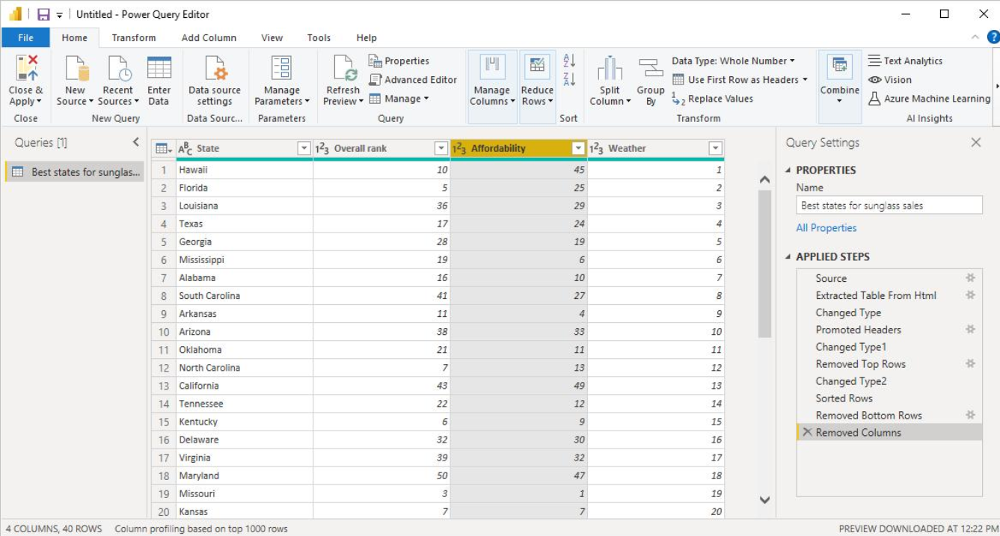

# Power Query Editor

Power Query Editor is a tool in Power BI used to clean, transform, and prepare data before loading it into Power B&#x49;**.** In this place, we fix, clean, and organize data before creating reports and dashboards.

<figure><figcaption></figcaption></figure>

#### What Can We Do in the Power Query Editor?

* Create headers
* Delete rows and columns
* Remove duplicate rows
* Rename columns
* Change data types
* Filter rows
* Split or merge columns
* Replace values
* Handle missing data

