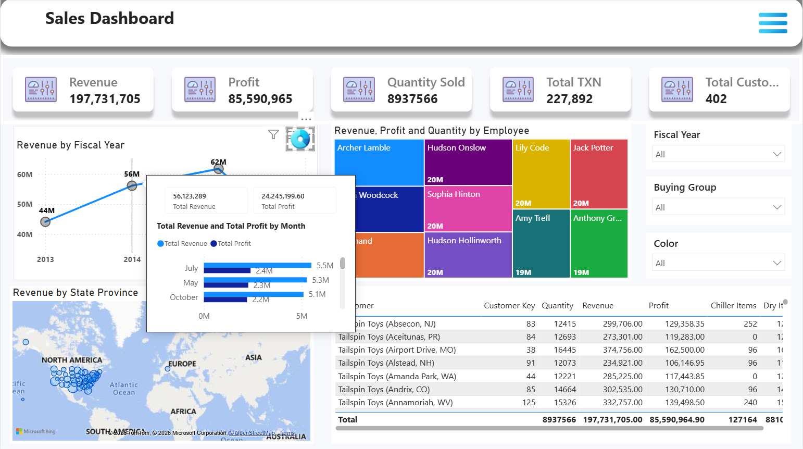

# Report Modeling (Model View)

## What is Report Modeling?

**Report Modeling in Power BI** is the process of organising and connecting data tables so that reports and dashboards can be created easily and accurately. It means **creating relationships between tables, arranging data properly, and preparing the data structure** before creating charts and reports.

<figure><figcaption></figcaption></figure>

