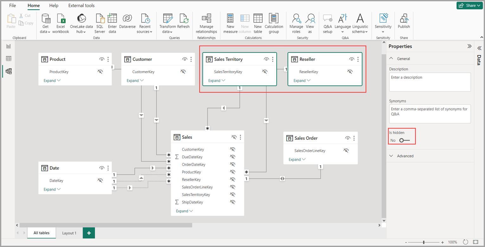
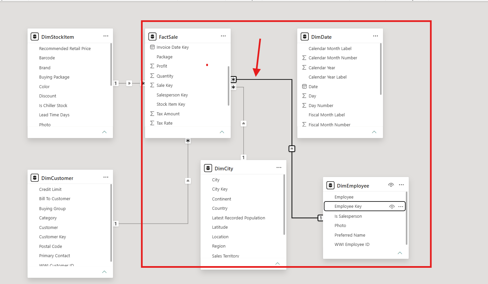
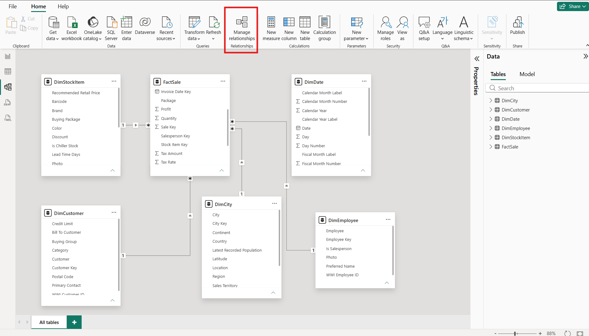
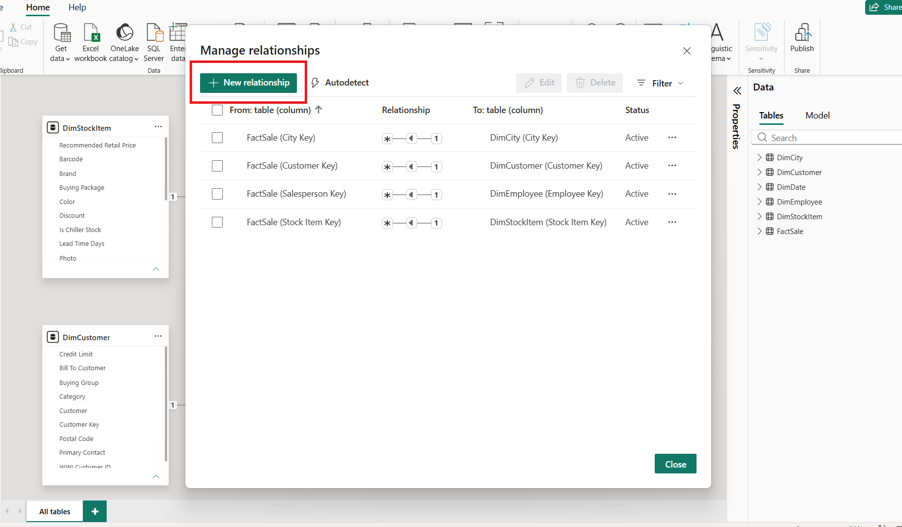
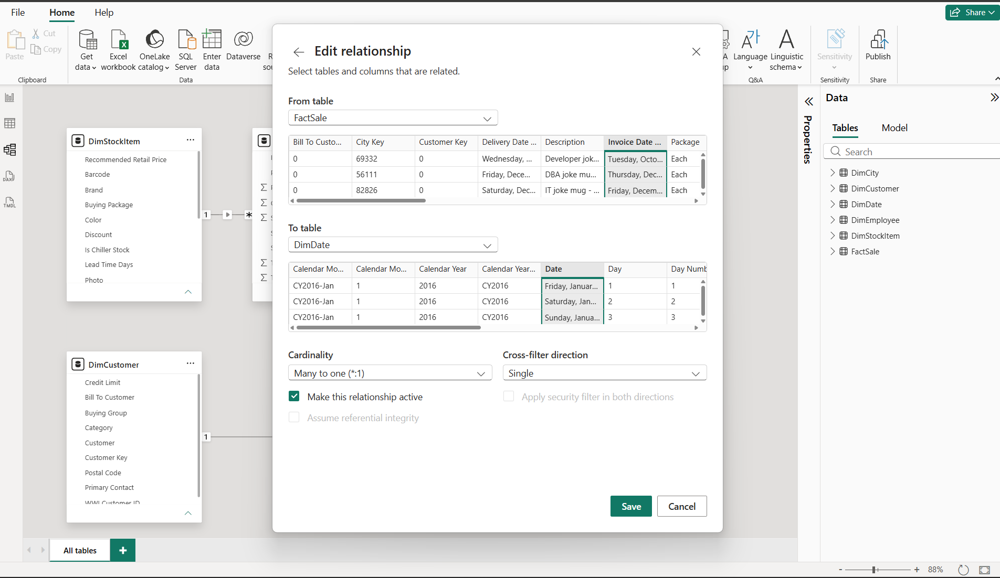

# Report View, Table View and Model View

In **Power BI Desktop**, there are **3 main views**:

* [ ] Report View
* [ ] Table View or Data View
* [ ] Model View

Here we understand the Power BI views in a descriptive way, what they are, and how they work....

To understand better way we start from Model view.

### **\*** Model View :

**Model View** shows the relationships between different tables in the Power BI data model.

#### Purpose

* Create relationships between tables.
* Manage star and snowflake schemas.
* Define cardinality (One-to-Many, Many-to-One).
* Improve data modeling and report performance.

<figure><figcaption></figcaption></figure>

&#x20;&#x20;

&#x20;      After Data loaded in Power BI, it automatically creates some relations within tables. But we have to check manually whether the weather relations are connected with same type or not. Also we can **DELETE** the relations manually.

We can also **Create** realation between the tables manually. It can be added by 2 types:

* By Drag and Drop
* Manage Relationships option

1. **Drag and Drop** is a method of creating relationships between tables in **Model View** by dragging a common column from one table and dropping it onto the matching column in another table.

* Quickly create relationships between tables.
* Connect Fact and Dimension tables.
* Enable data filtering and analysis across multiple tables.

<figure><figcaption></figcaption></figure>

#### Example

Suppose you have:

**Sales Table**

* Customer\_ID
* Product\_ID
* Sales\_Amount

**Customer Table**

* Customer\_ID
* Customer\_Name

You can drag **Customer\_ID** from the Sales table and drop it onto **Customer\_ID** in the Customer table to create a relationship.

<figure><figcaption></figcaption></figure>

2. **Manage Relationships** is a feature in Power BI that allows users to create, edit, delete, and view relationships between tables manually.

* Create relationships when Power BI does not detect them automatically.
* Modify existing relationships.
* Set Cardinality (One-to-One, One-to-Many, Many-to-One).
* Configure Cross Filter Direction.
* Manage the data model effectively.

<figure><figcaption></figcaption></figure>

<strong>Click on Manage Relationships ------> Select New Relationships</strong>

<figure><figcaption></figcaption></figure>

&#x20;    This image shows the Edit Relationship window in Power BI where the FactSale table is connected to the DimDate table using the Invoice Date and Date columns. The relationship has a Many-to-One (\*:1) cardinality because many sales transactions can occur on a single date. The Cross Filter Direction is set to Single, allowing filters to flow from the Date table to the Sales table. This relationship enables date-based analysis such as monthly, quarterly, and yearly sales reporting.

<figure><figcaption></figcaption></figure>

**Note:** In the above sheet DimDate will be join with FactSale table with Left Join.

### Types Of Tables:

There are mostly 2 types of tables in Power BI, which are:

1. Fact Table
2. Dimension Table

#### 1. Fact Table

A **Fact Table** stores the measurable business data or numerical values that you want to analyze.

**Characteristics:**

* Contains numeric values such as Sales, Profit, Quantity, Cost, etc.
* Usually has a large number of rows.
* Contains foreign keys that connect to dimension tables.
* Represents business transactions or events.

**Example:** Sales Fact Table

| OrderID | ProductID | CustomerID | DateID | SalesAmount | Quantity |
| ------- | --------- | ---------- | ------ | ----------- | -------- |
| 101     | P01       | C01        | D01    | 5000        | 2        |
| 102     | P02       | C02        | D02    | 3000        | 1        |

Here, **SalesAmount** and **Quantity** are facts (measurable values) in the Sales Fact Table.

#### 2. Dimension Table

A **Dimension Table** stores descriptive information about the business, such as product details, customer details, dates, or regions.

**Characteristics:**

* Contains text or descriptive columns.
* Usually has fewer rows than fact tables.
* Used for filtering, grouping, and slicing data.
* Connected to fact tables using primary keys.

**Example:** Product Dimension Table

| ProductID | ProductName          | Category    |
| --------- | -------------------- | ----------- |
| P01       | ConsoleFlare\_Laptop | Electronics |
| P02       | ConsoleFlare\_Mobile | Electronics |

**Example:** Customer Dimension Table

| CustomerID | CustomerName    | City   |
| ---------- | --------------- | ------ |
| C01        | ConsoleFlare\_A | Delhi  |
| C02        | ConsoleFlare\_B | Mumbai |

### Types Of Relationships Between Tables

In Power BI, there are 4 types of relationships between tables.

| Relationship Type              | Symbol  | Description                                          |
| ------------------------------ | ------- | ---------------------------------------------------- |
| **One-to-One (1:1)**           | 1 ↔ 1   | One row in Table A matches only one row in Table B.  |
| **One-to-Many (1:\*)**         | 1 → \*  | One row in Table A matches multiple rows in Table B. |
| **Many-to-One (\*:1)**         | \* → 1  | Multiple rows in Table A match one row in Table B.   |
| **Many-to-Many (**_**:**_**)** | \* ↔ \* | Multiple rows in both tables can match each other.   |

### 1. One-to-One Relationship ( 1 : 1 )

Each record in one table is related to exactly one record in another table.

**Example:**&#x20;

**Employee Table**

| EmployeeID | Name            | City   | Area  |
| ---------- | --------------- | ------ | ----- |
| 101        | ConsoleFlare\_1 | Mumbai | Dadar |
| 102        | ConsoleFlare\_2 | Pune   | Baner |

**Salary Table**

| EmployeeID | Salary | Provident\_Fund | Years\_of\_Experence |
| ---------- | ------ | --------------- | -------------------- |
| 101        | 50,000 | 4800            | 5                    |
| 102        | 60,000 | 5600            | 7                    |

* Employee **101** has only one salary record.
* Employee **102** has only one salary record.

**Use Case:**    Employee Details ↔ Employee Salary.

### 2. One-to-Many Relationship ( 1 : \* )

One record in the first table can have multiple matching records in the second table.

**Example:**

**Customer Table**

| CustomerID | CustomerName |
| ---------- | ------------ |
| C01        | Rahul        |
| C02        | Priya        |

**OrdersTable**

| OrderID | CustomerID | Amount |
| ------- | ---------- | ------ |
| O101    | C01        | 1000   |
| O102    | C01        | 1500   |
| O103    | C02        | 2000   |

* Customer **C01** has multiple orders.
* Customer **C02** has one order.

**Use Case:**   Customer → Orders.

This is the **most commonly used relationship** in Power BI, especially in **Fact and Dimension tables**.

### 3. Many-to-One Relationship ( \* : 1 )

Multiple records in the first table relate to a single record in the second table.

**Example:**

**Sales table**

| ProductID | Quantity |
| --------- | -------- |
| P01       | 5        |
| P01       | 8        |
| P02       | 10       |

**Product Table**

| ProductID | ProductName |
| --------- | ----------- |
| P01       | Laptop      |
| P02       | Mobile      |

* Many sales records belong to one product (ProductID).

**Use Case:**   Sales → Product.

### 4. Many-to-Many Relationship ( \* _: \*_ )

Multiple records in both tables can be related to each other.

**Example:**

**Student Table**

| StudentID | StudentName |
| --------- | ----------- |
| S01       | Rahul       |
| S02       | Priya       |

**Course Table**

| CourseID | CourseName |
| -------- | ---------- |
| C01      | Python     |
| C02      | SQL        |

**Enrollment Table**

| StudentID | CourseID |
| --------- | -------- |
| S01       | C01      |
| S01       | C02      |
| S02       | C01      |

* Rahul can enroll in many courses.
* Python course can have many students.

**Use Case:**   Students ↔ Courses.

### **\* Report View**

In Power BI, different chart types are used to visualise data and understand relationships between tables and measures. Charts in Power BI are graphical representations of data that help users analyze, compare, and understand patterns, trends, relationships, and business performance in an easy and interactive way. The most commonly used charts are:

#### Charts Most Used in Data Modelling

For data modelling and analysis, these visuals are used most frequently:

1. **Table Visual** – To verify imported data.
2. **Matrix Visual** – To analyze relationships between dimensions and facts.
3. **Bar/Column Chart** – To compare measures across categories.
4. **Line Chart** – To analyze trends over time.
5. **Scatter Chart** – To study correlations between variables.
6. **Treemap** – To analyze hierarchical data.
7. **Decomposition Tree** – To drill down into measures and dimensions.

